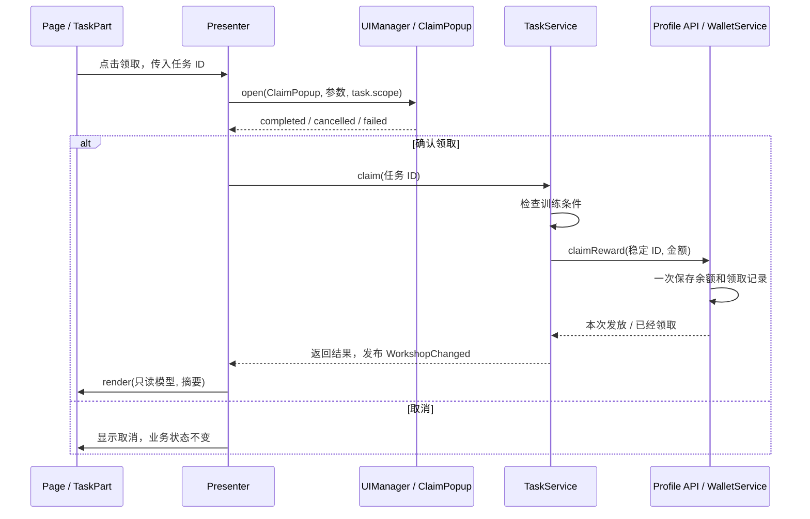

# 正式开发工作流

先运行 `assets/game/boot/Bootstrap.scene`，选择“正式业务流程 · 任务奖励”。再打开 **YZForge → 项目工作台 → 示例工作流**，按步骤查看实际源码。本文的任务、训练、金币都是示例业务；框架本身不要求这些概念。

## 1. 从职责开始

这个示例把任务规则放在 `workshop`，账号余额放在 `profile`，公共配置放在 `common`。`showcase` 负责功能导航和实验。不要按每一个按钮拆模块；共享状态与发布边界才是拆分依据。

| 层         | 真实文件                                                                                           | 负责什么                                              |
| ---------- | -------------------------------------------------------------------------------------------------- | ----------------------------------------------------- |
| 应用组合   | [showcase-navigation.ts](../assets/game/app/showcase-navigation.ts)                                | 用生成的 ViewKey 选择页面，持有覆盖页面导航的启动会话 |
| 模块装配   | [WorkshopModule.ts](../assets/game/modules/workshop/code/WorkshopModule.ts)                        | 注入声明的 Profile API，创建 TaskService              |
| 业务规则   | [TaskService.ts](../assets/game/modules/workshop/code/services/TaskService.ts)                     | 训练进度、配置查询、领取条件、业务事件                |
| 账号状态   | [WalletService.ts](../assets/game/modules/profile/code/services/WalletService.ts)                  | 余额、领取去重记录、存档和订阅                        |
| 展示流程   | [WorkflowPagePresenter.ts](../assets/game/modules/workshop/code/ui/WorkflowPagePresenter.ts)       | 取数、确认、命令、反馈；定义最小渲染 Port             |
| 页面显示   | [WorkflowPage.ts](../assets/game/modules/workshop/code/ui/WorkflowPage.ts)                         | 按钮绑定、动态 Part 创建、同步更新节点                |
| 可复用部件 | [TaskPart.ts](../assets/game/modules/workshop/code/components/TaskPart.ts)                         | 接收卡片模型，通过任务 ID 回传点击                    |
| 自动绑定   | [WorkflowPageBinding.ts](../assets/game/modules/workshop/code/ui/generated/WorkflowPageBinding.ts) | 节点引用和类型化 getter，由工作台生成                 |



**不要求每个简单页面都有 Presenter。** 只有打开提示、显示时间等局部操作时，页面直接使用上下文更清楚。涉及多步交互、多个领域服务、复杂状态和单元测试时，引入 Presenter；不要给 Service 传入 Label、Node 或页面实例。

## 2. 在工作台创建内容

1. 创建自己的模块，选择代码交付方式和默认资源包。示例 `workshop` 使用按需代码，`profile` 使用启动代码，`common` 仅有配置和资源。
2. 创建 Page，复杂页面勾选 Presenter；创建 Part 和 Service。先检查全部文件预览，脚本和预制体后缀自动补齐。
3. 在模块设置声明业务依赖。示例声明 `profile`，生成的依赖合同让模块工厂获得完整类型。
4. 通过生成的公开合同访问其他模块；不导入其他模块 `code` 里的具体服务或组件。

代码已加载和业务实例已创建是两回事。资源页读取 `TasksTable` 时只加载 JSON；第一次进入任务页时才加载 `code-workshop` 并创建任务业务。退出后业务持有归零可以销毁，代码通常仍由引擎保留。

## 3. 配置表先确定合同

[tasks.xlsx](../config-source/workshop/tasks.xlsx) 展示任务数据：`id:int`、`name:string`、`goal:int`、`reward:int`、`quality:enum<Quality>`、`economy:ref<common.economy>`。`__config` 声明导出包、主键、品质索引和正数约束；`__enums` 声明 Normal / Rare。

[samples.xlsx](../config-source/showcase/samples.xlsx) 补充 bool、float、数组、vec2、color、可空值、日期格式约束和 SpriteFrame 资源引用。`pack` 字段把 101 行导出到默认包、201 行导出到 extra 包。`Calculation` 工作表通过两条公式计算权重 1.5 / 2.5。

含公式的表修改后，需要在工作台执行“重新计算公式”，再正式导出。当前公式适配器使用 Windows 桌面 Excel，在副本上计算，不保存用户当前打开的 Excel 会话。已验证的公式结果位于 `project-settings/generated/formulas`，与源码一同复制；未改变输入时，读取这些结果不需要本机再次运行 Excel。源表或声明的关联输入改变会使旧结果失效。

```ts
// 公开合同可以跨模块导入；import 本身不会加载 JSON 或创建业务服务。
const tables = await show.config.loadMany({ tasks: TasksTable, economy: EconomyTable });
const task = tables.tasks.require(1);
const economy = tables.economy.require(task.economy);

// 一张表有多个分片时必须选定 Bundle，禁止隐式合并或猜测。
const samples = await show.config.load(SamplesTable, { bundle: ShowcaseBundles.extra });
```

动态资源放在 `bundles/<包>/dynamic` 自动生成资源 Key；静态引用放在同一包的 `static`，两者一起属于 Bundle。加载一个资源会加载它的必要依赖；下载/解压整包与加载某一资源到内存的成本不同，不能仅凭 API 次数估计流量。

## 4. 先写 Service，再写展示流程

`TaskService.train()` 先保存，再更新状态和发布事实。`claim()` 在 Service 内再次检查训练次数；按钮禁用只是显示行为，不能代替规则检查。

`WalletService.claimReward()` 用稳定的 `workshop/task/<id>` 去重，并把余额和领取记录放在同一次存档写入中。写入失败不会改变内存状态；重试不会重复增加余额。这是本地示例，联网项目应由服务端权威处理经济结算，不能把客户端记录作为防作弊依据。

`WorkflowPagePresenter` 每次展示重新创建，负责加载、生成展示模型、等待确认、调用命令和渲染。它只依赖 `WorkflowPagePort`，业务测试不需要启动 Cocos。模块状态持续时间由 Service 的模块期限决定，不由 Presenter 的字段决定。

## 5. 预制体与渲染

在 Creator 编辑预制体，命名节点：`btn_train`、`lbl_output`、`node_items`；在工作台“自动绑定”选择对应界面并扫描。生成文件可覆盖，手写 Page / Part 不会被生成覆盖。

页面用框架 `onShow(show)`、`onHide()` 等钩子；Part 用 `onActivate(activation)` 等钩子。业务不覆盖 `onLoad/start/update/onDestroy`。动态 Part 先用 `{ active: false }` 创建，传入模型和回调后调用 `show.assets.activate(node)`。

`render()` 只同步写节点。异步取数后通过捕获的 `show.commit()` / `task.commit()` 提交，阻止旧展示覆盖新展示。一次 show 的资源、监听和任务都使用它自己的 Scope；长期账号任务才由账号会话持有。

## 6. UI 与模块怎样通信

| 需求                 | 采用方式                                | 示例                                      |
| -------------------- | --------------------------------------- | ----------------------------------------- |
| 页面给弹窗传信息     | ViewKey 的类型化参数                    | 标题、奖励说明                            |
| 弹窗返回选择         | `handle.result` 的状态联合              | 确认才执行命令；取消没有成功值            |
| Part 通知父对象      | 明确的回调与 ID                         | `claim(taskId)`                           |
| 跨模块命令和查询     | 声明依赖 + 公开 API                     | TaskService 调用 ProfileApi               |
| 多处观察已发生的事实 | 类型化事件 + 所有者                     | `WorkshopChanged` 更新首页观察记录        |
| 页面切换             | 应用导航能力 + `pushPage` / `show.back` | 启动会话持有新页面，不用即将挂起的旧 show |

不把事件当作需要返回值的隐式 RPC，也不通过查找另一个页面节点进行通信。Popup 默认阻挡下层输入；Overlay/Toast 的策略独立；Part 不进入 UI 页面栈。缓存只复用节点，每次显示仍有新的 showId 和 Scope。

## 7. 验证与发布

```powershell
npm run verify
npm run test:showcase
```

在 Creator 中运行 Bootstrap，逐个操作实验按钮。构建 Web 后可运行真实运行时集成检查：

```powershell
node tests/integration/serve-build.mjs build/verify-showcase-web
# 另一个终端，填写服务输出的实际端口；需要连接当前项目的 Cocos MCP。
node tests/integration/verify-showcase.mjs http://127.0.0.1:实际端口/
node tests/integration/verify-showcase-editor.mjs
```

示例集成检查使用独立窗口和临时浏览器会话，不使用玩家已有存档。覆盖按钮输入、弹窗返回、资源路由、业务回收和页面反复进出；截图帮助检查屏幕适配。小游戏构建检查不能代替微信真机验证，Web 验证也不能代替原生设备验证。完整入口和覆盖范围见 [功能展示](showcase.md)。
