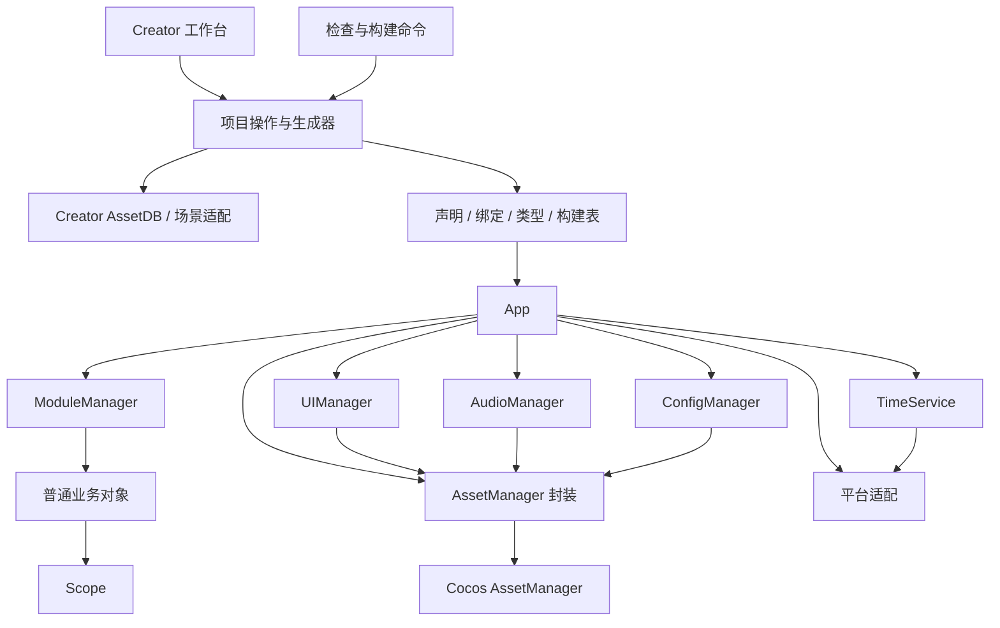

# YZForge 新框架设计方案

> 文档性质：从零重建的架构与实施规格，不是现有框架的修改方案。
>
> 编写日期：2026-09-20。基线：Cocos Creator 3.8.8、TypeScript。
>
> 目标：服务中小型到中型小游戏及原生游戏，以少量明确规则支持持续开发。
>
> 当前状态：正在新项目中实现。本文是目标规格，具体完成范围与验证证据见 [实施记录](implementation-status.md)。设计能力不能直接视为已实现或已通过平台验证。
>
> 后续评审：面板输入、目录与自动资源清单、XLSX、通用预制体、删除恢复和分包配置的调整建议见 [工作台与制作流程重构方案](workbench-redesign-proposal.md)。主要制作流程已于 2026-09-21 落实；涉及旧规则的变更以其中的明确决定为准，实际完成范围与平台验证边界见实施记录。

## 1. 设计决定

新框架采用 **模块组织业务、Bundle 交付资源、Scope 管理使用期限、面板完成重复操作** 的结构。

日常开发只有四个主要概念：

| 概念   | 开发者需要知道的事情                                                 |
| ------ | -------------------------------------------------------------------- |
| Module | 一个相对独立的业务功能，拥有公开 API、内部代码、UI、配置与资源       |
| Bundle | 一组实际打包与交付的资源；模块可有零个、一个或多个资源包，按需声明   |
| View   | 一个有参数、生命周期和可选返回值的界面；继承生成的绑定基类           |
| Scope  | 一次使用期限，例如一次界面显示、一次战斗；结束时取消任务并清理持有物 |

框架提供 App、模块管理、资源管理、配置管理、UI 管理、音频管理、时间服务，以及少量平台和通信基础设施。业务对象使用普通 TypeScript 类或函数，不强制继承 Model、Service、Manager、Controller 等基类。

具体决定如下：

1. 保留 YZForge 名称，重新设计 API 和实现；不承担旧 API 兼容。
2. 面板是首要入口，必须同时支持创建、编辑、移动、重命名、删除、检查，不能只做脚手架。
3. 配置导入、分包目标选择、错误定位、生成类型均在同一面板完成。
4. UI 使用 `业务 View → 生成 Binding → UIView → Component` 的继承链。
5. 自动绑定在编辑器完成：按节点命名生成字段，通过 Creator 写入序列化引用；运行时直接使用引用。
6. 模块边界与物理分包分别表达。默认按模块分资源包，不要求每个业务类、每张表、每个关卡单独分包。
7. UI、音频由 App 统一管理；模块获得带有默认 owner 的便捷入口，内部不各自创建一套全局层级和播放器。
8. 模块之间用类型化 API 完成命令与查询，用少量类型化事件发布事实；UI 用参数、结果和局部回调通信。
9. 保留简单资源作用域及异步取消；不把运行时设计成通用事务平台。
10. 保留代码复用能力，使用普通 import、构造函数和工厂组合；不设 ExtensionDefinition、installExtension、扩展安装清单和扩展专属生命周期，也不预建 libraries 目录。
11. 独立分包直接使用 Cocos Bundle、统一配置入口和 Scope；不另设 ContentPort、PackRef/PackAssetRef、Pack manifest 和独立内容包生命周期。资源包不隐含章节、关卡或活动等业务含义。
12. 普通远程资源按需解析。框架不因校验主动预加载整个包的资产；平台分包、Zip 或合并文件仍可能以整包/整文件为下载单位，不能把按需解析等同于只下载单项。
13. 动态资源提供统一清单：逻辑名字、生成的类型化引用和明确的路径入口共用资源加载器；名字与物理路径解耦，清单按命名空间按需读取。
14. 静态引用和动态加载是可以并存的使用方式，不拆成两套资源系统；资源身份、业务名字、分包位置、引用关系分别表达。
15. 配置表内建制作端工具和运行时 ConfigManager：JSON 数据按包交付，TS 生成类型与校验合同，通过统一 API 加载、查询和管理使用期限。
16. 引擎生命周期由框架基类独占；业务 View 和节点组件只实现框架钩子。模板、静态检查和构建检查共同执行这一规则，不依赖开发者记得调用 super。
17. 时间是内建服务：提供当前时间、服务器校时、日期计算和日/周/月/年回调，明确自然周期、从某日起算的周期以及退出后的恢复。普通延时调度不并入这个模块；内部超时仍使用独立单调计时，所有时间订阅归 Scope。
18. 框架、项目设置与使用示例分开：不内置大厅、战斗、关卡、奖励、竖屏、固定业务时区或项目数据。通用默认值必须可解释，涉及项目策略的值由项目声明。

衡量设计是否成功的标准：新增一个界面或一张配置表后，开发者能立即写业务，不需要理解注册图、所有权品牌类型或发布校验细节。

这里精简的是额外框架机制，并未取消“复用代码”或“把资源独立交付”的需求。目录改名不构成架构简化；验收应看新增能力是否仍要求专属注册、安装声明、引用类型和生命周期。如果这些手续仍在，即使换了目录名也没有完成本方案的精简。

## 2. 需求范围与必要调整

### 2.1 本轮需求对应的交付

| 原始需求                         | 新方案                                                             | 完成标准                                                                     |
| -------------------------------- | ------------------------------------------------------------------ | ---------------------------------------------------------------------------- |
| 插件面板自由创建删除功能         | 项目工作台，管理模块、界面、普通脚本、资源包、配置导入项、音频条目 | 创建后可使用；删除有引用检查、实际文件清单和可恢复记录                       |
| 配置导入各个分包并由框架管理     | 面板校验/导出、JSON 与 TS 合同、内建配置 API、按包/分片加载        | 数据类型和生成文件明确，查询有类型提示，版本与释放可控；未访问包不提前加载   |
| UI 继承自动绑定脚本              | 按命名规则生成继承基类，编辑器绑定引用                             | 移动节点后可重新检查；缺组件、重名、失效引用可定位                           |
| 游戏分模块分包                   | 逻辑模块 + 按需声明的资源包；代码交付按平台配置                    | 纯代码模块可不带资源，首包内容、模块依赖及远程资源归属可从产物确认           |
| UI 管理器                        | 页面、弹窗、覆盖层、Toast、Loading，共用一个管理器                 | 打开、关闭、返回、输入、缓存及异步失败有确定语义                             |
| 音频管理器                       | BGM、SFX、音量分组、播放句柄、并发限制、前后台处理                 | 模块退出后不留下所属播放和音频引用                                           |
| 模块和 UI 通信                   | API、事实事件、参数/结果、局部回调四种途径                         | 不使用全局广播代替命令，不查找其他界面的内部节点                             |
| 按图片等资源名字查路径和加载     | 工作台动态资源清单、稳定逻辑名、类型化引用、按需索引               | 能按名字解析包与地址、直接加载，移动资源不破坏逻辑名，重名和类型错误明确报错 |
| 静态/动态资源与重名管理          | 全部资源视图、动态入口标记、分层身份与冲突检查                     | 同一资产可混合使用，不重复复制，不误释放；重名、删除和构建遗漏能提前定位     |
| 业务使用框架生命周期             | UIView 与 GameComponent 提供业务钩子，框架保留引擎入口             | 业务覆盖引擎回调时检查失败；初始化、激活、显示、关闭和销毁顺序可验证         |
| 时间戳、日期、校时及日历周期回调 | 内建 TimeService、日期工具、绝对时刻与日/周/月/年订阅              | 明确自然周期与起算周期、月末/闰年、后台/重启恢复和重复触发规则               |

“自由删除”解释为能完整管理自己创建的内容，不解释为忽略依赖直接删除。“适用于原生”包括本地包、远程资源、存储和应用生命周期，不自动包含一整套原生脚本热更新平台。

### 2.2 必须补充的基础能力

- 统一资源释放和取消，否则模块化会放大泄漏与迟到回调问题。
- 平台边界：前后台、返回键、安全区、存储、网络与缓存能力。
- 启动与恢复界面：能表现加载失败和重试，不依赖出错模块本身。
- 构建检查：防止远程资源、模块代码被静态引用拉进首包。
- 定位信息：能追踪哪个 UI、播放或模块仍持有资源。
- 基础存储：设置持久化、版本号和业务迁移入口，避免散落平台调用。

### 2.3 不放进第一版核心

通用插件市场、运行时远程代码插件、通用依赖注入容器、反射扫描、ECS、确定性战斗、网络同步、复杂红点树、引导编辑器、通用响应式状态库、任意存档自动迁移、全项目内容加密、通用事务日志平台。

这些能力可由产品引入普通包，或通过明确的接口增加；核心不预先创建空 Manager。正式 native 全量热更新单列为可选交付，不与资源包版本切换混为一谈。

### 2.4 通用框架边界

| 位置                                         | 负责的内容                                           | 不应包含的内容                                       |
| -------------------------------------------- | ---------------------------------------------------- | ---------------------------------------------------- |
| `assets/framework`                           | 资源、生命周期、通信、UI、音频、配置、日历等通用机制 | 具体模块名、奖励规则、关卡字段、项目配置和示例的导入 |
| `extensions/yzforge-editor`、`tools/yzforge` | 通用制作与生成工具                                   | 按章节理解资源包、按怪物表理解配置、按竖屏理解 UI    |
| `project-settings`、`assets/game`            | 当前项目的标识、策略、模块及启动流程                 | 被反向依赖为框架核心的必需内容                       |
| 使用示例                                     | 演示真实调用、供删除和替换                           | 强制所有游戏存在相同模块、表、首屏或业务规则         |

资源包按加载与交付边界划分，可用于任意资源集合；表的分片字段由映射声明，不能硬编码 chapter、levelId 等字段。纯逻辑模块允许 `bundles: {}`；需要 UI 或表数据时，再显式添加目标资源包。新建 UI 从 Creator 项目设置读取设计尺寸，不改项目横竖屏策略；初始 Params/Result 使用 void，不预设标题、金额等业务字段。

应用必须提供稳定 `appId`，用于本地存档隔离；音频默认分组可在项目设置中补充。日历默认采用 UTC、周一、00:00，项目可以配置偏移、周起始日、周期边界；框架不会把日历通知自动解释为签到、刷新商店或发奖。现有 lobby、奖励弹窗及道具表均属于演示代码。

本文后续的 battle、forest、奖励和关卡代码用于说明 API，不是内置模型。实现必须以本节边界为准，不能把示例名写进工具规则。通用性也不意味着加入插件容器、任意脚本执行或为每个机制建立扩展注册体系。

## 3. 从参考实现中吸收与舍弃

| 来源             | 吸收                                                            | 舍弃或调整                                                                    |
| ---------------- | --------------------------------------------------------------- | ----------------------------------------------------------------------------- |
| XForge2          | 模块组织、工作台式创建入口、UI/声音便捷接口、业务生命周期直观   | 不以类名前缀决定 UI 行为；不依赖业务全局查找；UI 参数和结果不统一用 any       |
| 当前 YZForge     | 显式依赖、取消及迟到结果处理、资源作用域、UI 参数类型、配置校验 | 不要求所有资源经过复杂生成合同；不暴露 FeatureSession/Assembly 等多重业务概念 |
| 当前工具链       | 生成文件与手写文件分离、Creator 适配、变更预览、定位错误        | 工具不追求所有入口字节级一致，不建设超出实际编辑操作需要的事务系统            |
| 当前 ContentPack | 同时组织地图资源、配置和使用期限                                | 通过普通 BundleHandle 加 Scope 实现，去掉独立 PackRef/PackAssetRef 家族       |
| 当前 extensions  | 可选能力不污染核心                                              | 使用普通依赖及工厂组合，不建立新的扩展安装语言                                |

参考的是职责和使用体验，不复制源码中的全部实现假设。[XForge2 模块实现](https://gitee.com/cocos2d-zp/xforge2/blob/master/Cocos3/extensions/xforge/runtime/base/BaseModule.ts)、[UI 实现](https://gitee.com/cocos2d-zp/xforge2/blob/master/Cocos3/extensions/xforge/runtime/mgr/ui/UIManager.ts)、[面板实现](https://gitee.com/cocos2d-zp/xforge2/blob/master/Cocos3/extensions/xforge/editor/src/panels/Module.vue)。

## 4. 总体结构



依赖方向固定为：业务依赖框架公开接口；框架依赖 Cocos 和平台适配；工具通过读取项目声明与 Creator 数据生成必要产物。运行时代码不依赖编辑器、Node.js、Excel 解析器或工具包。

框架不重新实现 Node、Component、动画、物理和渲染。业务仍使用 Cocos 节点与组件，但节点型业务脚本继承 GameComponent，UI 根继承生成的 Binding；引擎生命周期入口统一由框架封装，见第 4.2 节。普通服务、模块工厂和 Flow 仍是 TS 类或函数，无需继承组件基类。

### 4.1 App 的职责

`App` 是项目组合入口，拥有持久根节点、固定管理器、根 Scope 和应用生命周期。由启动场景中的一个 `GameRoot` 驱动，防止重复创建。

固定服务：`modules`、`assets`、`config`、`ui`、`audio`、`time`、`events`、`storage`、`platform`。这些字段不是任意注册表；不提供 `getService(string)`。

业务通过构造参数或框架创建的上下文访问所需接口。测试可提供接口替身。不生成可从任意文件读取的可变 `window.app`；开发调试入口只暴露受限快照。

启动顺序：平台与基础 ClockDriver → 根 Scope/设置/TimeService → GameRoot/基础 Canvas/AudioRoot → 本地恢复 UI → 交付版本表 → 启动模块 → 启动流程。网络非必需的游戏可以跳过远程版本查询，直接使用安装包内版本表；无校时服务时明确使用本地估计时间。

退出顺序：停止接受新业务和新校时轮次 → 关闭流程和界面 → 结束音频 → 关闭模块 → 释放管理器缓存/关闭 TimeService 的业务任务 → 关闭根 Scope。基础 ClockDriver 的清理截止时间支持保留到所有收尾结束，不依赖已关闭的业务定时器。宿主进程被杀死时无法保证执行关闭回调，存档不能只依赖应用退出。

### 4.2 引擎入口与业务生命周期

这是框架使用规则：业务不实现 `onLoad`、`start`、`onEnable`、`onDisable`、`update`、`lateUpdate`、`onDestroy`，也不覆盖框架使用的 `__preload` 等内部入口。调用 `super.onLoad()` 不构成例外；框架不能把正确性建立在业务选择调用 super 的顺序上。

两类节点脚本分别使用以下入口，不要求业务同时实现两套钩子：

| 对象                         | 业务钩子                                                            | 调度与职责                                                                |
| ---------------------------- | ------------------------------------------------------------------- | ------------------------------------------------------------------------- |
| 普通节点组件 `GameComponent` | `onInit()`                                                          | 首次有效激活时同步初始化一次；读取已注入数据和本组件序列化引用            |
| 同上                         | `onActivate(activation)` / `onDeactivate()`                         | 每次有效启用/停用；activation 携带本次 Scope 与取消信号，停用后失效       |
| 同上                         | `onReady()`                                                         | 首次参与帧调度前一次；不作为其他组件初始化完成的屏障                      |
| 同上                         | `onTick(dt)` / `onLateTick(dt)`                                     | 仅组件有效启用、所属业务允许运行时接收对应帧阶段                          |
| 同上                         | `onDispose()`                                                       | 最终销毁前同步通知一次；异步资源收尾登记在 Scope 中                       |
| 受管 UI `UIView`             | `onCreate(instance)`、`onShow(show)`、`onHide(hide)`、`onDispose()` | 按第 10.3 节的实例/显示顺序调度；前三者可异步，onDispose 同步且只调用一次 |
| 同上                         | `onTick(dt, show)` / `onLateTick(dt, show)`                         | 可选；仅本次显示进入可交互状态后调用，关闭开始即停止                      |

GameComponent 与 UIView 各自直接封装 Component 入口，共用内部清理与任务辅助代码；UIView 不再通过 GameComponent 额外暴露一套 onActivate/onReady。生成 Binding 只提供字段与校验，不占用任何业务钩子。业务通常只写需要的钩子，无需补空方法。

GameComponent 钩子必须同步返回；异步工作通过 `activation.run(task)` 登记，任务使用捕获的 activation.scope/signal，在修改节点前调用 `activation.commit(fn)`。run 追踪完成与异常，commit 只接受同步函数且仅在该次激活有效时执行。停用先使本次 activation 失效，再调用 onDeactivate 并清理；反复启用不能把旧任务绑定到新一轮 Scope。受管实例的停用、重新激活和故障收尾复用第 10.3 节的排空/隔离规则，业务不直接修改受管根的 active/enabled 或调用 destroy。

受管 GameComponent 的实例 Scope 归创建它的实例 owner；UI 子组件的 activation 另外受本次 show 约束，隐藏就停止业务活动，不能只依赖组件本身是否 enabled。旧 activation 未排空时，即使引擎再次发出 onEnable，也不派发新一轮业务 onActivate；超时进入该实例的故障收尾。onInit 不读取兄弟组件尚未保证存在的初始化状态，跨组件准备由激活屏障之后的显式调用完成。

引擎入口先维护框架状态，再调用业务钩子；必要清理放在 finally，业务抛错不能跳过框架收尾。未初始化即取消的对象不伪造 onInit/onCreate/onDispose 配对；已经进入初始化的对象，即使初始化失败，也由框架保证一次最终收尾。不能依赖 Cocos 对“从未激活对象”的销毁回调来完成管理器自己的清理。

框架拥有这些入口不表示 TypeScript 存在 final 方法。工作台创建对应模板，检查器沿继承链检查方法和同名字段，包括间接基类、生成类与字面量计算属性；业务覆盖保留名直接阻止构建。对受管实例，开发运行时在激活前补充检查原型及实例同名属性，发现覆盖时报 `LIFECYCLE_OVERRIDE`，不能用运行时补丁悄悄改回。

规则覆盖项目自有节点业务及 UI 子组件。Cocos 内置组件、未修改的第三方组件和框架/平台适配器内部允许使用引擎入口；它们不属于业务可覆盖的基类，第三方集成通过明确适配文件接入。项目业务直接继承 Component 同样由检查器报告，不设“普通组件可随意绕过”的默认路径。

Cocos 首次激活节点时才触发 onLoad，start 又属于后续帧调度阶段；框架钩子必须建立在真实激活顺序上，不能仅改回调名字就假设子组件已准备好。[Cocos 生命周期](https://docs.cocos.com/creator/3.8/manual/zh/scripting/life-cycle-callbacks.html)

## 5. 项目目录与事实来源

```text
assets/
  framework/                       # 可整体替换的运行时核心
    core/                          # App、Scope、错误与小型事件工具
    modules/
    assets/
    config/
    ui/
    audio/
    time/                          # 时间查询、校时、日期工具、日历周期订阅
    platform/
  game/
    boot/                          # 启动场景、GameRoot、本地恢复 UI
    app/                           # 手写组合入口与跨模块业务流程
    shared/
      contracts/                   # 少量跨模块 DTO、事件定义
      code/                        # 确实公共的组件与工具
      bundles/
        default/                   # 共享资源 Bundle
          dynamic/
          static/
    modules/
      lobby/
        module.json
        public.ts                  # 仅类型、轻量引用与公开合同
        contracts/                 # 按需公开的类型、轻量值和生成合同
        code/                      # 普通业务代码、UI、可选代码入口
          generated/               # 模块内资源引用、配置类型等
        bundles/
          default/                 # 默认资源 Bundle；有资源时创建
            dynamic/
            static/
      battle/
        module.json
        public.ts
        contracts/
        code/
          BattleModule.ts
          services/
          ui/
            RewardPopup.ts
            RewardPopup.types.ts
            generated/
              RewardPopupBinding.ts
          entry/                   # 仅代码分包模式生成入口 Prefab/脚本
          generated/
        bundles/
          default/                 # 此层才是 Creator Bundle 根
            dynamic/               # 支持的资产自动进入框架动态清单
              ui/
              audio/
              config/
            static/                # 同包内的依赖素材
extensions/
  yzforge-editor/                  # Creator 插件：主进程、面板、场景脚本
tools/
  yzforge/                        # 同一套导表、校验、描述生成与构建逻辑
config-source/
  common/
  battle/
    Monster.xlsx                  # __config 规则、__enums 枚举、数据 Sheet
project-settings/
  framework.json                  # 命名规则、UI/音频/时间默认值及框架策略
  generated/                      # 工具维护并提交的稳定身份、生成物所有权
.yzforge/                         # 本机缓存、变更记录、回收区；不进入 assets
```

目录按实际需要创建，空项目不预建所有业务文件夹。`code/services` 只是推荐位置，普通业务对象也可直接放在模块内。

创建模块时可选择仅代码，或代码与默认资源包。需要独立交付更多资源时，再由面板增加可选资源包；下面的 forest/desert 仅是使用示例，每个子目录直接配置为一个 Cocos Asset Bundle：

```text
modules/battle/
  bundles/                         # 默认包与附加包采用同一结构
    default/                       # Creator Bundle
      dynamic/
      static/
    forest/                        # 按需创建的 Creator Bundle
      dynamic/
        levels/
        audio/
        config/
      static/
    desert/                        # 按需创建的 Creator Bundle
      dynamic/
      static/
```

`bundles` 只组织物理资源，不注册新的业务对象；对应包位置登记在已有 module.json 的 bundles 字段。BundleHandle 只是统一资源接口的包内使用入口，不能演变出第二套内容注册和释放机制。

`bundles/<name>` 是实际 Bundle 根，dynamic/static 不分别设为 Bundle。static 不进入框架动态清单，但不代表不参与构建；其无引用资产仍可能导出。实际归属还受主包及跨包静态引用、优先级影响，详见 [目录与交付边界复审](workbench-redesign-proposal.md#4-统一资源目录并明确打包边界)。

复用代码先按归属放置：单模块使用的放该模块 `code`，项目内共用的放 `shared/code`，跨项目复用且有独立发布需求的再提取普通依赖包。没有这些需求时不创建统一的 libraries 目录。根目录 `extensions/yzforge-editor` 是 Creator 编辑器插件位置，与被取消的游戏运行时扩展体系无关。

### 5.1 事实来源各自唯一

| 声明                               | 唯一事实                                                                           |
| ---------------------------------- | ---------------------------------------------------------------------------------- |
| `module.json`                      | 模块 id、运行时依赖、代码接入方式、资源包、UI 注册项、音频条目                     |
| XLSX 的表头、`__config`、`__enums` | 字段、数据、枚举和唯一的导出规则；目录不隐含目标，tables.json 仅作为旧数据迁移来源 |
| `project-settings/framework.json`  | 框架全局约定、UI/音频/时间默认值；不复制 Creator 的资源交付配置                    |
| Creator 项目设置与资源 meta        | 两类 Bundle 预设、实际包配置、资产 UUID 和序列化引用                               |
| 工具维护的版本化身份/所有权记录    | 自动编目的稳定名字与生成物归属；提交到版本控制，不要求人工逐项登记                 |

表字段结构由工作簿表头定义，不在另一份 YAML 重复声明。Prefab 的节点和组件引用以 Creator 保存结果为准，不再维护一套手写节点描述。

生成产物不能成为第二个编辑入口。面板修改源声明，生成器输出类型与目录表；禁止把面板数据库作为唯一真相。

### 5.2 稳定标识与资源访问

- 模块 id、资源包 id 使用小写短横线；显示名可用中文，改显示名不改变 id。
- Cocos 资源身份使用 AssetDB UUID；物理路径由生成器从 UUID 解析。
- Cocos 类名全项目唯一，创建工具自动补 Page/Popup/Part/Component/Service 等职责后缀，注册名包含模块；渲染层与排序不编码到类名中。新逻辑 ID 同样区分角色。
- 推荐资源引用是简单的 `AssetKey<K> = { id, type }`，K 为资源类型名，加载结果通过类型映射推导；物理 Bundle、路径和子资源信息放在生成的目录索引中。
- 生成资源引用提供补全与类型提示，不引入不可手工构造的品牌体系。动态字符串名字和显式 `loadPath` 也经过同一加载器，返回相同的作用域管理结果。
- 路径式加载须经过相同的包选择、引用计数和错误处理；不绕到裸 `resources.load`。
- 跨模块公开入口只导出合同、轻量引用和类型；不聚合导出整个模块实现。

模块声明示意：

```json
{
  "id": "battle",
  "displayName": "战斗",
  "dependencies": ["profile"],
  "bundles": {
    "default": { "id": "m-battle", "root": "bundles/default" },
    "forest": { "id": "battle-forest", "root": "bundles/forest" }
  },
  "views": {
    "reward-popup": {
      "prefab": "battle/default/prefab/ui/reward-popup",
      "kind": "popup",
      "cache": "none",
      "duplicate": "reject"
    }
  }
}
```

此示例展示目标声明结构；面板从真实资产自动生成逻辑引用，不让用户输入 UUID。新包名统一推导，已有包名通过显式迁移保留或更新。

dynamic 自动编目产生逻辑 id→UUID/子资源身份记录，工具维护稳定映射。views 只保存 Prefab 的逻辑 id 与 UI 选项，音频条目同样只引用 AudioClip 逻辑 id；不再各自保存一份 UUID 或物理路径。类型化 View 引用、地址和依赖都是派生产物，不能反向写成第二份手写源声明。

### 5.3 动态资源清单

#### 5.3.1 用户体验：查地址、按名字加载、按引用加载

资源清单是资源管理器的一个名字解析功能，不增加新的安装体系或生命周期。图片、Prefab、AudioClip、Material、JsonAsset 等使用相同的查找规则。

在 battle 模块默认资源命名空间中：

```ts
const assets = ctx.assets.in(viewScope);

// 通过名字取得地址，不将目标图片解析为 Asset。
// 冷缓存仍可能因平台分包或 Zip 下载包含该图片的整包。
const address = await assets.resolve("coin", SpriteFrame);
// 普通图片的 address 包含 bundle、path、type 和所选 revision。

// 配置或业务计算得到的名字：类型必须明确。
const frame = await assets.load("coin", "SpriteFrame");

// 手写代码推荐：编辑器补全名字，返回类型推导为 SpriteFrame。
const sameFrame = await assets.load(BattleRes.sprite.coin);
```

上面三种调用解析同一目录记录。它们不会各自形成一份资源缓存；相同物理资源仍遵循第 8 节的共享加载与 Scope 持有规则。

UI 中进一步提供便捷赋值：

```ts
await show.setSprite(this.sprIcon, BattleRes.sprite.coin);
await show.setSprite(this.sprIcon, "coin"); // 默认明确请求 SpriteFrame
```

`show.setSprite` 捕获本次显示 Scope、取消信号和最后一次调用生效的规则。关闭 UI 或复用列表项后，旧请求不能覆盖新图片。其他资源保留通用 load API，第一版不为每一种组件生成一个独立 Manager。

接口示意中的 `BattleRes` 是生成文件的导出值；`SpriteFrame` 是 Cocos 类型。全部 API 仍是本方案的待实现设计。

#### 5.3.2 名字、类型与物理地址分开

一个目录项包含三个不同层面的事实：

| 层面     | 例子                                                     | 稳定性                           |
| -------- | -------------------------------------------------------- | -------------------------------- |
| 逻辑标识 | `battle/default/sprite/coin`                             | 对业务公开，不随文件移动自动变化 |
| 类型     | `SpriteFrame`                                            | 决定加载返回类型及匹配的子资源   |
| 物理地址 | Bundle `m-battle`，路径 `dynamic/icons/coin/spriteFrame` | 随 AssetDB 和实际构建结果更新    |

逻辑标识格式为 `<module>/<bundle>/<kind>/<logicalPath...>`：前三段固定，最后是至少一段的逻辑路径；例如 `battle/default/sprite/icons/coin`。default 是默认资源包，sprite、texture、prefab、audio 等是类型分类。shared 保留给公共资源，不能创建同名业务模块。各段规范化为小写字母、数字和短横线，首字符为字母；生成 TS 标识时再次检查冲突，不因原文件名为中文而强制改源文件名。

这是资源索引 version 2 的规则；当前四段解析器、生成器、配置 asset 校验必须一起迁移。旧四段 ID 可保留为单段逻辑路径。本文部分 coin/reward-popup 例子使用这种合法短路径；新条目首次自动生成时保留 dynamic 下的相对层级。

命名空间与物理地址分别保存。同包改名/移动保留逻辑名；跨包/跨模块移动属于显式重构，预览规范名、使用方与依赖变化。确需兼容旧内容时保留旧名别名，不默默让旧归属继续伪装为实际归属。

同一图片的 SpriteFrame 和 Texture2D 是不同类型条目，例如 `battle/default/sprite/coin` 与 `battle/default/texture/coin`。根据 Creator 导入结果自动收录已支持的类型/子资源，不让用户逐个勾选；加载时类型明确，不能把“图片名字”自动猜成任意图片相关类型。

目录字段至少包括逻辑 id、类型、地址定位方式。编辑期还保存源 UUID/子资源 UUID、显示名和文件位置；这些编辑器字段无需全部带到运行时。

#### 5.3.3 简称与重名规则

- `ctx.assets.in(scope)` 默认使用当前模块的 default 组；`forest.assets` 使用 `battle/forest` 组。
- `load("coin", SpriteFrame)` 只在当前组的 SpriteFrame 条目中查找，不能遍历所有 Bundle 抢第一个同名结果。
- scoped 字符串入口解析相对逻辑路径，包含 / 也不自动视为完整 ID；完整 ID 用 AssetKey 或生成引用传入，例如 `BattleForestRes.sprite.coin`。迁移时更新原有完整字符串调用。
- 没有默认模块上下文的 App 资源入口必须显式选择 namespace，或使用完整 AssetKey/生成引用。
- 同组同类型可以有 icons/coin 与 rewards/coin；完整路径可区分，简称 coin 有歧义时列出候选并报错。完整路径规范化后冲突必须先解决。
- 不采用“本模块不存在就猜公共包”的隐式回退。公共资源使用 `SharedRes.sprite.coin` 等明确引用。
- 原文件名用作首次建议名字，不作为持续变化的唯一身份。文件名重名、大小写规范化冲突、生成字段冲突均在编辑期提示。

扫描到冲突时保留原登记，把新候选标为待处理；不覆盖旧条目，不用扫描顺序或自动追加数字决定公开名字。扫描批次经检查后统一提交，失败不留下半份有效索引。运行时按规范名字精确匹配，拼写大小写错误直接报告，不做模糊纠错。

图片的像素内容变化不会要求改名字。修改对业务公开的逻辑名属于重构操作，需要定位代码与配置引用；改显示名只是编辑器展示变化。

#### 5.3.4 类型化引用与解析结果

生成引用只包含普通数据，不直接持有 Cocos Asset，也不 import 某个 Prefab 的业务脚本：

```ts
// battle/code/generated/resources-default.ts，模块内生成产物示意
export const BattleRes = {
  sprite: {
    coin: { id: "battle/default/sprite/coin", type: "SpriteFrame" },
  },
  prefab: {
    rewardPopup: { id: "battle/default/prefab/reward-popup", type: "Prefab" },
  },
} as const;
```

类型映射的最小形态：

```ts
interface AssetTypes {
  SpriteFrame: SpriteFrame;
  Texture2D: Texture2D;
  Prefab: Prefab;
  AudioClip: AudioClip;
}

type AssetKey<K extends keyof AssetTypes> = Readonly<{ id: string; type: K }>;

// 作用域资源入口：
load<K extends keyof AssetTypes>(key: AssetKey<K>): Promise<AssetTypes[K]>;
load<T extends Asset>(name: string, type: AssetConstructor<T>): Promise<T>;
```

生产实现扩充支持的 AssetTypes，但不依赖运行时扫描类名。字符串加载在运行时核对目录类型，生成引用加载同时获得编译期提示和运行时校验。第一版明确验证 Prefab、SpriteFrame、Texture2D、AudioClip、JsonAsset、Material 等支持项；字体、动画、骨骼和其他复合资源仅在对应类型与加载适配通过验证后开放收录，不能因为 AssetDB 里存在就宣称全部可用。

真实 Scene 的地址可以复用目录解析，但切换与激活经过第 8.3 节的 SceneFlow，不把 Scene 当成 Prefab 交给普通 instantiate。

`resolve` 返回地址对象，不能只返回没有 Bundle 信息的字符串。直接资源包含 `kind: "asset"`、bundle、path、type、revision；图集帧包含 `kind: "atlas-frame"`、bundle、图集 path、frameName、type、revision。

图片 SpriteFrame 的地址与源图片文件路径不同；第三方图集中的帧需要先加载图集再取得帧。因此清单要表达具体定位方式，不能统一把文件名加上后缀。[Cocos 动态资源与子资源加载](https://docs.cocos.com/creator/3.8/manual/zh/asset/dynamic-load-resources.html)

加载器处理子资源差异，业务仍获得 SpriteFrame。图集帧的持有包括所需图集/纹理依赖，不能返回裸帧后立即释放它的来源。自动图集的映射交给 Creator 构建配置，工具检查输出可解析，不自行猜测生成的物理文件名。

`loadPath(bundle, path, type)` 是有明确需要时使用的底层入口，仍管理 Scope；其调用方承担路径变更风险。UI、音频、表数据优先使用逻辑引用，避免业务不断先 resolve 再手动调用 Cocos。

#### 5.3.5 如何自动生成并保持名字稳定

所有资源包的 dynamic 目录自动成为编目范围；static 不生成框架命名入口。公共资源采用同样规则。取消人工选择收录目录及逐项收录/排除，无法支持的资产应显示原因，而非静默漏掉。

生成过程：

1. 读取模块与 XLSX 规则，规划当次配置产物；从 Creator AssetDB 读取 dynamic 下源资产类型、UUID、子资源及包归属，排除清单自身、meta 和脚本等非入口。
2. 汇总源资产和计划产物；新资源从相对路径生成逻辑名，无冲突后更新工具维护的身份记录。源资产按 UUID 对应，待导入表按稳定表/分片身份对应。
3. 校验表、资源引用与输出关系，写入有变化的产物，等待 Creator 导入后取得真实 UUID 和加载地址。
4. 生成按命名空间拆分的 TS 引用和最终地址索引，排序稳定；合并自身写入引发的事件，不能循环导表或把旧产物作为新来源。
5. 构建后核对 Bundle 输出和可加载地址；遗漏、类型不匹配或地址不可解析的条目使构建失败。CI 只读检查不悄悄改仓库。

名字身份与生成物所有权由工具维护在 project-settings/generated 并进入版本管理，不能只存在于本机缓存。它们用于稳定引用、重建和安全回收，不引入 Pack manifest、人工资源登记或扩展安装机制。

同包移动或重命名源文件且 UUID 保持时，只改变物理地址，逻辑 id 和业务字段保持不变。跨包移动按第 5.3.2 节重构。资源删除后身份记录标为失效；同路径重新导入但 UUID 改变时，需明确选择“替换对应资源”，不能自动把旧名字绑到另一个文件。

逻辑重命名时，更新静态代码引用和配置引用；确有兼容旧内容需求时可保留一个显式旧名别名。别名只指向规范 id，不链式转发、不自动创建，过渡结束后经引用检查移除。

移出 dynamic 与删除源资产是两个操作。移到 static 前检查代码、UI、音频、表和别名引用；删除资产还要检查 Creator 原生序列化依赖，不能只手删索引条目让下次扫描重新生成。

#### 5.3.6 清单按需读取，不把全部内容拉进首包

编辑器可以展示全项目清单；运行时不内置一份所有资源包的完整路径字典。

- 每个命名空间生成一个轻量地址索引，随对应 revision 发布。默认是无代码资源 Bundle 内保留路径下的 JsonAsset；启动路由只保存命名空间、索引所在 Bundle、索引路径与版本选择信息。索引本身从扫描候选排除，读取它不依赖先查这份索引。
- 当前模块/资源包按需读取相关索引；`resolve` 是异步 API，冷缓存时会准备 Bundle 并读取索引，不把目标图片解析为 Asset。普通远程文件、Zip、小游戏分包的实际下载单位不同，不能一概承诺只读取索引字节；面板展示当前平台真实交付方式。
- 生成的代码引用文件按模块/组拆分；避免在 App 中 import 一个汇总全项目的 Res 对象。大目录应从实际用到的文件导入并检查构建体积，不能假定对象属性一定被 tree-shaking 移除。
- 索引只描述名字与地址，不保存真实 Asset 对象、Prefab 序列化引用或业务 Component 构造函数。
- 图片/音频的名字解析不会启动业务模块。Prefab/Scene 的反序列化只要求其所需脚本 codeReady；业务激活和服务注入另要求 moduleReady，见第 7.2 节。普通资源加载不能通过暗中等待自身模块初始化来形成循环。
- 索引使用已有交付版本表选择 revision，与目标 Bundle 配置对应；一次加载不能先用旧索引解析，再下载新版本同名资源。
- 运行时的地址缓存只在本次运行固定的命名空间 revision 内复用，资产缓存继续以最终物理资产身份、类型和版本合并；版本切换遵守第 7.5 节的完整重启规则。同一资产的不同合法逻辑别名不能导致重复计数或下载；移到共享包的条目指向同一个实际产物，不能保留指向两个复制品的映射。

索引是资源管理器内部的查询数据，不是第二套内容包管理器。它不负责安装、启动、销毁模块，也不要求整包下载校验。

配置工具生成的表复用这份 namespace 索引中的 tables 记录，保存 tableId 到数据资产地址的映射。它是第 11 节导入映射的派生产物；资源面板可以查看归属，不能独立修改生成表的身份或地址。

#### 5.3.7 与配置表、UI、音频协作

Excel 的 `asset<SpriteFrame>`、`asset<Prefab>` 等字段默认填写完整逻辑 id，或在明确目标组下填写简称；导表时解析目录、核对类型，生成普通 AssetKey。它仍不会通过字符串自动加载目标资产。

View 注册项与音频条目继续保存各自业务选项，底层资产只引用同一资源目录中的逻辑 id。面板选择 Prefab/AudioClip 时按 UUID/类型取得自动编目结果；不在 dynamic 内的资源先预览保 UUID 移动，再写入业务引用。更新这组声明遵守第 14.5 节恢复规则；View/音频面板的 UUID、路径仅供读取，禁止另存覆盖值。

由资源名字构造的批量加载使用显式 key 列表，仍支持进度、并发上限、取消和 Scope。第一版不开放在运行时搜索全部项目文件、正则扫描所有包或自动加载同名前缀资源。

网络头像这类没有参与构建的任意 URL 使用独立的 `loadRemoteImage(url, options)` 平台资源入口，不写入静态清单，不混用名字查找；其缓存和持有仍遵循资源管理规则。这个入口按产品需求实现，不能把任意 URL 解释为可执行远程 Prefab。

#### 5.3.8 自动编目检查视图

检查报告提供“全部资源”和“自动清单”视图，不保留人工登记动态资源的独立页面。列表可按名字、类型、模块、资源包、静态引用/动态入口和状态筛选；图片可预览，其他类型显示基础信息。

每行显示：显示名、逻辑 id（未登记时为空）、生成代码字段、类型、源路径、包内地址、所属 Bundle、本地/远程状态，以及有效/冲突/已失效状态。详情展示源 UUID/子资源身份、已知序列化使用方、代码/配置使用方、候选和实际构建归属，不强迫日常开发查看底层字段。

操作包括定位 AssetDB、查看使用方、复制名字/代码、刷新、检查，以及有预览的改名、替换或移动重构。清单成员由 dynamic 目录自动决定，不提供与目录规则冲突的收录/排除开关。

未读取索引的运行时调试视图应明确显示“未解析”，不能为了展示所有资源状态而加载所有命名空间索引。未知名字、重名、类型不符、索引版本不兼容分别报告，不静默返回 null 或任意候选。

### 5.4 静态引用、动态入口与资源边界

#### 5.4.1 两种使用方式可以同时存在

本文的“静态引用”指 Scene、Prefab、Material 等序列化资产中保存的资源引用；“动态加载”指运行时通过名字、引用或显式路径请求资源。它们描述使用方式，不是两个互斥的文件类型。运行时创建 RenderTexture 等对象属于另一种来源，也不能与动态加载混为一谈。

编辑器展示两个独立状态：**已发现序列化引用**由依赖分析得出，**收录动态清单**由 dynamic 目录及支持类型决定。不增加要求用户手填的 static/dynamic 枚举；目录分类不阻止 dynamic 内的资产同时被序列化引用。

| 已发现序列化引用 | 收录动态清单 | 含义与处理                                                                       |
| ---------------- | ------------ | -------------------------------------------------------------------------------- |
| 是               | 否           | 可作为其他资产的依赖加载，无需为它单独生成查名入口                               |
| 否               | 是           | 可直接按名字请求，例如配置表选出的道具图标；不能当作无用资源裁掉                 |
| 是               | 是           | 混合使用；同一源资产、同一交付身份，按各自使用期限保留                           |
| 否               | 否           | 未发现以上两类用途；可能是构建场景入口、显式路径加载或待用素材，不能据此自动删除 |

例如 RewardPopup.prefab 动态加载，它内部固定背景图通过序列化引用随 Prefab 加载；coin.png 既被这个 Prefab 使用，也用于商城按名字换图，可以同时具备两个标记，仍然只需一份源文件。

静态依赖的加载时机随入口而定：远程关卡 Prefab 的固定贴图不等于必须随启动场景加载。反之，启动场景已经直接引用的资源，不会因为移入 dynamic 就自动变成延迟加载。构建与首包分析必须展示实际依赖链。[Cocos 资源与依赖加载](https://docs.cocos.com/creator/3.8/manual/zh/asset/dynamic-load-resources.html)

#### 5.4.2 组织、交付、加载与存活分别决定

| 维度                          | 解决的问题             | 不能据此推断                     |
| ----------------------------- | ---------------------- | -------------------------------- |
| 源 UUID / 子资源身份          | 编辑器中的哪个资产     | 名字、像素内容或物理路径永远不变 |
| 逻辑 id 与类型                | 业务如何稳定找到它     | 一定在某个固定 Bundle 中         |
| 静态引用与动态入口            | 谁会使用、如何发起加载 | 本地或远程、是否已经加载         |
| Bundle 与平台方案             | 资源如何打包交付       | 加载 Bundle 就已得到全部资源     |
| Scene、实例、Scope 与显式缓存 | 哪些使用方仍需要它     | 所属模块停止就一定能销毁         |

目录按模块与 Bundle 组织；Bundle 内约定 dynamic/static 用于自动编目分类，有实际内容时创建相应目录。不为两种用法复制资产，不创建 StaticAssetManager/DynamicAssetManager；两个目录共用同一套加载、依赖和释放机制。

公共资源与模块私有资源也不是静态/动态分类。被多个模块共享时先分析是否应放 shared Bundle；是否需要动态逻辑名由使用方式决定。

#### 5.4.3 重名与重复的完整处理

| 情况                                                 | 允许与否           | 处理规则                                                                                            |
| ---------------------------------------------------- | ------------------ | --------------------------------------------------------------------------------------------------- |
| 不同目录有同名文件                                   | 允许               | 文件路径和 UUID 区分源资产；收录时另检查逻辑名                                                      |
| 不同模块/内容组都有 coin                             | 允许               | 简称限当前 namespace；跨范围用完整 id 或生成引用                                                    |
| 同一 namespace 同一类型有两个 basename 为 coin       | 路径不同则允许     | icons/coin 与 rewards/coin 可共存，简称 coin 报歧义；完整逻辑路径重复仍禁止                         |
| 同一 namespace 的 SpriteFrame 和 Texture2D 同叫 coin | 允许               | 类型分区不同；字符串接口必须给出类型                                                                |
| 同一物理路径去掉扩展名后同类型冲突                   | 不允许作为路径入口 | 例如同目录 coin.png 与 coin.jpg 的同类型子资源；调整实际文件名/位置，仅改逻辑名不能解决引擎地址歧义 |
| 名字只有大小写、空白或规范化形式不同                 | 不允许形成含糊入口 | 逻辑名严格按规范校验；源路径另做跨平台大小写冲突检查                                                |
| 两个逻辑名生成同一个 TS 字段                         | 不允许             | 生成时检查，不能后生成者覆盖前者                                                                    |
| 两个图集内都有同名帧                                 | 允许               | 用图集身份与 frameName 区分物理来源，公开逻辑名仍须在 namespace 内唯一                              |
| 复制同一图片得到不同 UUID                            | 是两个源资产       | 报告疑似内容重复，不按哈希自动合并，避免破坏导入设置和后续独立修改                                  |
| 同一个 UUID 被多个 Bundle 重复导出                   | 需要检查           | 优先调整共享归属和构建优先级；业务确需副本时显式记录并计入体积                                      |
| 旧名字与新名字都指向同一资产                         | 仅显式兼容别名     | 旧名直接指向规范 id，不能形成循环、别名链或另一份资产缓存                                           |

源身份检查也包括重复 meta UUID：不能把两个不同源文件错误当成同一资产。主资产与子资源分别识别；子资源因重新导入而消失时，旧登记失效，不能仅凭同名静默绑定新对象。

图集帧、模型子材质/动画片段等使用 AssetDB 导入结果和对应加载适配，不能把所有文件都用“去扩展名 + /spriteFrame”处理。请求图集的一帧可能需要下载和保留整张图集纹理；清单不会改变真实的存储与依赖粒度。

#### 5.4.4 清单收录不等于完成打包

动态清单是可寻址入口集合，编辑器全部资源视图是源资产视图，Creator 构建结果是交付事实。三者必须核对，不能把清单中的字符串当作引擎能够自动追踪的序列化引用。

1. 收录时确认目标位于可动态寻址的 Bundle 范围，并识别真实子资源；仅作为别的 Prefab 依赖被导出的资源，不保证能直接按原文件路径加载。
2. 构建适配将登记入口及生成索引纳入所需导出范围，依赖交给 Creator 分析；显式排除与必需入口冲突时构建失败，不私自覆盖用户配置。
3. 默认先保留当前 Bundle 的有效配置，不因扫描自动删除或排除文件。项目需要裁剪时，再显式选择“已声明入口及其依赖”等经过验证的构建策略。
4. 实际构建后检查所有公开 id 都能定位到正确类型的产物，包含第三方图集帧；Preview 成功不能替代发布产物检查。
5. 移出动态清单只取消名字入口，不保证资产不再被打包；它可能仍在 Bundle 导出范围内或被其他资产依赖。删除源文件是另一个操作。

声明与产物不一致是构建错误。工具不能靠向启动场景挂一个“引用所有资源”的组件来保证导出，否则会破坏延迟加载和首包目标。[Cocos Bundle 配置与构建](https://docs.cocos.com/creator/3.8/manual/zh/asset/bundle.html)

#### 5.4.5 引用分析、删除与未知使用方

资源详情汇总三类证据：Creator 序列化依赖、可解析的代码引用、配置表及 UI/音频等声明引用。构建场景、动态目录规则和显式预加载列表也作为入口纳入分析；运行诊断补充实际加载记录。

工具可以可靠追踪生成引用和常量逻辑名，但不能承诺识别任意字符串拼接、服务器返回的新名字或项目外旧版本配置。确实使用这类数据时，声明其允许的内容组/资源范围；缺少本地使用方不能推导“线上无人使用”。使用 loadPath 的已知常量单独检查路径，无法解析的表达式在报告中明确标记。

有已知引用的取消收录、重命名或删除，必须先处理引用；只找到“未发现已知使用方”时，提供候选清理清单与可恢复操作，不自动清理。已发布的逻辑名还要检查兼容策略，不能因本地重构就删除线上会话仍需要的旧发布物。

#### 5.4.6 平台差异与内容扩展边界

同一个逻辑 id 可以在不同构建 profile 下对应平台适合的纹理压缩和交付位置，业务无需改名字；每个选定的 profile/revision 内，id 必须有唯一且类型一致的解析结果。开发预览索引与发布索引来自同一登记，不能靠 Preview 独有路径掩盖构建遗漏。

新增配置驱动的资源允许随兼容内容 revision 发布，新客户端代码不必为每张新图片重新生成；动态字符串接口可以访问新索引中的名字，生成的 TS 引用仅覆盖编译时已知项。新资源类型、Prefab 组件或配置结构需要客户端已经具备解释能力，并遵守第 7.5 节的版本切换规则。

多语言图片、皮肤和画质切换若有明确产品需求，再增加一个显式的逻辑引用选择函数；第一版不引入自动优先级匹配、任意变体覆盖或层层回退系统。可选图片的占位图由调用方明确指定，并走相同的加载与持有流程；缺失配置、地图入口等必要资源不能被静默占位掩盖。

## 6. 模块模型与加载

### 6.1 模块的划分

推荐按相对独立的业务能力划分，如 lobby、battle、inventory、profile。一个按钮、一张表、一个普通弹窗不成为模块。关卡通常是 battle 的内容；只有玩法和运行服务确实独立时才成为新的模块。

一个模块只有一个业务实例，允许实例下面有多个 UI 或业务 Session。并行对局由普通 `BattleSession` 对象表达，不创建第二种模块模式。

模块对外返回一个 API 对象；内部服务直接创建和传参，不建设自动 ServiceGroup：

```ts
export function createBattleModule(ctx: ModuleContext, deps: BattleDeps) {
  const levels = new LevelRepository(ctx.assets, ctx.config);
  const rewards = new RewardService(deps.profile);
  const api: BattleApi = createBattleApi(ctx, levels, rewards);
  return { api };
}
```

需要清理的对象立即注册到 `ctx.scope`。如果初始化异步失败，模块管理器关闭本次 Scope，API 不发布。

### 6.2 使用与持有

```ts
const battle = await app.modules.use(Modules.battle, flowScope);
const session = await battle.api.startLevel(101, { scope: flowScope });
// flowScope 关闭时自动 release；也可以提前 await battle.release()。
```

`use` 返回 `ModuleHandle<TApi>`。调用方 Scope 持有它，不要求业务手写引用计数。API 只在 Handle 有效期内使用；不能将其缓存到更长寿命的全局变量。接口入口在开发环境检查模块是否已停止。

需要区分模块本身与某次调用的寿命：普通查询不需要 Scope，异步命令接收取消信号，创建关卡/长连接/交互会话的 API 必须接收调用方 Scope。共享 API 不能把所有调用方的任务都默认挂到模块根 Scope。

模块上下文提供一个简单的 `createSession(ownerScope, label)` 辅助方法，返回普通 Scope：它属于调用方，内部同时持有模块使用引用，关闭时先清理会话再归还引用。这样一个调用方退出不会结束另一个调用方的会话，原始 ModuleHandle 提前 release 也不会卸载仍有会话的模块。模块自己的常驻内部任务不使用这个辅助方法，避免自持有循环。

示例中的 `session` 是 Battle 模块自己的业务对象，不是框架要求的新基类。它应暴露结果和结束操作，结束操作关闭上面创建的普通 Scope。

管理器的确定行为：

- 同一模块并发首次使用，合并初始化；每个调用方独立获得 Handle。
- 一个调用方取消，只取消自己的等待；其他使用方仍需要时不终止共享加载。
- 最后一个有效业务使用方退出后，将本代模块置为 stopping，先驱逐闲置 UI 缓存，再关闭模块内部 UI/音频/任务，最后停止服务并归还依赖。由外部 Scope 拥有的有效 Session 本身就是业务使用方，不能提前被这个流程结束。
- 模块的内部子对象不反向申请永不释放的“模块外部 Handle”，避免模块自己持有自己。
- 被其他模块依赖时，依赖方的有效实例持有依赖 Handle；实例销毁后归还。
- 无人需要时仍在初始化的模块可以取消；引擎迟到结果按 Scope 规则处理。
- 初始化失败后，下一次显式使用允许重试；不缓存一个永久失败实例。
- `release()` 幂等；处于关闭过程时，新 `use` 等旧代关闭后创建新代，不复用半关闭实例。

App 常驻模块只是由根 Scope 长期持有 Handle，不另设一套 GlobalModule 继承结构。

必须明确区分“仍有业务需要模块”和“尚有物理对象需要收尾”，不能只维护一个混合引用数：

| 持有来源                                            | 计入业务使用方       | 退出方式                                         |
| --------------------------------------------------- | -------------------- | ------------------------------------------------ |
| 显式 ModuleHandle、其他模块的依赖、外部 Session     | 是                   | 所属 Scope 或显式 release                        |
| 外部 owner 的打开中/活动 UI、仍在导航栈中的页面条目 | 是                   | 请求结束或条目真正关闭；suspend 不等于退出       |
| 没有导航条目的闲置 UI 缓存                          | 否                   | 模块 stopping 前由 UIManager 驱逐                |
| 模块自己创建且随模块退出的任务/UI/池                | 否                   | 模块内部 Scope 清理，不反向持有自己              |
| 超时后尚未排空的实例与任务                          | 否；记录为待清理持有 | 阻止本代物理释放及下一代启动，不阻止其他模块工作 |

UI 完成关闭进入闲置缓存时，先登记为模块拥有的可驱逐对象，再归还原 UI 的业务 Handle；缓存只继续持有实例资源，不继续持有一个外部 ModuleHandle。这样计数可以达到零，而服务仍会活到缓存的 onDispose 与资源收尾完成之后。导航栈中的非顶层页面仍由导航条目持有业务 Handle，其物理实例是否缓存不改变这个事实。

归还 UI 的模块使用权之前，先完成显示清理并移除活动 Handle 记录；闲置缓存驱逐调用独立的实例销毁流程，不再次等待这个 Handle 的 close。禁止出现“UI 关闭等待模块 release，模块 release 又等待同一次 UI 关闭”的收尾循环。

每个模块串行处理使用方变更与 stopping 决定。新 open/use 若先取得使用权，可复用同代的健康缓存；若本代已进入 stopping，必须等待本代完整收尾再建新代。发生第 10.3 节的清理超时后，本代标记清理故障，新 use 报 `MODULE_CLEANUP_PENDING`，直到待清理任务排空；不能复活已停止的服务或无限创建新代绕开残留对象。

### 6.3 模块依赖和循环

`module.json.dependencies` 表达真实运行依赖，构建时验证有向无环图；管理器按依赖顺序初始化，逆序结束。工厂的 `deps` 由生成装配代码传入，不在模块内部按字符串查服务。

类型化合同引用不等于运行时依赖，工具分别报告“合同引用”和“模块使用”。实际 `modules.use` 发生在跨模块流程或声明依赖的装配点，不能藏在事件处理器里形成未声明的循环。

例如 battle 与 inventory 都需要对方时，先检查是否应抽出 profile/reward API，或者由 `game/app` 的结算流程协调两者。禁止用互相订阅命令事件来掩盖循环。

## 7. Bundle、代码交付与附加资源

### 7.1 逻辑与物理分别配置

| 对象                      | 默认打包                   | 可选变化                                     |
| ------------------------- | -------------------------- | -------------------------------------------- |
| framework、boot、公共合同 | 本地启动代码及必要本地资源 | 按 Creator 构建结果优化，不远程下载执行      |
| 模块代码                  | 随应用交付                 | 支持的平台可放本地代码 Bundle/小游戏代码分包 |
| 模块 `bundles/default`    | 一个默认资源 Bundle        | 本地、远程、平台资源分包                     |
| 模块可选的 `bundles/<id>` | 独立无代码资源 Bundle      | 按加载、更新或交付需求独立划分的资源集合     |
| shared/bundles/<id>       | 公共资源 Bundle            | 根据启动需要本地或远程，避免成为巨大兜底包   |

“随应用交付”与“启动时全部执行”不是同一个要求。是否代码延迟加载由具体构建方案决定，不能从源码目录名推断。

Cocos 的 Bundle 加载入口与包内资源加载是两步，且不同平台对代码与交付位置存在差异；构建方案必须检查真实输出。[Cocos Bundle 说明](https://docs.cocos.com/creator/3.8/manual/zh/asset/bundle.html)

### 7.2 两种代码接入路径

**embedded 路径**：App 生成装配文件静态 import 模块工厂。适合原型、模块很少或首包代码足够小的项目。资源依然按 Bundle 延迟加载，不能把它宣传为模块代码分包。

**bundled 路径**：框架先加载本地交付的模块代码 Bundle，然后加载它内部的轻量 `ModuleEntry` Prefab。Prefab 上的入口组件继承核心 `ModuleEntry`，返回模块工厂结果。主包的索引只记录代码 Bundle 名与入口路径，不静态 import 模块实现或具体 View 类。

入口由面板生成，用户只实现普通模块工厂；它是 Cocos 分包适配细节，不再暴露 Assembly、AssemblyRef 或独立装配生命周期。

选择入口 Prefab 的原因：利用 Cocos 已有的脚本注册与序列化组件机制，避免远程 `import(url)`、运行时目录扫描和用户手写全局注册表。

bundled 加载顺序：

1. 确保核心和所需公共代码已就绪。
2. 按代码依赖关系通过平台适配加载本地交付的代码 Bundle，确认所需组件已注册，达到 codeReady。小游戏代码使用平台允许的本地分包交付。
3. 加载入口 Prefab，创建到不激活的内部节点，取得核心基类组件并验证 moduleId；入口不依赖 onLoad 启动工厂。
4. 获取已声明依赖模块的就绪 Handle，创建本模块 Scope 和初始化上下文。
5. 调用并等待模块工厂；期间允许加载配置、预加载本模块 Prefab，或准备保持不激活的实例池。
6. 工厂成功后发布 API，达到 moduleReady，再允许依赖服务的实例注入、激活与 UI 显示。

codeReady 与 moduleReady 是两个内部检查点，不增加两套业务 Module API。前者表示所需脚本可以反序列化，后者表示服务和 API 可用；embedded 模式也遵守同样的区分。资源入口根据 Prefab/Scene 的实际脚本依赖检查 codeReady，不以“必须先等整个模块工厂完成”作为加载本模块 Prefab 的前提。

工厂预热实例使用统一实例入口的 `{ active: false }` 选项，节点先保持 inactive 再挂载，禁止中途激活；普通 activate/instantiate 默认路径在 moduleReady 前报 `MODULE_NOT_READY`，UIManager 的外部请求则先获取模块 Handle。工厂不得 await 打开自身模块 UI 或再次 use 自己，检查器与初始化路径报告 `MODULE_INIT_REENTRY`，不等待形成死锁。初始化失败销毁预备节点并归还资源。

inactive 只阻止引擎激活回调，不能阻止 JS 构造器和字段初始化。业务组件构造阶段只允许局部字段默认值；依赖服务、节点间调用、订阅和异步任务放到注入之后的框架钩子。真实 Scene 的反序列化准备与运行激活也分开，切换提交由 SceneFlow 在 moduleReady 后执行。

代码入口不能序列化引用默认包或附加资源包的全部内容；它仅保存入口组件。模块代码 Bundle 的构建顺序与资源 Bundle 的依赖关系由适配器明确配置，确保 UI Prefab 的脚本引用不会让代码重复进入远程资源包。公共组件只放公共代码侧，不能让附加资源包反向成为代码依赖。

退出会销毁入口节点、模块实例和资源引用，但不承诺卸载 JS 类或反执行模块顶层代码。第二次进入可复用已执行的代码，创建新的业务实例。

该路径必须在第一阶段通过 Creator 3.8.8 的真实构建验证；若某平台构建不能保留这种脚本边界，该平台配置直接报不支持 bundled，不能悄悄退回 embedded 并声称分包成功。

工作台建立真实的 Creator“代码配置”“资源配置”公共预设，而非框架中的两个占位字段。代码 Bundle 必须单独进入交付表；当前生成器只汇总无代码资源包，尚不满足这条链路。公开 contracts 与私有 code Bundle 分离，共享枚举常量也遵守该边界；详情与实施检查见 [代码配置与资源配置复审](workbench-redesign-proposal.md#9-代码配置与资源配置)。

### 7.3 公共资源与引用检查

资源 Bundle 依赖形成独立图，不等同于业务模块依赖图。公共纹理、音频、材质放到明确共享包，按依赖拓扑设置优先级并先加载依赖包。

构建检查覆盖：

- 相同 UUID 在多个包重复输出；区分 Creator 内建资产和项目资源。
- 启动场景、常驻 UI、公共静态字段直接引用远程 Prefab，导致提前包含依赖。
- 公共合同通过普通 import 或 barrel 间接引用模块实现。
- 资源包包含脚本，或包内 Prefab 引用了其模块未交付的脚本。
- Bundle 依赖循环、同名 Bundle、多包引用但共享优先级不正确。
- 打包图集、合并 JSON 导致一次加载涵盖比预期更大的范围。

同优先级 Bundle 的共享资源可能重复，不能假定拆包后总量不变。[Cocos Bundle 优先级](https://docs.cocos.com/creator/3.8/manual/zh/asset/bundle.html#优先级)

### 7.4 附加资源包的使用

```ts
const levelScope = ctx.createSession(callerScope, "level:101");
const forest = await ctx.assets.openBundle(Bundles.forest, levelScope);
const levels = await forest.tables.load(BattleTables.levels);
const row = levels.require(101);
const map = await forest.instantiate(row.prefab, worldRoot);
// map 节点、表句柄、Bundle 引用均归 levelScope。
// 结束关卡时 await levelScope.close()。
```

`BundleHandle` 只是把默认包、资源作用域和表入口组合在一起；不创建另一套资产引用类型。普通资源使用同一种 AssetKey，Prefabs 同一种实例化入口。

`openBundle` 只准备 Bundle 和必要依赖，不加载全目录、不加载全部表。表与资源分别在使用时加载。附加包不得为业务执行新代码；更新内容的解释能力必须已存在于客户端。

按资源的共同使用时机、体积、更新频率与平台限制划分资源包，不预设章节等业务单位。例如关卡项目中，纯配置关卡可以共用一个包；资源独立、体积大且需要独立更新时才考虑按关拆包。

### 7.5 远程按需加载、预下载与版本

- 默认使用引擎按需下载与平台缓存；不再强制 Service Worker、整包文件 SHA-256 和二次缓存复制。
- `prepareLevel` 只预加载该关入口及依赖；`downloadBundle` 明确表示完整下载，UI 展示其估算体积与进度。
- 整包下载仅在对应平台适配已实现时开放。预加载不是离线完整性保证，不能把 `loadBundle` 当成离线下载完成。
- 发布物使用固定 revision 路径及 Cocos config 版本映射；禁止原地覆盖正在服务的旧资源。
- 发布顺序为所有资源上传完成并验证，再发布新索引；旧版本保留到缓存和在线会话安全退场。
- 首版一次游戏运行固定一份内容发布快照，同名 Bundle、资源索引和配置表始终使用该快照选择的版本。发现新发布只记录为待用，在下一次完整启动游戏运行环境时选择；模块退出/重进不切换版本，也不承诺同名多版本并存。
- 版本索引包含客户端兼容范围；结构不兼容时要求更新客户端或保留旧版本，不在错误结构上继续运行。
- 如产品确需防篡改，对将要读取的文件做独立校验或增加专项下载器；完整性策略不改变默认内容粒度。

这里的完整启动是重新建立游戏 JS 运行环境及引擎资产缓存；只销毁 App、切换 Scene、removeBundle 或卸载模块都不满足条件。平台无法可靠重建运行环境时，继续使用当前快照，下一次真实启动才选择新版本。

运行中热切资源版本不属于首版。将来若增加，必须专项验证引擎 UUID 缓存、共享依赖和未完成请求的排空；不能仅看框架 Scope/Handle 归零就更换 Bundle。配置表同样遵守此边界。

## 8. Scope 与资源管理

### 8.1 Scope 的最小接口

```ts
interface CancellationSignal {
  readonly aborted: boolean;
  readonly reason: OperationCancelled | undefined;
  throwIfAborted(): void;
  onAbort(listener: (reason: OperationCancelled) => void): () => void;
}

interface Scope {
  readonly signal: CancellationSignal;
  child(label: string): Scope;
  defer(cleanup: () => void | Promise<void>): () => void;
  close(): Promise<void>;
}
```

业务通常只接触 `child`、`signal` 和 `close`；UI、资源、事件、音频接口自动登记 cleanup。异步结果的接纳与归还由内部统一辅助函数实现，业务不必调用一组 adopt/lease/quarantine API。

CancellationSignal 由框架用普通 TS 实现，不是 DOM AbortSignal 的别名，不要求全局 AbortController、EventTarget 或 DOMException 存在。取消单向且幂等；先更新 aborted/reason，再通知订阅者。取消后新增 onAbort 订阅立即收到同一原因，退订幂等，一个监听器抛错不阻断其他通知。throwIfAborted 抛同一类 OperationCancelled，所有平台的业务判断一致。

只有平台网络适配层在宿主支持时把它桥接到原生 AbortController/请求任务的 abort；结束时解除订阅。引擎不可中止的加载继续按迟到结果规则回收，不把“支持框架取消”表述为“底层下载必然中止”。Web、微信和原生均须覆盖没有 DOM 取消全局对象的测试。

父 Scope 关闭时先置为 closing 并发出取消信号，再关闭子 Scope、逆序执行清理；清理可等待异步结束。`close` 多次调用返回同一次关闭任务。关闭后的 Scope 禁止新增工作。

取消信号与资源归还不是同一个时刻。UI、音频和实例化节点向 owner 登记的是完整清理句柄，其内部先停止对象使用，再释放资源；不能把节点销毁和资产 decRef 作为不受约束的并列回调。框架内部保留“停止对象→等待销毁/停止完成→归还资产→归还 Bundle”的顺序，独立普通 cleanup 仍按逆序执行。

单个 cleanup 失败继续执行其他独立清理，并在结束时汇总错误。故障信息保留到诊断面板；不能为了把计数清成零而强制释放仍可能被使用的资产。普通 close 代表完整收尾；达到管理器的截止时间时可拒绝为清理故障，但尚未完成的物理收尾仍由内部记录追踪，不能标记成“已释放”。UI 的逻辑退场与超时对象隔离见第 10.3 节，不增加业务可操作的隔离 API。

Scope 的任务/清理截止时间直接使用基础 ClockDriver 的前台单调计时，不使用可以校准的 nowMs，也不创建一个归即将关闭 Scope 拥有的日历任务。校时不能让资源收尾无限等待；宿主挂起时不承诺仍能执行 JS，后台时长不计入这类内部截止时间。这是清理机制的基础设施，不是第 15.5 节对业务开放的时间功能。

### 8.2 资源的统一规则

资源入口封装 Cocos `assetManager`，管理 Bundle、资源缓存与引用，业务默认不直接使用引擎加载/强制释放函数。

```ts
const assets = app.assets.in(viewScope);
const frame = await assets.load(BattleRes.sprite.coin);
sprite.spriteFrame = frame;
```

资源只保证在所属 Scope 有效期间存活。将其赋给寿命更长的节点时，应由接收方作用域重新持有该资源，不能只传递一个裸对象引用。

引用规则：

1. 请求先归一到实际 Bundle、选定版本、规范地址/子资源与类型；得到引擎资源身份后合并同一产物的使用记录。名字、生成引用和显式路径不各建一份独立缓存。
2. 同一 Scope 重复加载同一资源只持有一次；不同 Scope 各有使用权。
3. 加载成功在回调中先建立临时引用，再分配给仍有效的等待方，最后归还临时引用。
4. 所有等待方均取消时，迟到成功仍需接住并归还；它不能再写入已关闭 UI。
5. 动态持有由框架成对调用 `addRef/decRef`，不为所有依赖递归重复加减引用。
6. 不以 `bundle.releaseAll()` 作为常规模块退出操作；先释放本模块实际持有的资源。
7. 移除 Bundle 注册、释放引擎对象、删除磁盘缓存是三件事，API 分别表达。

Cocos 无法从所有运行时代码赋值中自动推断动态引用；框架封装的意义是集中维护使用期限。[Cocos 资源释放与动态引用](https://docs.cocos.com/creator/3.8/manual/zh/asset/release-manager.html)

### 8.3 实例、场景和异步任务

- 实例化 Prefab 时，Scope 持有 Prefab 及节点。清理先停止业务，再销毁节点，确认 Cocos 延迟销毁完成后归还 Prefab 引用。
- 对象池中的节点仍然存活，池必须继续持有相关资源。第一版只提供简单、可限容的实例池，不做通用池管理平台。
- 通过编辑器序列化引用加载的场景资源遵循 Cocos 规则；框架只管理自己动态获取的引用，避免重复所有权。
- 引擎下载不一定支持物理中止；取消的合同是停止交付与后续副作用，并处理迟到结果。
- 网络请求可以在平台支持时物理中止；共享下载不能因一个消费者退出就取消其他消费者。
- 普通业务每个 `await` 后若要产生新副作用，应检查捕获的所属信号；UI 使用本次 show 上的 run/commit/setSprite，GameComponent 使用本次 activation，不能重新读取一个已指向新代的 this.scope。

主游戏默认采用一个持久启动根，加模块页面和场景内容。确需切换真实 Cocos Scene 时，增加薄 `SceneFlow`：预加载目标场景 → 运行目标 → 成功后关闭旧场景 Scope。引擎切换提交后失败应显示本地恢复 UI，不能承诺回滚到已销毁场景。

### 8.4 静态与动态混合使用的释放

静态依赖由引擎维护；框架维护自己发起的动态持有。动态清单只决定如何找到资源，不因资源被收录就额外常驻，也不接管所有引擎引用。

例如一个 Scene/受管 Prefab 静态引用 coin，另一个弹窗通过名字加载同一个 SpriteFrame：弹窗关闭只归还它自己的引用，前一个使用方仍必须正常显示。反方向先销毁静态使用方时，弹窗的动态引用也必须保住该图片。对受管 Prefab，实例存活期间同时持有 Prefab 资产，避免源依赖先被回收。

`setSprite` 内部为目标组件维护一份可替换的持有记录，归显示 Scope 管理。新图成功并确认请求仍有效后，先完成赋值，再归还旧动态持有；新图失败则保留旧图并向调用方报告。连续换图不会把全部历史图片一直留到关窗。清理时先解除自己写入的动态引用，再归还持有；失效的旧请求不能清掉新请求已设置的图。

直接 load 后赋值的资源由调用方按 Scope 生命周期负责；如果在长生命周期界面内频繁替换，应使用上述辅助方法或独立的短生命周期子 Scope。不能因为“替换成功”就强制 release 旧 Asset，它可能仍被其他 Scope 或序列化依赖使用。

资源诊断分别展示已知静态依赖来源、框架持有方和可获得的引擎计数；离线依赖图不等于全部使用方当前都在内存。模块停止只归还本模块持有；引擎对象、下载缓存和目录索引也不能用同一个“卸载包”按钮混合删除。

## 9. UI 自动绑定

### 9.1 唯一默认方案

采用 **编辑器生成字段 + 序列化引用绑定**。节点命名用于编辑器识别，运行时不逐层 `find`、不全树扫描、不计算组件指纹。

```text
RewardPopup.ts                 手写：业务逻辑
      ↓ extends
RewardPopupBinding.ts          生成：字段、访问器、引用校验
      ↓ extends
UIView<Params, Result>         框架：上下文与 UI 生命周期
      ↓ extends
Component                      Cocos：正常序列化和组件能力
```

Cocos 的序列化属性支持继承，因此生成基类可以保存引用，由业务派生组件使用。不能在构造函数中读取尚未反序列化的引用。[Cocos 属性装饰器与继承](https://docs.cocos.com/creator/3.8/manual/zh/scripting/decorator.html)

### 9.2 节点命名约定

默认只处理明确带前缀的节点，未标记节点正常存在，不强迫整棵 UI 树遵循框架命名。

| 节点名             | 生成业务访问字段  | 类型                           |
| ------------------ | ----------------- | ------------------------------ |
| `node_content`     | `nodeContent`     | Node                           |
| `btn_confirm`      | `btnConfirm`      | Button                         |
| `lbl_title`        | `lblTitle`        | Label                          |
| `spr_icon`         | `sprIcon`         | Sprite                         |
| `edit_name`        | `editName`        | EditBox                        |
| `toggle_sound`     | `toggleSound`     | Toggle                         |
| `scroll_rewards`   | `scrollRewards`   | ScrollView                     |
| `progress_loading` | `progressLoading` | ProgressBar                    |
| `anim_open`        | `animOpen`        | Animation                      |
| `cmp_rewardList`   | `cmpRewardList`   | 面板明确选择的自定义 Component |

前缀到内建类型的映射在项目设置统一定义，团队不为每个 UI 维护一套规则。只改变渲染和物理组件不改变绑定目标。

确定规则：

- 后缀必须能生成合法且唯一的 TypeScript 标识符；转换后冲突也视为重复。
- 同一绑定根内字段唯一，与节点在不同子层级无关。重复字段不自动加数字隐藏问题。
- 缺少所需组件时提示节点与目标类型，用户可以点击“添加组件”；检查动作本身不静默修改 Prefab。
- 同节点需要 Node 和 Button 时，默认绑定 Button，通过 `.node` 访问节点；不为常见情况设计复合命名语言。
- 自定义组件由面板选择真实组件实例及脚本类型；多个同类组件时必须明确选择，禁止猜测第一个。
- 第一版不设计隐含数组、可选后缀或复杂命名表达式。组件列表通过普通子 View/列表组件管理。
- 嵌套 Prefab 是默认边界，不递归绑定其内部；父界面可绑定它的根节点或公开组件。
- Prefab 变体和嵌套覆盖分别检查，不能修改父界面时顺带写入共享子 Prefab。

### 9.3 生成代码的形态

以下为拟定 API 的示意，最终生成格式在适配原型通过后固定：

```ts
// RewardPopupBinding.ts，禁止手工修改
import { _decorator, Button, Label } from "cc";
import { UIView } from "framework/ui";
import type { RewardParams, RewardResult } from "../RewardPopup.types";
const { ccclass, property } = _decorator;

@ccclass("battle.RewardPopupBinding")
export class RewardPopupBinding extends UIView<RewardParams, RewardResult> {
  @property({ type: Button, visible: false })
  private _bindBtnConfirm: Button | null = null;

  @property({ type: Label, visible: false })
  private _bindLblTitle: Label | null = null;

  protected get btnConfirm(): Button {
    return this.requireBinding(this._bindBtnConfirm, "btn_confirm");
  }
  protected get lblTitle(): Label {
    return this.requireBinding(this._bindLblTitle, "lbl_title");
  }

  protected validateBindings(): void {
    void this.btnConfirm;
    void this.lblTitle;
  }
}
```

面板只在 Prefab 根上添加业务 `RewardPopup` 组件，不同时添加 Binding 组件。生成器为基类声明的序列化字段写入对应引用；访问器让业务无需到处使用非空断言。

业务文件只在首次创建时生成，后续更新 Binding 不能覆盖业务代码：

```ts
@ccclass("battle.RewardPopup")
export class RewardPopup extends RewardPopupBinding {
  protected onShow(show: ViewShowContext<RewardParams, RewardResult>): void {
    this.lblTitle.string = show.params.title;
    show.listen(this.btnConfirm.node, Button.EventType.CLICK, () => {
      show.finish({ accepted: true });
    });
  }
}
```

`show.listen` 自动归本次显示 Scope；关闭后解绑，捕获的 show 永远属于这次显示。业务类所需 import（包括 ViewShowContext 类型）在真实模板中完整输出。本文的代码块用于确定调用关系，不视为已经可编译的工程文件。

### 9.4 编辑器处理流程

1. 用户保存当前 Prefab，在面板点击“生成/更新绑定”。
2. 场景适配读取已保存 Prefab 的节点和组件快照，生成绑定候选及冲突列表。
3. 用户看到新增、删除、改名字段；新增正常绑定可直接生成，删除/改名显示可能受影响代码。
4. 写入生成基类，等待 Creator 编译和导入完成，确认目标派生组件识别了继承字段。
5. 经 Creator 场景操作将 Node/Component 引用赋给字段，保存 Prefab。
6. 重新打开/重新读取 Prefab 检查持久化结果，确认 UUID、业务脚本及字段值。
7. 只有以上步骤全部完成才标记成功；编译失败时不得把未完成的绑定当作可构建状态。

不直接拼写 `.prefab`/`.scene` JSON 或手造 `.meta`。场景处理使用版本适配后的 Creator 消息和场景脚本，跨进程仅传 JSON 快照，不传原生 Node 对象。[Creator 场景脚本](https://docs.cocos.com/creator/3.8/manual/zh/editor/extension/scene-script.html)

### 9.5 检查与例外

- 保存后增量扫描变更的受管 Prefab；正常内容变化不自动覆盖手写文件。
- 构建前扫描所有受管 UI，校验命名、生成字段、序列化引用与脚本编译结果。
- 运行时进入业务钩子前只检查生成字段非空且对象有效。生产环境失败时拒绝打开并进入统一错误处理，不带完整编辑器快照。
- 节点改名或移动后，序列化引用可能仍有效；编辑器检查负责提醒生成字段与新命名不同，不需要运行时哈希锁死整个结构。
- 普通 Prefab 不强制自动绑定。可选择创建 `BoundComponent` 基类版本，复用同一生成器，不增加另一套绑定规则。
- 引用绑定适配失败时先修复适配；不得偷偷以运行时扫描作为第二条默认路径。

## 10. UI 管理器

### 10.1 UI 分类与层级

只设一个 `UIView` 基类，类型由声明数据决定，不通过 `Page`/`Pop` 等类名前缀推断。

| kind    | 用途            | 默认规则                                                   |
| ------- | --------------- | ---------------------------------------------------------- |
| page    | 主页面          | 一个页面导航栈，顶部显示；返回恢复上一页                   |
| popup   | 模态弹窗        | 遮罩、焦点和返回优先权，有参数及结果                       |
| overlay | HUD、局部附加层 | 绑定所属页面或业务 Scope，默认不阻挡整个屏幕               |
| toast   | 短消息          | 有长度上限的队列，同内容短时间合并                         |
| loading | 等待提示        | Ticket 计数，有非阻塞/阻塞模式，最后一个 Ticket 关闭后隐藏 |

App 持久 UI 根的物理层次：Page → Overlay → Popup → Toast → Loading。3D 世界、World Space UI 仍由场景管理；本管理器首先服务屏幕 UI，不把世界对象强行放进 Canvas。

安全区由顶层容器统一提供；具体界面可选择忽略安全区，不能每次打开重新修改全局分辨率策略。平台返回键接入统一导航，业务按钮调用同一返回逻辑。

### 10.2 公开接口与结果

```ts
type ViewResult<T> =
  | { status: "completed"; value: T }
  | { status: "cancelled"; reason: "back" | "mask" | "owner-closed" | "replaced" | "caller" }
  | { status: "failed"; error: UiError };

interface ViewHandle<T> {
  readonly result: Promise<ViewResult<T>>;
  close(reason?: "caller"): Promise<void>;
}

const popup = await app.ui.open(Views.confirm, { message: "是否退出？" }, {
  scope: flowScope,
});
const answer = await popup.result;
if (answer.status === "completed" && answer.value.accepted) {
  await leaveBattle();
}
```

`open` 返回 Promise<ViewHandle>，正常路径在进入可交互状态后 resolve；另有一种成功路径：onShow 在显示前调用 show.finish，完整收尾后返回 result 已经 completed 的 Handle，不闪现界面。调用方通过 result 判断业务结果，不能把获得 Handle 无条件等同于“界面当前仍可见”。加载或钩子失败在尚未交付 Handle 时 reject 为 UiError。

尚未交付 Handle 的普通取消，以可识别的 OperationCancelled 结束 open Promise；交付后的关闭通过 result 表达。完成与普通取消采用管理器先接受的终结意图，真实钩子/清理故障可以把正常结果改为 failed。所有终结操作幂等，result 最多落定一次，不吞掉迟到的实际故障。

正常 result 在退场和显示清理完成后落定；发生清理超时则在实例被隔离、输入已解除后以 failed 落定，并记录 cleanupPending，不能宣称物理资源已全部释放。外部 Handle.close 等待同一次逻辑关闭，清理故障时 reject。待清理对象的后续释放由管理器继续追踪，不重复修改已落定的 result。

外部通过参数和结果使用 View，不拿内部 Component。生成的 View 引用只有模块 id、ViewId、类型化 Prefab 逻辑引用和轻量选项，不 import 业务 View 类。UIManager 为外部打开请求/导航条目持有模块使用权；闲置缓存不持有外部 ModuleHandle，转换和驱逐遵守第 6.2 节。

模块内部需要服务的 View 在模块工厂中用一个小型 View 工厂映射注入，例如 `reward → { rewards }`；外部参数不携带全局服务对象。映射随模块代码加载，主包不导入它。

### 10.3 生命周期

```text
请求 → 模块服务就绪 → 加载 Prefab → 创建未激活节点
     → 注入实例上下文 → 校验绑定 → 进入准备容器并激活
     → 完成本轮活动子树的引擎初始化 → onCreate（实例一次）
     → 建立本次 show → onShow(show) → 提交显示/入场动画 → 可交互
     → 关闭请求 → 禁止输入与业务更新 → 使 show 失效并通知取消
     → 等待已登记任务退出 → onHide(hide) → 退场 → 清理动态引用
     → 关闭显示 Scope → 闲置缓存或销毁实例 → result
```

**激活屏障。** 准备容器位于有效 Canvas/场景树中，保证 activeInHierarchy=true，同时由框架的渲染与输入闸门保证不可见、不可交互；不能仅设 opacity=0 就宣称输入已禁用。激活完成、当前活动子树的同步 onLoad/框架 onInit 都执行后，管理器才调用根 View 的 onCreate/onShow，不能在根组件自己的 onLoad 中抢先调用它们。框架记录子组件初始化失败，不能仅凭 node.active 赋值成功就放行业务。准备阶段屏蔽受管子组件的 onActivate/onReady 与帧更新；引擎 start 若已发生，仅记录调度条件，显示提交后才开放业务活动。

inactive 子节点、后续动态添加的子节点不包含在这次屏障中；业务访问其方法前通过明确的激活/准备流程处理。屏障不承诺所有子组件的 start/onReady 已执行，公共方法所需的同步局部准备应放到 onInit，异步就绪通过显式方法等待。内置/第三方组件若依赖后续帧才能计算布局，由适配器显式等待其就绪，不能硬编码“等一帧必然可用”。根 View 禁止业务更改 active/enabled 或自行 destroy，统一走管理器。

**钩子与上下文。** onCreate(instance) 只处理该物理实例的一次性准备，instance.scope 归实例；onShow(show) 处理每次显示；onHide(hide) 处理已经进入过 onShow 的这次显示退出，hide 携带固定 showId、参数、原因和专用关闭任务上下文；onDispose() 同步完成一次最终业务通知。未进入 onShow 的失败不伪造 onHide。所有异步钩子由管理器登记、等待并捕获异常。

onCreate 期间打开请求取消时，管理器取消 instance 的准备任务并按相同排空规则销毁该实例，不能等到 show 已创建才处理取消。钩子已经结束但抛错时，继续执行其余独立清理并保留原始错误；只有仍未结束的任务才需要延迟相关物理释放，不能把普通异常一律变成永久隔离。

每次 onShow 获得新的 `ViewShowContext<Params, Result>`；它的 showId、参数快照、Scope 和方法绑定永不改指向下一次显示。**不提供可随复用变化的 this.scope/this.params/this.finish 入口。** 同步代码和异步闭包都使用接收到的 show：

| show 接口                             | 语义                                                                                        |
| ------------------------------------- | ------------------------------------------------------------------------------------------- |
| `showId`、`params`、`scope`、`signal` | 本次显示的只读身份/参数快照/Scope/框架取消信号；参数使用数据 DTO，不传服务对象              |
| `run(task)`                           | 登记属于本次显示的异步任务，追踪完成和异常，不返回一个让业务自行忽略的裸任务                |
| `commit(fn)`                          | 同步检查本次显示仍有效才执行 fn；失效返回 false，不能传 async 函数                          |
| `listen(target, event, handler)`      | 显示结束解绑；handler 返回 Promise 时纳入同一次任务跟踪                                     |
| `setSprite(target, key)`              | 同次显示内最后有效请求获胜；换图及释放顺序见第 8.4 节，旧代请求不能操作新代节点             |
| `finish(value)`                       | 同步登记完成意图，返回 void；重复或旧代请求无效果，不返回需要等待自身钩子退出的关闭 Promise |
| `time`                                | 绑定本次 show.scope 的时间入口；日历订阅随取消停止交付，不从下次显示借用 Scope              |

```ts
protected async onShow(show: ViewShowContext<RewardParams, RewardResult>): Promise<void> {
  const items = await this.ctx.config.load(SharedTables.items, show.scope);
  show.signal.throwIfAborted();
  const item = items.require(show.params.itemId);
  show.commit(() => { this.lblTitle.string = item.name; });
}
```

这里 this.ctx 只包含实例注入的模块服务，不携带会跳到新代的显示状态；示例假定对应 Params 包含 itemId。show.run、Promise 型事件回调以及生命周期钩子都纳入同一任务集合，禁止未登记的异步 fire-and-forget。每次 await 后的副作用检查同一 show；框架不声称能强制终止任意 JS 或拦截业务绕过 API 后的直接字段写入。

**关闭与物理收尾。** 打开时订阅 owner.signal，一旦取消立即请求关闭，同时向 owner 登记一个完整收尾句柄；订阅负责发起关闭，cleanup 负责等待同一次收尾。这样父页面任务即使正在 await 子弹窗.result，父 show 取消也会立即关闭子弹窗，不必等父 Scope 释放阶段才触发。UI 内部 Scope 由管理器持有，不能作为外部 owner 的普通子 Scope 提前释放。

show.time/activation.time 的日历订阅也在 signal 取消时立即撤销后续派发，并通知正在执行的回调取消；不能等到最后的资源释放阶段才停止旧显示的业务。

关闭先使 show 失效、解绑输入与订阅、停止受管子组件的业务活动、取消显示任务，然后等待已登记任务排空；onHide 和退场动画使用独立关闭上下文，不能依赖已经取消的 show。节点停止使用动态资产、清除动态引用后才归还显示资源，实例资源留到销毁或缓存驱逐。UIManager 退出先关闭所有 Handle，再关闭内部根 Scope。

**超时与复用。** Promise.race 只能结束等待，不能停止旧钩子。异步钩子、登记任务、关闭钩子或动画超过截止时间时，将物理实例移出显示和输入系统，标记不可复用，停止可控动画/调度；不把它放回缓存，不对同一个实例发起新 show，也不与尚未结束的旧钩子并行执行 onHide/onDispose。管理器记录未完成任务、模块代次和仍需保留的实例/资源持有，向调用方报告 `UI_LIFECYCLE_TIMEOUT` 或 `UI_CLEANUP_TIMEOUT`。解除输入阻挡不等于释放这些资源。

迟到任务最终结束后，执行一次剩余的可安全清理步骤并销毁，回收记录；永不结束的任务保留为可诊断的清理故障，禁止为“计数归零”释放它仍可能使用的资产。故障所在 ViewId 拒绝新的打开，模块按第 6.2 节限制本代重启，避免重复故障无限积累；其他 View/模块可继续工作。只有本次钩子、登记任务、子组件任务、动画和资源清理全部结束且无故障的实例才允许闲置缓存。正常重开得到新 show，旧上下文的方法始终失效。

**提前完成。** 在 onShow 中调用 show.finish 后，管理器登记结果并取消剩余显示工作；等待当前钩子正常返回或按取消信号退出，再执行关闭，不能在调用栈内等待自己。未提交显示时跳过入场/退场动画，不抢旧页面的导航位置；成功返回已 completed 的 Handle。若钩子随后抛出真实错误或清理超时，按失败结束；不能为了保留完成结果吞掉故障。onHide 内重复 finish 无效。

### 10.4 重复打开与导航

第一版默认每个 ViewId 同时只有一个活动实例，避免默认多实例混淆返回结果。

| 行为            | 确定语义                                                      |
| --------------- | ------------------------------------------------------------- |
| page `push`     | 目标准备成功后再隐藏旧页；失败保留旧页                        |
| page `replace`  | 新页提交成功后关闭旧页及其所属 overlay/popup                  |
| popup 重复 open | 默认报 `UI_ALREADY_OPEN`；不悄悄加入别人的 result             |
| 同页重复请求    | 已显示则聚焦；参数不同必须显式 replace，不静默覆盖            |
| 返回            | 先关闭顶部可返回 popup，再处理当前 page，最后交给平台退出策略 |
| mask 点击       | 只触发对应顶部 popup 的一次取消，不能点击穿透                 |
| owner 关闭      | 无条件关闭所属 UI，业务返回拦截不能阻止资源收尾               |

需要同时展示多个相同组件时使用普通子组件或专门的列表/窗口功能，后续有真实场景再开放 `instanceKey`，不在第一版引入完整多窗口导航模型。

页面不活动时执行隐藏流程，显示 Scope 结束；恢复时创建新的 show 上下文并重新 onShow。只有旧显示完整收尾的实例才能复用，超时实例不得重新显示。应保留的业务状态在服务或显式页面状态中，不能依赖已取消任务继续更新隐藏页面。

页面被下一页覆盖属于 suspend，不结算导航条目的 result。导航栈保存 ViewId、参数和显式页面状态；无缓存策略时可以销毁其物理实例，返回时重建。只有弹出、替换或 owner 结束才结算对应 Handle。`push` 遇到已在栈内但不在顶部的同一页面时报明确冲突，调用方使用 `backTo` 或 replace，不隐式生成第二个实例。

### 10.5 缓存、输入与 Loading

- 默认关闭销毁；只有高频 UI 显式 `cache: keep-one`，受全局数量和可估算内存预算限制。
- 闲置缓存实例不再订阅业务事件，不继续计时、播放声音或持有未结束的显示任务；保留 Prefab 静态依赖。它登记在模块清理表中，不计入模块业务使用方。
- 模块最后一个业务使用方退出后，UIManager 在停止服务之前驱逐其闲置缓存；导航条目仍持有的页面不是这里的闲置缓存。详见第 6.2 节，不能仅靠“缓存低优先级”的描述消除循环。
- 内存告警和主动切换大场景时驱逐非活动缓存。预算不能以压缩文件大小冒充 GPU 实际占用。
- 每个 popup 的遮罩与窗口共同管理；触摸阻挡由当前栈派生，不使用容易失配的全局布尔值。
- `loading.show({ scope, blocking })` 返回 Ticket，关闭幂等；并发请求不会互相关掉 Loading。
- loading 默认延迟短时间显示以避免闪烁，具体阈值可配置；超时只提示，并不自动宣告业务请求成功。
- BGM、存档和网络请求不应以 UI loading 是否可见作为生命周期依据。

### 10.6 UI 之间如何通信

| 场景                           | 方式                                        |
| ------------------------------ | ------------------------------------------- |
| A 打开 B 并传入选择条件        | B 的类型化 Params                           |
| B 把确认/选择结果交给 A        | `ViewHandle.result`                         |
| 父界面与内部子组件协作         | 明确的组件方法、局部 callback 或局部 Signal |
| 多个界面同步金币/背包状态      | 查询同一个业务 API，订阅该 API 的事实变化   |
| 非父子界面要求另一界面执行操作 | 交给持有双方的业务 Flow 或 UI 导航接口协调  |

不提供按名称寻找其他 UI 的任意实例入口，不让弹窗直接修改另一个页面的 Label，不用 `emit("刷新所有界面")` 代替明确状态更新。

## 11. 配置表系统：制作、导出与运行时 API

### 11.1 配置表是框架的内建能力

配置表系统分为制作端和游戏运行时，两端共用表合同，但不共用运行环境：

| 部分   | 入口                                              | 职责                                                           |
| ------ | ------------------------------------------------- | -------------------------------------------------------------- |
| 制作端 | Creator 工作台、工具 API、CLI                     | 读取 XLSX、校验、选择分包、生成数据与 TS、预览差异；迁移旧 CSV |
| 运行时 | `app.config`、`ctx.config`、`bundleHandle.tables` | 按需加载、校验合同、建立索引、类型化查询、随 Scope 释放        |

App 只创建一个 ConfigManager；模块和 Bundle 的配置入口是带默认上下文的轻量入口，不各自维护一份全局配置。运行时通过已有资源加载器取得 JsonAsset，不再实现另一套下载、Bundle 管理或缓存系统。

```text
工作簿 + 导入映射
  → 工具校验与转换
  → 代码侧 TS 类型/表描述 + 各 Bundle 内的 JSON 数据
  → ConfigManager 按需加载与校验
  → 只读表查询 → 业务服务/UI
```

表按 `module.table` 分配稳定逻辑 id，例如 `battle.monsters`、`shared.items`；段名使用小写字母、数字和短横线。Sheet 名、显示名、源文件名不作为运行时唯一身份。修改稳定 tableId 属于重构，移动工作簿不改变 tableId。

### 11.2 可以配置什么数据

| 数据                   | 推荐组织                        | 例子                                     |
| ---------------------- | ------------------------------- | ---------------------------------------- |
| 道具、装备、角色、怪物 | 一行一个定义，主键唯一          | 名称、基础属性、品质、图标、模型引用     |
| 技能、升级、成长曲线   | 主表加明细表，或简单数值数组    | 冷却、倍率、每级经验、消耗道具           |
| 关卡、波次、地图入口   | 按章节分片，配置引用实际资源    | 关卡 Prefab、怪物 ID、出生位置、背景音乐 |
| 掉落、奖励、商店       | 独立条目和分组索引              | 奖励组、权重、数量、价格、解锁条件参数   |
| 游戏常量与模块设置     | 使用一行的强类型表              | `id = default`，背包上限、默认移动速度   |
| 展示与活动参数         | 普通值、文本 key 和明确资源引用 | 文案 key、颜色、开关、活动时间字符串     |

复杂奖励组优先用奖励明细表和 `groupId` 索引表达，不在单元格塞脚本。条件和效果可以配置客户端已经支持的枚举及参数，由业务代码解释；导表工具不执行 JavaScript、表达式或任意函数。

配置描述游戏定义。玩家当前金币、背包数量、任务进度进入业务状态与 Storage/服务端；游戏运行时没有 `config.set()`、`saveConfig()` 用来修改全体玩家共享的设计数据。一行设置表也使用同一查询接口，不为每个模块生成一个新的配置 Manager。

### 11.3 面板工作流与源文件

工作台“配置表”页提供源文件、Sheet、tableId、显示名、目标模块/包、主键、索引、校验规则、分片、预览与导入操作。

1. 拖入 `.xlsx`，复制到 `config-source/<module>`，或选择项目内已有文件；创建模板也在此页完成。
2. 选择 Sheet，读取表头，预览字段、类型、默认值和数据。
3. 选择工作簿所属模块，再选择主键和模块内目标包，或按声明的列分片；公共数据使用公共归属的工作簿。
4. 按需要添加单字段索引、唯一性和数值范围等规则。
5. 检查类型、主键、外键、资源名字和分包归属，查看新增/修改/删除行及输出文件差异。
6. 点击“导入/生成”，输出 JSON、TS 合同和必要索引，通过 Creator 导入资源。

错误定位到工作簿、Sheet、行列、字段和原始值，提供打开源文件/复制位置。可开启源变更自动检查；自动生成由项目选项控制。失败时保留最近有效产物并标记陈旧，构建不得把旧产物冒充本次源数据的结果。

新制作流程以 `.xlsx` 为唯一源格式；已有 UTF-8 CSV 提供保留类型/数据的转换与路由迁移，不再新建 CSV 模板。旧 `.xls`、宏工作簿和额外来源适配不列为首版保证。Excel 解析依赖仅存在于工具端，不进入小游戏/原生包。

每个工作簿属于一个模块；__config 是表目标、索引、约束和分片的唯一规则来源，面板选择器编辑同一份配置，__enums 保存命名枚举。既有工作簿写回必须验证其他 OOXML 内容未丢失，不能默认通过 ExcelJS 全量重写。安全写入、源摘要冲突与锁处理按 [XLSX 工作流](workbench-redesign-proposal.md#6-xlsx工作簿配置页与选择器共用同一份规则) 实施并验收。

### 11.4 表头、字段类型与空值

默认四行表头：字段名、类型、默认值、注释；第五行开始数据。主键默认是 id，可在面板选择另一个非空 int/string 字段；第一版不支持复合主键。

Monster 表示例：

| 行       | A        | B      | C      | D                 | E            | F                           |
| -------- | -------- | ------ | ------ | ----------------- | ------------ | --------------------------- |
| 1 字段名 | id       | name   | hp     | rank              | skillIds     | icon                        |
| 2 类型   | int      | string | int    | enum<MonsterRank> | int[]        | asset<SpriteFrame>?         |
| 3 默认值 |          |        | 1      | normal            | []           |                             |
| 4 注释   | 怪物编号 | 名称   | 生命值 | 分类              | 技能编号列表 | 图标                        |
| 5 数据   | 101      | 史莱姆 | 50     | normal            | [1001]       | battle/default/sprite/slime |

首版支持的类型与输出对应如下。后面的 vec2/vec3/color 是固定形状的数据，不是引擎对象。

| 表头类型                | 单元格示例                    | 生成的 TS / JSON 值                     | 约束                                            |
| ----------------------- | ----------------------------- | --------------------------------------- | ----------------------------------------------- |
| `int`                   | `100`                         | number / JSON 整数                      | 必须在 JS 安全整数范围内，不接受 1.5            |
| `float`                 | `1.25`                        | number / JSON 数字                      | 必须有限，不接受 NaN/Infinity                   |
| `bool`                  | `true`、`false`、`1`、`0`     | boolean                                 | 不按字符串真假值强制转换                        |
| `string`                | `00101`、`item.sword.name`    | string                                  | 保留文本；有前导零的编号必须用文本单元格        |
| `enum<MonsterRank>`     | `elite`                       | 生成的枚举值联合类型 / string 或 number | 解析 __enums 中的定义；成员与稳定存储值分别声明 |
| `ref<monsters>`         | `101`                         | 目标主键类型 / number 或 string         | 当前模块表的主键引用                            |
| `ref<shared.items>`     | `2001`                        | 目标主键类型 / number 或 string         | 完整 tableId 引用，导入时检查                   |
| `asset<SpriteFrame>` 等 | `battle/default/sprite/slime` | `AssetKey<"SpriteFrame">` / 普通对象    | 解析第 5.3 节资源登记，核对类型                 |
| `vec2`                  | `[10,20]`                     | 只读 `{ x, y }`                         | 恰好两个有限数字                                |
| `vec3`                  | `[10,0,20]`                   | 只读 `{ x, y, z }`                      | 恰好三个有限数字                                |
| `color`                 | `#FFAA00`、`#FFAA0080`        | 只读 `{ r, g, b, a }`                   | 每通道 0–255，六位形式的 alpha 为 255           |
| `T[]`                   | `[1,2]`、`["normal","elite"]` | `readonly T[]` / JSON 数组              | 一维数组，逐元素使用 T 的规则                   |
| `T?`、`T[]?`            | 空单元格                      | `T \| null`、`readonly T[] \| null`     | 整个字段可空，不代表数组元素可以是 null         |

`T` 为上表的非空基础/引用/固定结构类型；第一版不支持嵌套数组和任意匿名对象。asset 数组的源单元格填写逻辑名字字符串数组，导出时逐项转换为 AssetKey；ref 数组仍导出主键列表。数组中的 vec3 使用如 `[[0,0,0],[1,0,1]]` 的固定向量列表，不等同于开放任意多维数组。

此例在 __enums 声明 MonsterRank 的成员 Normal/Elite/Boss，存储值分别为 normal/elite/boss；数据单元格填写稳定存储值。同一枚举不能混用字符串和数值。支持命名枚举的数组、可空及跨模块公开引用；配置声明格式 version 2 与旧内联 `enum<a,b>` 显式迁移，不能按逗号数量猜格式。配置声明版本与下文 JSON 数据信封的 formatVersion 分别管理。

示例的 skillIds 声明为 int[]，只检查整数列表；字段名字不会自动触发外键校验。需要保证技能存在时，改用 `ref<skills>[]` 并提供对应的技能表。

空值与转换规则固定为：

- 空单元格先采用第 3 行的默认值；无默认值时，可空字段导出 null，必填字段报错。0、false、`[]` 都是有效值，不能因“假值”而套用默认值。
- 默认值经过相同类型、引用和范围校验；可变默认数组/对象不能成为运行时可写的共享状态。
- 空字符串不另设隐含转义协议；无文本可用 string? 的 null 表达。字符串 `null` 保留为文字，不自动变成空值。
- 数字取单元格的原始值，不取千分位/百分比等显示文本；非法数字文本拒绝导入，不使用 parseInt 截断容错。
- 完全空的数据行跳过；有数据而主键缺失的行报错。`#` 开头的字段是注释列，不导出；隐藏行列默认仍参与处理，隐藏不是排除标记。
- 公式只导出结果：日常预览明确标记使用缓存，正式导出使用经过重算验证且输入摘要一致的结果/快照；ExcelJS 本身不计算公式。无公式表不要求重算工具。有数据区的合并单元格拒绝导入。日期时间用明确时区的 ISO 8601 文本，日期可用 YYYY-MM-DD；不猜 Excel 日期序号或本地时区。

大整数编号用 string；需要精确数量时使用明确单位的整数。需要 Cocos Vec3/Color 的调用方根据只读值创建自己的对象，不能让业务修改共享配置中的引擎对象。以后若增加结构化对象类型，必须同时具备明确 schema、校验器和生成类型，不以 any 作为“支持复杂配置”。

### 11.5 校验、索引与事实来源

表头负责字段名、类型、默认值和注释；工作簿 __config 保存 Sheet→tableId/目标包、主键、索引、约束与分片映射，__enums 保存命名枚举。面板编辑这些约定区域，不另建长期生效的 tables.json 或手写字段 schema；可重建缓存不是权威来源。

内置校验包括重复/空主键、类型/枚举错误、数组元素错误、数字范围、字符串/数组长度、单字段唯一性、外键、资源存在性/类型和分包归属。日期字符串可选择 date/date-time 格式约束；用于时间服务的 date-time 采用第 15.5.6 节严格 ISO 子集，必须有明确时区，仍导出 string。具体的概率总和、升级消耗单调性等业务约束，可以在工具侧接入普通项目校验函数；它们不进入游戏运行时，也不允许从 Excel 执行代码。

主键自动建立唯一索引。其他索引由面板显式选择，第一版支持单字段分组索引和单字段唯一索引；字段须是非空标量或标量外键，不给数组、AssetKey、vec3 等对象建通用索引。索引名明确保存并生成类型，例如 rank。重复唯一值使导入/加载失败，不静默覆盖。

导出数据按主键稳定排序，数字主键按数值排序，字符串主键按固定的码位顺序排序。需要展示顺序时增加 sortOrder 字段，业务对副本排序，不把 Excel 行位置当稳定身份。多条件查询先使用普通数组 filter；只有实际查询量需要时再增加复合索引，不引入 SQL 查询语言。

### 11.6 导出格式与 JSON 数据结构

| 产物                            | 首版定位                                           | 是否随游戏资源包交付                 |
| ------------------------------- | -------------------------------------------------- | ------------------------------------ |
| `.json`                         | 唯一默认运行时数据格式，开发可格式化，发布压缩空白 | 是，进入选择的 Bundle                |
| `.ts` 类型与表描述              | 编译期提示和运行时合同，详见下一节                 | 随本地客户端代码交付，不放远程资源包 |
| 导入/校验报告 `.json`           | 错误、变更、源摘要、输出列表，面板与 CI 共用       | 否，放工具输出目录                   |
| CSV 数据预览导出                | 可选的制作端辅助输出，不作为第二套运行时格式       | 否                                   |
| 二进制、MessagePack/Protobuf 等 | 实测 JSON 体积/解析成本成为问题后再选择一种适配    | 首版不提供                           |

不默认生成“所有数据写成 TS 常量”的模式，否则可能把未使用的分片数据随代码带入首包；也不同时维护 JSON、TS 数据、二进制三份可编辑真相。Cocos 可以将 JSON 作为 JsonAsset 动态加载，配置系统在它之上做数据合同与查询封装。[Cocos JSON 资源](https://docs.cocos.com/creator/3.8/manual/zh/asset/json.html)

运行时 JSON 使用固定信封。下面的摘要字符串仅示意，真实值由生成器计算：

```json
{
  "formatVersion": 1,
  "tableId": "battle.monsters",
  "schemaHash": "sha256:由字段和合同生成的摘要",
  "dataRevision": "sha256:由本分片规范数据生成的摘要",
  "rows": [
    {
      "id": 101,
      "name": "史莱姆",
      "hp": 50,
      "rank": "normal",
      "skillIds": [1001],
      "icon": { "id": "battle/default/sprite/slime", "type": "SpriteFrame" }
    }
  ]
}
```

这里细化原方案笼统的 schemaVersion/revision：formatVersion 表示信封和编码格式；schemaHash 标识字段类型、主键、索引与校验合同；dataRevision 标识该表/分片的规范数据。发布的 releaseId 则属于本次应用启动选择的内容版本，不能把这几者混为同一个计数器。

数据文件不重复携带整份字段 schema，不包含工作簿路径、注释列或编辑器 UUID；类型校验合同随生成的 TS 描述交付。配置中 asset 字段保存稳定逻辑引用，避免直接绑定物理路径。

### 11.7 会生成哪些 TypeScript 文件

以 battle 的 Monster 表为例：

```text
config-source/battle/Monster.xlsx                  数据及 __config/__enums
assets/game/modules/battle/code/generated/config/
  MonsterRank.ts                                  枚举常量与值类型
  Monster.types.ts                                行类型、主键类型、索引参数类型
  Monster.table.ts                                TableKey 与数据校验合同
  tables.ts                                       模块内便捷导出 BattleTables
assets/game/modules/battle/bundles/default/dynamic/config/
  monsters.json                                   默认包的数据
assets/game/modules/battle/bundles/forest/dynamic/config/
  levels.json                                     仅当关卡表配置了森林分片
```

上例是模块内合同；供其他模块或主包使用的枚举/表描述生成到模块的 contracts/generated，禁止借此静态引入私有 code Bundle。数据行始终留在 JSON 中。枚举文件生成 as const 常量与同名值类型，类型文件只用 import type；使用枚举成员值或表描述时是实际代码导入。

行类型字段含注释，数组和结构递归只读。例如：

```ts
import type { AssetKey } from "framework/assets";
import type { MonsterRank } from "./MonsterRank";

export type MonsterId = number;

export interface MonsterRow {
  readonly id: MonsterId;
  readonly name: string;
  readonly hp: number;
  readonly rank: MonsterRank;
  readonly skillIds: readonly number[];
  readonly icon: AssetKey<"SpriteFrame"> | null;
}

export interface MonsterIndexes {
  readonly rank: MonsterRank;
}
```

表描述由生成器产出，不要求手写。下面假定面板还给 hp 设置了最小值 1，并声明 rank 索引：

```ts
import { defineTable } from "framework/config";
import type { MonsterRow, MonsterId, MonsterIndexes } from "./Monster.types";

export const MonsterTable = defineTable<MonsterRow, MonsterId, MonsterIndexes>({
  id: "battle.monsters",
  schemaHash: "sha256:由字段和合同生成的摘要",
  primaryKey: "id",
  fields: {
    id: { kind: "int" },
    name: { kind: "string" },
    hp: { kind: "int", min: 1 },
    rank: { kind: "enum", values: ["normal", "elite", "boss"] },
    skillIds: { kind: "array", element: { kind: "int" } },
    icon: { kind: "asset", assetType: "SpriteFrame", nullable: true },
  },
  indexes: { rank: { field: "rank", unique: false } },
});
```

`TableKey<Row, PrimaryKey, Indexes>` 是 defineTable 返回的类型化表描述。它包含表身份及轻量数据合同，不包含所有行数据，不静态 import JsonAsset，也不手写固定 CDN 地址。模块内可生成 `BattleTables.monsters = MonsterTable` 的便捷聚合；跨模块或首包只导入公开 contracts 中需要的 .table.ts，纯类型使用 import type，避免引入私有实现和无关表描述。

不为每张表生成独立 Manager、可变静态单例或需要业务继承的行类。物理地址由本次发布生成的路由和资源索引提供：单包表路由到唯一 namespace，分片表要求目标 Bundle；namespace 索引中的 tables 记录保存 tableId→JsonAsset 地址及摘要。它们从导入映射生成，不是新的手写 manifest。生成表属于配置工具管理项，不要求用户再手动收录一次动态资源清单。

### 11.8 分包与分片

默认采用整表路由：一个 Sheet 导出到一个目标包。需要时在面板按一个路由列分片，例如 chapter 的 forest/desert 分别映射到 battle-forest/battle-desert；路由列可不进入运行时行数据。

- 同一逻辑表的主键在所有分片中唯一；如果需要同号而意义不同的记录，应声明为不同表。
- 分片共享同一 schemaHash、行类型和 TableKey，数据和 dataRevision 各自独立；类型只生成一次。
- 未映射路由值报错，不根据单元格文本自动创建目录。空分片按映射输出合法空表，不保留上一轮残余数据。
- 只加载所选包内的分片，不在运行时搜索其他包补齐缺失主键。若业务需要 id→章节定位，显式制作一张轻量关卡目录表，不合并所有章节详情。
- 一个源表多 Sheet 合并须显式声明、合同相同并检查全局主键，不能默认猜测合并关系。
- 不同逻辑表在同一包的输出路径不能冲突；生成器同时检查大小写和文件名规范化冲突。

资源索引的表路由可以随兼容内容版本变化，TableKey 不复制物理路径。公共数据放公共包；不会为了让外键通过而复制进每个资源包。代码侧只保留所需表合同，远程包里只有数据与资源。

### 11.9 外键与资源引用

`ref<monsters>` 表示当前模块表，`ref<shared.items>` 表示完整 tableId；导入时按目标主键类型解析并检查记录存在，运行时保存主键值，不生成对象关联图。FK 类型的 TS 引用使用 import type，不把目标表实现或数据拉进当前模块。

强外键默认允许同包表、已声明的公共表和模块默认表。跨同级可选资源包的强外键默认拒绝；导航等用途可以使用普通 ID 字段，或给 ref 字段显式配置 soft 模式。soft 仍能在构建时检查已知记录存在，但允许目标资源包尚未加载。强弱外键都不会在读表时自动递归加载目标表；需要联合查询的业务显式 loadMany 或分别加载所需表。

`asset<Type>` 填写第 5.3 节完整逻辑 id，或所属目标内容组内的简称。按行分片时，简称在每行最终分片的 namespace 中解析；跨组资源应写完整 id。未登记或类型不符时定位到单元格并提示收录/修正，不把单元格当随意拼接的物理路径。

AssetKey 是普通 JSON 数据，不是 Cocos 序列化依赖。构建时记录按需关联并检查目标能导出，读取配置时不加载全部图片、音频或 Prefab；业务实际使用资源 API 时才取得资产。跨资源包的真实序列化依赖单独处理。

### 11.10 框架运行时 API 与加载方式

运行时对外提供以下必要能力。示意 API 均为待实现合同；表的 Row、主键和索引参数类型由传入的 TableKey 推导，不要求业务填写泛型。

| API                                                    | 输入与结果                        | 语义                                                           |
| ------------------------------------------------------ | --------------------------------- | -------------------------------------------------------------- |
| `app.config.load(key, scope, options?)`                | TableKey → 对应类型的 ConfigTable | 通用入口，必须提供 owner Scope；options 可指定分片 Bundle      |
| `ctx.config.load(key, scope?, options?)`               | 同上                              | 默认 owner 是模块 Scope；短期 UI/关卡显式传自己的 Scope        |
| `config.loadMany({ name: key, ... }, scope, options?)` | 名字映射 → 同名的类型化表集合     | 仅加载指定表，全部成功后返回；options 的目标包规则与 load 相同 |
| `bundleHandle.tables.load(key)`                        | TableKey → 对应 ConfigTable       | 目标包与 Scope 来自 BundleHandle                               |
| `bundleHandle.tables.loadMany({ name: key, ... })`     | 目标包内的多个表                  | 同一 ConfigManager，复用批量加载规则                           |

`options.bundle` 和 BundleHandle 是显式目标约束：单包表必须与其唯一发布归属匹配，分片表必须包含对应分片；不匹配报 CONFIG_TARGET_MISMATCH。分片表未指定目标时报 CONFIG_TARGET_REQUIRED，不根据当前关卡或上一次加载猜测。未指定目标的普通单包表由发布路由唯一定位，包括公共表。

模块默认表与公共表：

```ts
const monsters = await ctx.config.load(BattleTables.monsters, battleScope);
const slime = monsters.require(101);
const elites = monsters.by("rank", "elite");

const data = await app.config.loadMany({
  monsters: BattleTables.monsters,
  items: SharedTables.items,
}, flowScope);
// data.monsters 与 data.items 各自有准确的行类型和主键类型。
```

按包分片及资源使用：

```ts
const levelScope = ctx.createSession(callerScope, "level:101");
const forest = await ctx.assets.openBundle(Bundles.forest, levelScope);
const levels = await forest.tables.load(BattleTables.levels);
const row = levels.require(101);
const map = await forest.instantiate(row.prefab, worldRoot);

// 也可不先取得 BundleHandle，目标仍须明确。
const sameLevels = await app.config.load(BattleTables.levels, levelScope, {
  bundle: Bundles.forest,
});
// 同一目标数据共享底层缓存，访问其他分片仍须明确选择目标包。
```

UI 读取道具定义后显示图片：

```ts
const items = await this.ctx.config.load(SharedTables.items, show.scope);
show.signal.throwIfAborted();
const item = items.require(show.params.itemId);
show.commit(() => { this.lblName.string = item.name; });
await show.setSprite(this.sprIcon, item.icon);
```

最后一个示例位于 onShow(show) 或 show.run 的受管任务内，假定该 View 已通过注入获得配置上下文，Item.icon 为非空 SpriteFrame 引用。可空字段由调用方明确处理占位方案，加载器不猜默认资源。

加载过程为：检查 owner → 从固定发布版本解析目标 → 准备 Bundle/必要索引 → 通过统一资源入口加载 JsonAsset → 校验信封、schemaHash、dataRevision、行与索引 → 建立只读查询视图 → 确认 owner 仍有效后返回。泛型只提供编译期提示，不能代替运行时数据校验。

已就绪且仍被持有的数据复用缓存；同一物理表的并发请求共享加载/校验/索引构建，一个调用方取消不影响其他调用方。首次加载是异步操作，get/require/by 不发起网络请求。

需要提前准备时，直接在预备 Scope 下调用 load/loadMany 并持有到使用结束；这会完成解析，不是只下载文件。首版不另造含义相同的 preloadAll，也不承诺一次下载后永久离线可用。应用从全局/模块上下文都访问同一个 ConfigManager，不使用一个无法归属生命周期的 `Config.get("任意表")` 静态入口。

### 11.11 查询接口、只读与释放

```ts
interface ConfigTable<Row, Key extends string | number, Indexes extends object> {
  readonly id: string;
  readonly dataRevision: string;
  readonly size: number;
  has(id: Key): boolean;
  get(id: Key): DeepReadonly<Row> | undefined;
  require(id: Key): DeepReadonly<Row>;
  all(): readonly DeepReadonly<Row>[];
  by<Name extends keyof Indexes & string>(
    index: Name,
    value: Indexes[Name],
  ): readonly DeepReadonly<Row>[];
}
```

DeepReadonly 是框架提供的递归只读数据类型；Row 只包含本节允许的数据。具体语义如下：

| 查询                  | 行为                                                                       |
| --------------------- | -------------------------------------------------------------------------- |
| `has(101)`            | 判断当前表/分片内是否存在                                                  |
| `get(101)`            | 可选查询，缺项返回 undefined                                               |
| `require(101)`        | 必须存在，缺项抛 CONFIG_ROW_NOT_FOUND，包含 tableId、包和主键              |
| `all()`               | 返回当前表/分片的只读行数组，不复制全表、不合并其他分片                    |
| `by("rank", "elite")` | 使用已声明索引返回只读列表，无结果为空数组；唯一索引也返回 0 或 1 行的列表 |

查询不会把字符串 "101" 当成数字 101。未声明索引时报错，不偷偷退化为全表扫描。筛选可用 `table.all().filter(...)`；排序使用复制出的数组。主键和索引建立一次，所有有效使用方共享底层数据和索引。

向业务交付的行、数组、AssetKey 和固定结构在解析校验后递归冻结一次，内部 Map 不直接暴露；不用每次查询做深拷贝。它们都是数据，不冻结 Cocos JsonAsset 对象本身。性能验证需记录这次校验/冻结的耗时。

ConfigTable 是绑定调用方 Scope 的只读视图。Scope 关闭后，该视图的查询报 CONFIG_SCOPE_CLOSED；其他 Scope 的视图仍有效。最后一个持有者退出后，管理器归还底层 JsonAsset 和可释放的索引缓存。提前释放某一批表，关闭它们自己的子 Scope 即可：

```ts
const previewScope = viewScope.child("item-preview");
const items = await app.config.load(SharedTables.items, previewScope);
// 使用 items ……
await previewScope.close();
```

没有会强制失效其他使用方的 `unload(tableId)` 或 `clearAll()` 业务接口。不要把行对象长期保存到比 Scope 更长寿命的全局变量；跨生命周期传递主键或明确复制的业务 DTO。已经被业务引用的普通 JS 对象不会因关闭 Scope 凭空消失，这部分内存仍由其真实引用决定。

### 11.12 制作端 API、版本与失败处理

面板和 CLI 共用工具侧 ConfigTooling，拟定 API 如下。它只供编辑器扩展、项目工具和 CI 调用，不挂到游戏运行时 app.config 上。

| 工具 API                                          | 功能                                                 |
| ------------------------------------------------- | ---------------------------------------------------- |
| `createImport(input)` / `updateImport(id, patch)` | 创建/修改导入映射、目标、约束与索引                  |
| `preview(importId)`                               | 读取源、展示类型化预览和与已有产物的差异，不提交输出 |
| `check({ imports? })`                             | 校验指定导入项及受影响依赖，返回结构化问题           |
| `generate({ imports?, dryRun? })`                 | 校验通过后生成数据/TS/路由；dryRun 只返回输出计划    |
| `removeImport(id, options)`                       | 执行引用检查和可恢复删除，明确是否保留源文件         |

CLI 对应 `yzforge config check`、`yzforge config import` 等命令；“导入”包括读取工作簿并生成运行时产物，不是把 xlsx 复制进游戏包。监听变更和“生成后重启 Preview”由编辑器控制，不作为游戏线上热重载接口。

一致性规则：

1. 同样的源数据、规则和工具版本生成同样的产物；注释/显示名变化不改变数据合同。记录 schemaHash 与 dataRevision，不依赖多人手填一个会冲突的版本递增号。
2. 同一导入影响多个分片时，先在临时区全部转换与校验，再更新整组产物；文件提交遵守第 14.5 节的备份/恢复规则。中途失败不能把残缺组标为成功。
3. 首版一次游戏运行固定一个内容发布快照，配置、资源索引、Bundle 映射共用它。后台发现新版本只用于下一次完整启动游戏运行环境，不能在引擎缓存尚存时只重建 App 就换版本；运行中不提供生产 reload/patch/set 来替换正在使用的表。
4. 只改行数据且合同相同，可发布新内容版本；schemaHash 变化时，客户端必须已经携带匹配的表合同，否则报 CONFIG_SCHEMA_MISMATCH。字段/枚举/索引变化不能仅依赖 TS 类型断言兼容旧客户端。
5. loadMany 在内部临时子 Scope 持有所请求的表，全部成功后才返回结果集合；任意失败或 owner 取消，归还本批次取得的持有。其他调用方的有效视图和共享缓存不受影响；这不是全局数据库事务。
6. 错误区分目标未指定/不匹配、表未导出、下载失败、格式/合同/数据版本不符、行校验失败、查询缺项和 Scope 已结束。必要表失败不返回假空表继续游戏，可选数据由调用方明确处理。

运行时只加载所需表与分片，数组中的一行仍以所在 JSON 文件为最小读取粒度。若单表过大，应按共同使用时机与数据体积分片；不承诺 get(101) 只从服务器下载第 101 行。监测下载字节、JsonAsset 占用、校验/冻结/建索引耗时和首次使用延迟，再决定是否需要增量解析或二进制格式。

## 12. 音频管理器

### 12.1 核心能力

App 持有一个 AudioManager 与持久 AudioRoot。模块的 `ctx.audio` 自动附带默认资源包和 Scope，不额外创建另一套全局音乐状态。

第一版提供 BGM 和 SFX；分组为 master/music/sfx，独立音量与静音。Voice、空间音频和混音器复杂路由留给具体产品。

```ts
const bgm = await ctx.audio.playMusic(Audio.forestBgm, {
  scope: levelScope,
  loop: true,
  fadeInMs: 250,
});
const hit = await ctx.audio.playEffect(Audio.hit, {
  scope: levelScope,
  group: "combat",
  priority: 1,
});
await hit.stop();
```

可控播放返回 `AudioHandle`：stop/pause/resume、完成状态与资源使用期限。Scope 关闭会停止所属播放；从开始下载到真正播放都检查调用代次，迟到的旧 BGM 不能抢占新 BGM。

### 12.2 播放与引用规则

- 使用可复用的 AudioSource 播放实例池，并配置并发上限；示例配置是初始值，实际值以目标设备测试决定。
- 达上限先丢弃低优先级、可丢弃音效；同组可配置最短重播间隔，避免一帧几十次命中音效。
- 需要停止、暂停或结束通知的 SFX 使用独立 AudioSource，不用 playOneShot 伪造可控句柄。
- 每次播放或已准备的播放缓存持有 AudioClip；结束、停止或池驱逐后清除 clip 引用再归还资产。
- 同一 Clip 的不同并发播放各有身份和代次，旧结束事件不能回收新播放实例。
- BGM 默认一次一个，切换时可使用两个源短暂交叉淡入淡出；新曲加载失败保留旧曲。
- 默认不自动恢复更早模块的 BGM。需要“战斗结束恢复大厅音乐”时，由大厅/应用流程显式恢复，避免隐含音乐栈。
- 音量结果为 master × 分类 × 单次播放增益，限制到支持范围；设置变化立即作用于活动播放，并写入基础存储。

Cocos 的 playOneShot 不提供完整的停止、暂停和结束通知语义；这一限制决定了可控播放必须使用其他播放路径。[AudioSource 官方说明](https://docs.cocos.com/creator/3.8/manual/zh/audio-system/audiosource.html)

### 12.3 平台生命周期

应用进入后台时记录由框架暂停的播放；恢复时只恢复这些播放，不能恢复用户手动暂停或所属 Scope 已结束的音频。

处理首个用户手势后的音频解锁；后台、电话打断及系统音频策略通过平台适配传递，不能仅凭浏览器 Preview 推断真机行为。原生需要实测 Android/iOS 音频中断，小游戏需要实测宿主前后台事件。

播放能力不被假定在各平台完全一致；错误结果包含不支持、加载失败或播放失败，不能把静音当作正常完成。

## 13. 模块通信、状态与业务流程

### 13.1 四条通信规则

| 目的               | 首选方式                        | 例子                      |
| ------------------ | ------------------------------- | ------------------------- |
| 要求完成一件事     | 模块公开 API，返回 Promise/结果 | `inventory.grant(reward)` |
| 获取当前事实       | 模块查询 API                    | `profile.snapshot()`      |
| 通知已经发生的变化 | 类型化事件                      | `inventoryChanged`        |
| 一次交互交换数据   | Params/Result 或局部 callback   | 选择装备弹窗返回 itemId   |

事件名用过去发生的事实表达，不使用事件实现请求/响应总线。需要返回值、顺序或失败语义的调用使用函数。

### 13.2 类型化事件的最小实现

```ts
// 轻量公共合同，不 import 业务模块实现
export const InventoryChanged = defineEvent<{
  revision: number;
  changedItemIds: readonly number[];
}>("inventory.changed");

events.on(InventoryChanged, viewScope, event => {
  refreshChangedItems(event.changedItemIds);
});
events.emit(InventoryChanged, { revision: 12, changedItemIds: [3, 8] });
```

约定：

- 监听必须提供 Scope，自动解绑；可提前 unsubscribe，重复解绑无副作用。
- emit 同步按订阅顺序通知本次快照，监听器异常单独报告，不中断其他监听器，也不反向回滚已完成业务。
- 不等待异步监听器；需要异步工作由监听方启动受管任务并处理错误，不让 emit 成为隐含 await 链。
- payload 为只读 DTO，不包含 Node、View 实例或可变内部集合；开发环境可冻结 payload，生产环境不强制深拷贝所有事件。
- 发布事件不会自动加载没有运行的模块。未订阅时事件即丢弃，重要状态通过查询 API 补齐。
- 限制递归派发深度并报告事件链，防止 A 改 B、B 又改 A 形成递归死循环。
- 事件定义 id 唯一；只用显式合同，不导出任意字符串 emit/on 作为业务推荐入口。

局部事件使用对象自己的 Signal，不进入 App 事件域。共享状态首次显示先订阅再读取 snapshot，必要时按 revision 丢弃较旧更新，避免加载期间错过变化。

### 13.3 业务状态归属

框架不强制 Model 层，但要求每份可变业务状态有一个明确所有者。背包由 InventoryService 管，玩家资料由 ProfileService 管；View 只维护短期展示状态。

数据修改必须先提交所有者状态，再发送变化通知。保存失败、联网确认和奖励去重属于业务 API 的明确语义，不能由 UI 事件广播隐含完成。

涉及货币/奖励时，业务应使用事务 id 或服务端确认防止重复领取；框架只保证本次 UI result 一次完成，不能把界面防连点当成业务幂等。

### 13.4 跨模块流程

`game/app/flows` 放跨模块编排，例如登录、进入战斗、结算回大厅。Flow 是普通函数/类，创建自己的 Scope，通过 ModuleHandle 持有所需模块。

```text
BattleFlow 获取 battle/profile Handle
  → battle 开始关卡
  → 等待关卡结果
  → profile API 提交奖励
  → 打开结算 UI
  → 收到结果后退出关卡并归还 Handle
```

流程错误统一进入本地恢复 UI 或明确重试入口。重试是否安全由业务操作决定；框架不得对扣款、领取等非幂等命令自动重复执行。

## 14. Creator 工作台

### 14.1 信息结构

面板名称“YZForge 工作台”。主入口为模块与文件、预制体与绑定、配置表、构建配置；检查报告和回收记录是辅助入口。左侧项目树显示公共资源、模块及资源包，右侧为上下文操作。以下是能力分组，不代表每行另建一个顶级页签。

| 页面     | 主要操作                                                        | 必须看到的信息                                                     |
| -------- | --------------------------------------------------------------- | ------------------------------------------------------------------ |
| 项目概览 | 初始化、选择启动模块、检查                                      | Creator/框架版本、未完成操作、错误摘要                             |
| 时间设置 | 选择时间来源模式、校时策略、业务日历，Preview 模拟日期变化      | 来源/质量、时区/日切/周起始日、未来周期预览；发布构建禁用调试改时  |
| 模块     | 创建、编辑依赖、重命名、删除                                    | 公开 API、包含内容、消费者、代码与资源交付方式                     |
| 界面     | 创建、定位 Prefab、生成绑定、配置行为、删除                     | 类型、字段差异、缓存规则、引用位置                                 |
| 业务脚本 | 创建普通类、Service、Flow 或 GameComponent 模板，移动/删除      | 归属模块、文件路径、使用方、生命周期覆盖检查                       |
| 资源包   | 创建、移动资源、配置交付、依赖检查                              | 本地/远程/平台分包、大小、共享依赖、重复资源                       |
| 资源检查 | 查看自动清单、查引用、复制加载代码、预览移动/改名               | 静态引用与动态入口标记、逻辑 id、类型、真实地址、冲突和导出状态    |
| 配置表   | 创建模板、导入、检查、预览差异、设置索引/约束、分片、删除导入项 | 源工作簿、字段类型、生成 TS、输出格式/包、合同与数据版本、错误行列 |
| 音频     | 添加/移除条目、试听、分类和并发配置                             | 音频资源、默认组、资源归属；试听停止可控                           |
| 构建     | 选择目标、检查、构建、打开报告                                  | 包归属、首包统计、发布 revision、平台能力                          |
| 运行诊断 | 连接 Preview/调试构建、查看和导出                               | 模块、UI、播放、Scope、资产引用和加载错误                          |

不在普通创建流程展示 SHA、适配 ledger、IPC 等实现字段。技术详情折叠在诊断页。

### 14.2 创建操作的产物

| 创建项       | 用户填写                                   | 自动完成                                                                           |
| ------------ | ------------------------------------------ | ---------------------------------------------------------------------------------- |
| 模块         | 名称、显示名；多选依赖模块                 | module.json、工厂模板、public.ts；按选择创建资源包及 Bundle 配置，不要求空资源登记 |
| UI           | 模块、名称、kind                           | 业务脚本、参数/结果类型、生成绑定基类、Prefab、UI 条目与关联动态入口               |
| 普通脚本     | 模块、名称、模板                           | 普通 TS 文件；不自动注册全局对象                                                   |
| 节点业务组件 | 模块、名称                                 | 继承 GameComponent 的脚本、自定义生命周期示例；不生成引擎回调                      |
| 资源包       | 所属模块、id、用途                         | 资源目录、Bundle 配置、模块包条目                                                  |
| 配置导入     | 选择工作簿/Sheet、目标包及字段；输入新表名 | __config 规则、分包 JSON、行类型、枚举、表描述/校验合同、表路由与报告              |
| 音频条目     | AudioClip、逻辑名、类别                    | 资源目录引用与音频目录条目；不重复复制已存在资源                                   |
| 通用预制体   | 模块、包、名称和角色；可选择已有 Prefab    | 职责后缀、可选脚本/Binding、组件接入与引用写入；纯视觉资源不强制生成脚本           |

新 UI 默认含根容器，popup 可选择带标题和关闭按钮的模板。模板使用 onShow(show)、show.listen、show.finish 和取消检查；新节点脚本使用第 4.2 节钩子。面板与 CLI 检查保留回调覆盖、直接继承 Component、async 同步钩子和未登记异步任务。模板提供清晰的代码与最少节点，不生成大型示例业务。

对象名称按 Page/Popup/Part/Component/Service 等职责自动补后缀；预览列出每个实际文件名及声明变化，执行前复核输入版本。dynamic 下的资源自动编目，不再作为手工创建条目。普通 Prefab 复用已有 Assets.instantiate/App.bindInstance 链路；编辑器接入、业务宿主与代码依赖区分、场景钩子顺序按 [普通预制体方案](workbench-redesign-proposal.md#8-普通预制体和自动绑定) 补齐。复杂 UI 可生成普通 TS Presenter，简单界面不强制增加层次。

### 14.3 移动和重命名

- 显示名修改只修改显示名，不改模块 id、类名或资源 UUID。
- 修改稳定 id、代码类名或资源归属是单独的“重构”操作，有影响列表。
- 资源通过 AssetDB 移动，保留 UUID；UI 的生成字段和路径目录随后刷新。
- 同包源文件移动/改名保持动态逻辑 id；跨包/模块按显式重构处理规范名与必要别名。修改逻辑名同步处理生成字段、代码和配置引用。替换源 UUID 是明确操作，不能由同名文件自动触发。
- TypeScript import、类名和字段引用通过语法树/语言服务处理；不使用全文件正则替换。
- 不能可靠改写的动态字符串引用列出位置，要求开发者处理；禁止报告“已全部修复”。
- 跨资源包移动后必须重新计算配置路由、Bundle 依赖和构建归属。移动源 xlsx 与改变导出目标是两个独立动作。

### 14.4 删除规则

删除分成“解除管理”和“删除文件”两种明确操作，默认视对象提供合适选项。例如移除音频条目可以保留 AudioClip，删除配置导入项可以保留工作簿。

删除预览展示：待删文件、生成文件、Prefab/Scene 引用、代码引用、配置外键、动态资源登记/别名、依赖模块、尚未保存的编辑状态，以及无法静态证明的动态使用范围。

| 对象         | 删除约束                                                                         |
| ------------ | -------------------------------------------------------------------------------- |
| 模块         | 存在依赖模块或活动编辑状态时阻止直接删除；提供先解除依赖的定位入口               |
| UI           | 清除 UI 注册项、Binding 和指定业务文件；存在其他 Prefab/Scene/代码引用时先处理   |
| 资源包       | 有使用方时阻止；可先把资源移动到指定包，再删除空包                               |
| 配置导入项   | 保留源表时停用 __config 对应项；回收无共享使用方的生成物，其他表/代码依赖须定位  |
| 表分片       | 重新生成受影响路由及分片集合，不能只删一个 JSON 留下旧目录记录                   |
| 音频条目     | 不默认删除共享 Clip；删除 Clip 必须单独检查资源引用                              |
| 动态资源入口 | 通过移出 dynamic 或删除源资产调整；先检查逻辑名、UI/音频/配置使用方及兼容别名    |
| 源资产       | 同时检查静态依赖、动态登记、构建入口和已知外部使用范围；无已知引用仅作为清理候选 |

对模块整目录的删除，手写代码也在明确预览清单内，不能只删除声明后留下无法识别的残余。

配置权威来源已迁入 XLSX；删除模块/包时必须把受影响的 __config 启用项纳入同一预览和备份，不能只删生成路由。Creator 操作与 XLSX 写回不具备全局原子性，失败按阶段显示和恢复。现有 EPERM 尚待复现，不能将“改用 Creator API”直接记为修复；详见 [删除恢复方案](workbench-redesign-proposal.md#7-删除与恢复作为优先修复项)。

成功删除前，在 `.yzforge/trash/<operation-id>` 保存必要文件、meta、声明与源路径快照。恢复操作经 Creator 导入并验证 UUID，冲突时停止，不覆盖用户后来新增的同名文件。

场景 Undo 不等于跨文件恢复。面板提供本次操作的恢复记录；回收区清理由用户显式执行或通过可见保留策略执行，不进入游戏包。工具不删除远程服务器的旧发布物。

### 14.5 工具内部边界

结构保持三层：

1. 面板：展示数据、收集输入、进度与错误定位。
2. 项目操作层：读取声明、计算差异、校验引用、生成内容，供面板及 CLI 复用。
3. Creator 适配层：AssetDB、脚本编译等待、Prefab/Scene 编辑、Bundle 配置和构建调用。

面板与主进程使用 `Editor.Message.request` 等正式消息；根据安装版本的公开消息清单接入，不把某个私有函数路径写进业务生成器。[Creator 消息系统](https://docs.cocos.com/creator/3.8/manual/zh/editor/extension/messages.html)

文件操作按项目串行执行，点击期间禁用重复提交。开始执行前重新检查快照，防止用户编辑后旧预览覆盖新内容。

生成普通文本采用临时文件/替换；Creator 资产经 AssetDB/场景适配。只维护本次操作所需的步骤和备份记录，不宣称跨文件系统与编辑器 IPC 的绝对原子性。

失败时恢复已经完成且确认由本次操作修改的步骤；恢复失败记录未完成状态、保留备份，并阻止继续构建受影响内容。超时的 IPC 先查询实际结果，不能直接重试创建并留下双份资产。

取消在尚未写入时立即结束；进入提交后按安全检查点停止或完成恢复，不能在写 Prefab 一半时只关闭对话框。

### 14.6 源文件归属与多人协作

- 手写 TS、声明、工作簿、Prefab/Scene、meta 和必要生成代码进入版本管理。
- 缓存、构建产物、回收区、个人面板布局不进入版本管理。
- 保持生成排序稳定、无时间戳噪声，只改受影响文件。
- 生成器不覆盖已有手写文件；创建同名目标时明确冲突。
- 面板发现未保存的 Prefab/Scene 先提示保存，不能以磁盘旧内容重写编辑器中的新修改。
- CI 使用同一套检查逻辑；需要 Creator 的资产验证实际运行 Editor 构建环境，纯 Node 检查不能伪装成完整 Prefab 验证。

## 15. 平台支持与基础服务

### 15.1 支持范围

第一版正式验收目标：微信小游戏、Android、iOS；Web Preview/发布作为开发和回归目标。抖音等其他小游戏平台复用接口，但只有完成对应适配与真机矩阵后才能标为支持。

| 能力                | 微信小游戏                 | Android/iOS                | Web                                 |
| ------------------- | -------------------------- | -------------------------- | ----------------------------------- |
| 模块/UI/配置/音频   | 统一业务 API               | 统一业务 API               | 统一业务 API                        |
| 本地资源 Bundle     | 支持目标                   | 支持目标                   | 支持目标                            |
| 远程无代码资源包    | 平台网络与缓存适配         | 引擎网络与本地缓存         | HTTP 与浏览器缓存                   |
| 模块代码分包        | 使用平台允许的本地代码分包 | 本地随包代码，按需接入     | 默认 eager，可选本地交付代码 Bundle |
| 完整内容下载        | 专用下载适配通过验收后开放 | 文件缓存适配通过验收后开放 | 非默认能力，不要求 Service Worker   |
| 原生脚本/资源热更新 | 不采用此机制               | 可选专项适配               | 不采用 jsb 热更新                   |

远程资源包不承载可下载执行的新业务代码。代码和资源的交付方案必须分别配置，小游戏平台分包不是一个任意 CDN 文件夹。[Cocos 小游戏与 Bundle 交付说明](https://docs.cocos.com/creator/3.8/manual/zh/asset/bundle.html#asset-bundle-中的脚本)

平台大小限制、并发限制和网络能力可能变化，不在核心源码写死一组永久数字。构建配置记录目标平台/工具版本和当前检查阈值，构建报告标注依据；平台工具的实际校验是最终依据。

### 15.2 平台接口

`Platform` 只抽象确实需要跨平台的事实：

- 应用进入前台/后台、窗口/安全区变化。
- 返回键、退出请求、外部音频中断。
- 基础持久化、文件缓存能力及内存告警（平台提供时）。
- 网络状态提示、请求能力和下载能力。
- 原始设备时间、经过验证的单调时钟、宿主唤醒与前后台时钟连续性；不让业务自行选择 performance/原生 API。
- 可选登录、广告、分享通过项目注入的明确接口接入，不预装所有 SDK。

接口优先表达能力和结果，例如“不支持完整离线下载”，而非提供一个内部塞满平台 if/else 的万能对象。适配层可使用编译平台标记，业务代码不能遍布 wx/jsb/window 分支。

### 15.3 基础存储

内建 `SettingsStore` 负责音量、画质等小数据；普通 `Storage` 提供带 namespace 的读写与错误。存档文件携带 schemaVersion，由项目传入迁移函数。

不宣称跨平台写入具有数据库事务性。重要存档可由可选文件适配采用临时文件与替换/双副本等已验证策略；微信本地存储和原生文件能力分别实现。

读取失败区分“无存档”和“损坏”，不静默把损坏存档覆盖成空档。进入后台时尽力保存已经确认的数据，同时在重要业务提交点保存，不能依赖最终退出钩子。

### 15.4 原生热更新的边界

资源 revision 更新属于常规内容交付。涉及脚本搜索路径、完整安装清单、重启恢复的原生热更新是另一项功能，可基于 Cocos 原生机制实现独立 adapter。

其实现不进入 ModuleManager、UIManager 的核心路径。业务仅收到“内容可用/需要重新启动/需要应用更新”的结果。引擎升级、渠道约束和发布回滚分别验证，本文不承诺在线替换正在执行的业务类。[Cocos 热更新教程](https://docs.cocos.com/creator/3.8/manual/zh/advanced-topics/hot-update.html)

### 15.5 时间服务与日历周期

#### 15.5.1 功能范围与时间语义

App 持有一个 TimeService。`app.time` 是应用入口，`ctx.time` 是模块默认 Scope 的便捷入口，`show.time` / `activation.time` 绑定本次显示/激活 Scope；它们共享时间源和日历订阅，不各建一套全局时钟。

本模块围绕日历时间设计：现在是什么时间、与服务器校准时间、某个时刻是否已经到达、进入新的一天/一周/一月/一年，以及从指定起点满一个日历周期。普通“1 分钟后执行”、每 0.5 秒刷新、帧调度和战斗倍速属于任务调度/玩法循环，不作为 TimeService 的公开功能。

| 业务说法                | 明确语义                   | 例子                                                |
| ----------------------- | -------------------------- | --------------------------------------------------- |
| 新的一天/一周/一月/一年 | 自然业务周期边界           | 每日 04:00、每周一 04:00、每月 1 日、每年 1 月 1 日 |
| 从现在起满一个月        | 按登记起点计算一次目标日期 | 1 月 31 日 10:00 → 2 月最后一天 10:00               |
| 从订阅日每过一个月      | 固定原始锚点的重复周期     | 1 月 31 日 → 2 月月底 → 3 月 31 日，不逐次漂移      |
| 某日某时执行            | 绝对 UTC 时刻              | 活动 endAtMs 到达后的状态刷新                       |

对外时间戳使用 Unix epoch 的整数**毫秒**，内部校时采样允许保留小数精度；秒入口明确叫 nowSeconds，转换用 Math.floor，不用会截断为 32 位整数的位运算。月/年通过日历计算，不能分别换算成 30/365 天。日期时间不保证单调：校时可以前跳或后跳；框架内部测量 RTT/清理超时另用单调源，不受校时影响。[W3C High Resolution Time](https://www.w3.org/TR/hr-time-3/#clocks)

日历回调是游戏进程内的通知，进程退出后不会执行；跨运行需要保存目标日期或锚点及业务处理记录，再在启动时恢复，见第 15.5.5 节。不保存 JS 回调、Scope 或设备单调时钟值。

#### 15.5.2 获取时间和更新时间的 API

以下是待实现合同，不表示当前工程已经有这些接口：

| API                                   | 结果与用途                                                                            |
| ------------------------------------- | ------------------------------------------------------------------------------------- |
| `app.time.nowMs()`                    | 当前业务 UTC 毫秒估计；不隐式联网，不宣称总是服务器时间                               |
| `app.time.nowSeconds()`               | 当前业务时间的整数秒                                                                  |
| `app.time.nowDate()`                  | 以当前业务时间创建新的 Date；修改返回对象不影响时钟                                   |
| `app.time.deviceNowMs()`              | 原始设备 UTC 毫秒，仅用于本地用途和诊断                                               |
| `app.time.snapshot()`                 | 同一次采样的 nowMs、来源、质量、样本年龄、估计误差和校时 revision                     |
| `app.time.requireNowMs(policy?)`      | 仅在服务器校时仍满足新鲜度/误差要求时返回，否则抛 TIME_NOT_SYNCHRONIZED；不自动发请求 |
| `app.time.sync(scope)`                | 向已注入的时间源采样、校验并更新业务时钟，返回新快照；Scope 控制本调用方等待          |
| `app.time.resetSync(reason)`          | 应用连接层在换账号/服务器等边界使旧校时失效，并淘汰旧请求代次；普通 UI 不调用         |
| `app.time.onChanged(listener, scope)` | 订阅调整/质量变化事实；先提交状态再通知，随取消解绑，无每帧广播                       |
| `app.time.remainingMs(deadlineMs)`    | `max(0, deadlineMs - nowMs())`，用于展示；重要判断先 requireNowMs 或由服务器执行      |
| `app.time.calendar`                   | 纯日期转换和时长格式化工具，见第 15.5.6 节                                            |

snapshot 至少包含以下只读字段，读取不会触发校时：

```ts
interface TimeSnapshot {
  readonly nowMs: number;
  readonly source: "device" | "server";
  readonly quality: "local" | "synced" | "stale";
  readonly sampleAgeMs: number | null;
  readonly estimatedErrorMs: number | null;
  readonly revision: number;
}
```

- 尚未同步或未配置服务端时间源：source=device、quality=local，nowMs 使用设备时间；sampleAgeMs/estimatedErrorMs 为 null。离线游戏可正常使用，但不能把它叫可信服务器时间。
- 有效校时后：source=server；以服务器 UTC 锚点加连续单调时长推算，不在每次查询中重新加减 Date.now。设备改时不改变这个服务器估计。
- 超过 maxAgeMs、误差预算、发生不连续恢复或 resetSync 后：旧锚点最多用于估计，quality=stale，requireNowMs 拒绝。未知的样本年龄/误差为 null，不能伪装成 0 或 synced。
- revision 在提交新锚点、显式失效或检测到本地设备时间跳变时递增，正常时间前进不递增。onChanged 提供 reason、revision 及变更前后快照；时间老化跨过质量阈值也产生一次状态变化，不能循环广播同一 stale 状态。getter 不同步派发业务回调，变化进入统一派发队列，避免读 nowMs 时重入业务。

“更新时间”在生产中的含义是 sync 接受新样本，不是业务任意 `setNow(Date.now() + offset)`。服务器样本提交立即生效，允许 UTC 时间后退；不通过钳住 nowMs 制造长时间冻结的假时钟。首版不做隐含平滑校时，需要平滑的倒计时数字可以在展示层过渡，判定仍使用当前时间快照。

调试的设置日期、快进和假服务器时间通过测试 ClockDriver/Preview 调试注入完成，与生产服务端来源分开标记；发布构建不暴露调试修改入口，也不修改宿主操作系统时间。

#### 15.5.3 服务器校时的采样与失败规则

TimeService 不自带网络协议栈；App 注入一个通过现有网络适配访问的 ServerTimeSource。项目接入的时间源须说明 sourceId、UTC 毫秒单位、时间戳产生位置及分辨率，不把任意缓存响应的 HTTP Date 当成高精度样本。校时数据是实时会话数据，不受第 7.5 节固定资源 releaseId 限制；它不能借机切换 Bundle 或配置版本。

推荐时间源一次响应提供：

```ts
interface ServerTimeReply {
  readonly requestId: string;
  readonly receivedAtMs: number; // S1：服务端收到本次请求
  readonly sentAtMs: number;     // S2：服务端生成本次响应
}
```

客户端 M0/M3 由框架在发送前/收到响应时读取同一单调时钟，不使用可能中途被用户调整的客户端 UTC。近似计算为：

```text
networkRttMs = (M3 - M0) - (S2 - S1)
serverAtReceiveMs ≈ S2 + networkRttMs / 2
业务时间锚点 = { epochMs: serverAtReceiveMs, monotonicMs: M3 }
```

这是基于往返时延的近似估计，借鉴四时间戳校时的基本思想；不承诺上下行时延相同，也不是实现完整 NTP 协议。[RFC 5905 校时与往返时延](https://www.rfc-editor.org/info/rfc5905/)

首版的确定规则：

1. 一轮默认串行采 3 个样本，普通校时至少 1 个有效样本，较大修正至少 2 个一致样本；这些阈值作为项目策略显式记录，并限制总耗时、单次超时和最大 RTT。从有效样本中选网络 RTT 最小者。每个样本有独立 requestId，一轮只提交一次；旧样本推算到提交时刻再比较，不能把已过时的 S2 当“提交时的现在”。
2. 检查数值有限、epoch 在项目明确的有效日期范围、S2≥S1、M3≥M0、请求/来源匹配；明显负 RTT 或超阈值样本拒绝。仅允许按已声明分辨率容忍小的负误差，并计入误差估计；不靠猜“10 位还是 13 位”自动改单位。
3. estimatedErrorMs 包含网络路径不对称的估计预算、时间戳分辨率与随时间增长的漂移预算；它是可配置模型下的估计，不是安全保证。maxAgeMs/maxErrorMs 超限转 stale。较大的反向/正向修正先要求本轮多个有效样本一致，不因设备时钟本来错误就永久拒绝第一次正确校时。
4. 并发 sync 合并同一轮请求，每个等待者独立取消；还有有效等待者时可以提交。全部等待者退出则废弃本轮，迟到响应不能改时。后台切换、resetSync、时间源/账号变化或时钟代次变化使本轮失效，后到旧响应不得覆盖新锚点。
5. 样本不足或全部无效时报告 TIME_SYNC_FAILED，保留旧锚点及其真实质量，不退回设备时间并冒充新校时成功。未配置来源报 TIME_SOURCE_UNAVAILABLE；不自动创建后台网络轮询。
6. App 可在登录、回到前台和显式重试时调用 sync，周期校时由项目配置，前台运行且采用有上限的重试与退避。服务器/账号变化时应用连接层先 resetSync；过期来源的结果不能跨会话生效。

只有单个 serverTime 字段的旧接口可以由适配器提供低精度估计，但必须说明其生成时机和不确定性，不能伪造 receivedAtMs=sentAtMs 并走高质量路径。无法给出误差预算的样本不满足 requireNowMs；首版默认验收上述双服务端时间戳协议。

#### 15.5.4 日、周、月、年与指定日期回调

```ts
type CalendarUnit = "day" | "week" | "month" | "year";
interface CalendarPeriod {
  readonly unit: CalendarUnit;
  readonly count: number; // 调度要求正整数；纯日期加减可用有符号整数
}

interface TimeHandle {
  readonly active: boolean;
  readonly nextAtMs: number | null;
  cancel(): void;
}
```

| API                                                       | 语义                                                                        |
| --------------------------------------------------------- | --------------------------------------------------------------------------- |
| `app.time.onBoundary(unit, callback, scope, options?)`    | 每进入新的自然业务周期通知，例如每天/每周/每月/每年；默认不立即通知当前周期 |
| `app.time.at(epochMs, callback, scope)`                   | 指定绝对时刻的一次通知；已过期时在下一次有效派发通知一次                    |
| `app.time.afterPeriod(period, callback, scope, options?)` | 以登记时的有效业务时间为起点，按日历加一个指定周期；只通知一次              |
| `app.time.everyPeriod(period, callback, scope, options?)` | 以固定 anchorMs 重复计算第 n 期；省略 anchorMs 时在登记时捕获一次           |
| `ctx.time` 的上述入口                                     | 相同实现，省略 Scope 时归模块；较短工作显式指定 owner                       |
| `show.time` / `activation.time` 的上述入口                | 相同实现，自动归本次显示/激活，不允许捕获下一代 Scope                       |

onBoundary 的 options 支持明确的 offsetMinutes、weekStartsOn、resetMinute 和 emitCurrent。默认采用项目业务日历：UTC、星期一开始、00:00 切换；emitCurrent 默认 false，为 true 时在时间有效后异步通知当前周期一次，适合打开界面或启动时核对。星期使用 0=日、1=一…6=六；不默认使用设备时区。

afterPeriod/everyPeriod 的 options 使用 offsetMinutes；everyPeriod 另有 anchorMs 和 emitLatestOnStart。emitLatestOnStart 默认 false，首次仅安排注册时刻之后的下一期；为 true 时，如果已有到期周期，在下一次有效派发合并通知最近到期的一期。起算周期保持锚点当地时分秒，不套用自然周期的 resetMinute/weekStartsOn。

at/onBoundary 及带明确 anchorMs 的 everyPeriod 可先登记，在时间质量允许后判断。afterPeriod 和省略 anchorMs 的 everyPeriod 必须立即取得合格的当前时间，否则报 TIME_NOT_SYNCHRONIZED，不能悄悄把起算点推迟到未来某次联网时。

项目配置时间判定模式：server 模式注入服务端来源并要求 quality=synced；local 模式不注入服务端来源，接受设备时间及其变化。nowMs 在 server 模式首次校时前可以返回 local 估计供显示，但日历订阅不能据此判定到期，也不能因断网自行降级。修改模式需由 App 显式重建来源与订阅，不能让同一计划悄悄换时间基准。已登记目标日期不会因为再次校时或恢复而重新以“现在”起算。

callback 接收 CalendarEvent 和本次调用的任务上下文，支持 void 或 Promise<void>。任务上下文提供固定 Scope 与 CancellationSignal；Promise 由框架登记，一个 Handle 的回调串行执行，不重叠。UI 回调需要改节点时仍使用捕获的 show.commit，不把全局时间回调当成跨显示有效的授权。

show.time 将异步回调纳入同一次 show 的任务集合，activation.time 同理；取消、排空和超时隔离遵守第 10.3 节，不能仅登记一个最终 defer 来取消监听。调用前先保留本期派发状态，再进入业务函数；即使回调同步触发新的校时检查，也不能重入同一期。everyPeriod 从 n=1 开始，锚点本身不算“已经过一个周期”。count 必须是正的安全整数，日期计算和期次乘积都检查溢出。

事件至少包含 occurrenceKey、scheduledAtMs、observedAtMs、reason 和 missedCount：

- occurrenceKey 由本订阅的稳定计划与周期产生：自然日使用日标识，周使用周起始日期，月/年使用相应日历标识，固定锚点周期使用期次。它不是全局业务幂等键；业务须加自己的活动/功能身份。
- scheduledAtMs 是本次通知对应的目标时刻/周期起点；observedAtMs 是实际派发时的有效时间，不能把回调延迟隐藏掉。
- reason 区分 due、resume、time-adjusted、initial。missedCount 是本次运行已知被合并的较早期次数；首次恢复不知道业务历史时为 null，不能假设玩家之前一次都没处理过。
- 框架至多合并通知最近到期的一期，不循环补发几年积压。callback 执行期间又跨周期时，等待它结束后重新读取当前时间并合并，不能并发重复刷新同一业务。

TimeHandle.cancel 同步且幂等：立即撤销未来派发并通知当前任务取消，不能强行打断 JS。异步回调结束前保留必要 Scope；错误/超时报 TIME_CALLBACK_FAILED/TIME_CALLBACK_TIMEOUT 并停止该 Handle，复用第 8 节收尾规则，不无限自动重试。其他订阅不受影响；一次性任务成功后自动变为 inactive。

同一目标时刻按登记顺序提交回调，但不保证异步完成顺序。派发前再次检查时间质量、当前时刻和 owner；回调中新增的已到期任务下一轮才处理，限制单轮派发预算。取消/结束后移除调度项、闭包和订阅，不让长期已失效的时间记录留住模块。

#### 15.5.5 跨后台、重启、校时与补处理

**运行期间。** 游戏进入后台只停止回调执行，不把日历时间暂停。回前台先恢复可信时间，再比较上一次已通知期次与当前期次；跨过一天、一周或多个月，默认合并为一次最新通知。只挂起而未销毁的 Handle 保留期次；UI 已关闭的 Scope 不恢复旧订阅。

**进程退出。** Scope/Handle/回调不会自动跨重启存活。一次性计划由业务保存 deadlineMs，重新进入后用 at 恢复；不能重新调用 afterPeriod 把“一周后”每次都顺延一周。重复起算计划保存 anchorMs、unit/count、日历设置和业务最后处理期次，不能在每次启动用新的 nowMs 代替原始锚点。

**启动核对。** 每日/每周/月度业务启动时可用 onBoundary(..., { emitCurrent: true }) 获取当前周期；业务读取 Storage/服务端保存的最后处理标识后决定刷新、补算或无需处理。everyPeriod 用保存的 anchorMs 与 emitLatestOnStart 恢复。同一个周期再次启动可以再次收到 initial 通知，业务处理记录负责去重；框架不把“本次进程只通知一次”宣传为跨设备恰好执行一次。

**校时。** 时间向前调整时重新计算到期状态，按上述规则合并；向后调整时，不倒着触发周期，不撤销已完成的一次性任务。每个运行中的 Handle 保留已经通知的最高期次，时钟回到旧周期再前进不能重复通知同一期。onChanged 仍报告校时变化，界面可以重新显示日期。时间源质量失效时暂停判定，恢复后核对；不能继续把 stale 值用于重要日历触发。

**业务结算。** 时间模块负责“某个周期/时刻已到”的通知，不自动签到、发奖励或清空每日数据。回调应调用业务服务按活动 id+期次等幂等键处理；回调抛错、重启及“业务已成功但保存记录失败”都可能导致重试，框架不承诺代替服务端事务。如果需要补算连续 7 天，应由业务依据保存的最后处理日期计算范围，并设置产品上限，不让核心逐天重放任意业务回调。

更换账号时，应用先关闭旧会话 Scope，再 resetSync；新账号业务重新登记自己的日历计划。显示名或回调函数引用不能充当持久计划身份。修改时区、日切点或起算规则属于业务计划变更，显式取消旧订阅并建立新计划，不能沿用不兼容的期次去重记录。

#### 15.5.6 日期、时区与倒计时工具

日期工具只转换传入值，不访问网络或修改时间源：

| API                                                            | 用途与约定                                                                             |
| -------------------------------------------------------------- | -------------------------------------------------------------------------------------- |
| `calendar.toISO(epochMs)`                                      | 输出带 Z 的 UTC ISO 字符串                                                             |
| `calendar.parseISO(text)`                                      | 首版仅解析完整日期时间及 Z/明确数字时区；严格校验，不猜本地格式                        |
| `calendar.parts(epochMs, { offsetMinutes })`                   | 返回只读年月日时分秒毫秒及 weekday；月份 1–12、星期日 0，offset 东正西负               |
| `calendar.format(epochMs, { offsetMinutes, style })`           | style=date/time/datetime，固定输出 YYYY-MM-DD、HH:mm:ss 或两者组合；不提供任意模板语言 |
| `calendar.add(epochMs, period, { offsetMinutes })`             | 加减日/周/月/年，保留当地时分秒；月末与闰日按下述规则约束                              |
| `calendar.startOf(unit, epochMs, options)`                     | 当前自然业务日/周/月/年的起点，使用统一时区与日切约定                                  |
| `calendar.nextBoundary(unit, epochMs, options)`                | 严格晚于输入时刻的下一个周期边界                                                       |
| `calendar.periodKey(unit, epochMs, options)`                   | 当前日/周/月/年的稳定业务标识；周以起始日期标识，不猜 ISO 周编号                       |
| `calendar.isSamePeriod(unit, aMs, bMs, options)`               | 按相同日历设置比较两个时刻是否处在同一周期                                             |
| `calendar.dayStartMs(epochMs, { offsetMinutes, resetMinute })` | 所属业务日的起点 epoch；resetMinute 是该固定时区零点后的分钟，默认 0                   |
| `calendar.dayKey(epochMs, options)`                            | 同一业务日起点对应的当地 YYYY-MM-DD；与 dayStartMs 共用规则                            |
| `calendar.formatDuration(durationMs)`                          | 非负剩余时长向上取整到秒，输出 HH:mm:ss；小时不按 24 回绕，例如 49:00:00               |

UTC 和固定偏移是首版保证，例如 UTC+8 使用 offsetMinutes=480；业务日历默认 UTC，其他默认值由项目配置明确选择。offsetMinutes 是 [-840, 840] 的整数，resetMinute 是 [0, 1439] 的整数。固定偏移日历可按 24 小时计算业务日起点，不能把这个结论推广为所有有夏令时的地区。

dayStartMs/dayKey 只是 startOf/periodKey 的日粒度便捷别名，共用一份实现。计算自然周期时，先按固定时区和 resetMinute 确定业务日期，再取日/周/月/年的起点；例如 UTC+8、04:00 日切时，1 月 1 日 03:00 仍属于上一业务年，月/年边界也发生在当地 04:00。weekStartsOn 必须为 0–6 的整数，并参与计划身份。

calendar.add 的日/周按固定时区的日历日推进，周为 7 个日历日；月/年保留原日号，目标月份不存在该日时取该月最后一天。例如 2028-02-29 加一年为 2029-02-28。重复起算计划每一期都计算 `add(originalAnchor, { unit, count: n * period.count })`，而不是对上次已经缩短的日期继续加；因此 1 月 31 日的月计划三月份回到 31 日，闰日年计划在下一闰年回到 2 月 29 日。计算溢出、非法数量或无下一有效日期时报 TIME_INVALID_VALUE，不产生一个 NaN 计划。

首版不实现任意 IANA 时区和夏令时数据库。设备本地化显示可由可选显示适配提供，但不能拿玩家设备时区作为全服日切规则。Date 表示一个时间点，本身不保存业务时区；不要修改 Date 对象“加 8 小时”后再当真实 epoch 存档。

parseISO 接受的首版格式为 YYYY-MM-DDTHH:mm:ss[.SSS]Z 或同形态的 ±HH:mm 偏移形式；日期、时分秒和偏移必须有效，不自动把 2 月 30 日滚到 3 月。无时区字符串、日期单独出现和秒=60 不作为活动时刻解析。配置里的纯日期可以保留为日期文本，只有显式选定业务时区/时刻后才能转成 epoch。首版日历工具支持公历年份 0001–9999，并要求输入 epoch 与计算结果均在 Date 支持范围内；服务端有效日期范围还可进一步收紧，越界报 TIME_INVALID_VALUE。

倒计时始终从截止 epoch 重新计算。跨日签到、体力补偿、每日任务等由业务服务保存已处理的日标识/结算状态，并在恢复或校时后重新核对；核心不默认每到零点自动发奖，也不因校时后退重复结算。涉及共享经济状态的最终时间判定与幂等结算放在服务端。

#### 15.5.7 平台时钟、唤醒与依赖顺序

底层 ClockDriver 只负责设备 UTC、原始单调采样、宿主唤醒和连续性信息；它不依赖 App、Scope 或 TimeService。根 Scope 与 TimeService 共用同一实例，避免“创建 Scope 需要 TimeService，而 TimeService 又要 Scope”的循环。

原始单调时钟用于校时 RTT/锚点；框架清理机制另在它之上累计前台区间，并显式排除已观察到的后台区间。二者不能混用：服务器 UTC 锚点不能加前台累计值来推算，否则切后台就把真实时间暂停了。业务只看到日期时间接口，无需管理底层计时器。

适配必须验证时钟不受设备改时影响，并报告休眠期间是否连续。不能仅因为某平台存在名为 performance.now 的函数就认定其符合要求，更不能静默用 Date.now 冒充单调源；若目标没有可验证的源，提供原生/宿主适配，否则该目标不能通过正式时间能力验收。Cocos 的帧 dt、从游戏启动起的累计时间和真实 UTC 也不能混为同一数值。[Cocos Game API](https://docs.cocos.com/creator/3.8/api/en/class/Game)

后台与恢复规则固定为：

1. 进入后台暂停日历回调派发，废弃在途校时轮次；保持已经登记的绝对目标与周期起点。后台不保证 JS 执行，不承诺“到点一定当场回调”或进程退出后仍触发。
2. 已验证原始单调时钟包含这段挂起时间时，服务器 UTC 估计可以继续外推，但回前台仍先将质量标为 stale 并请求重新校时；显示可使用明确标记的估计值，重要判定需等待新鲜结果。
3. 时钟不包含挂起时间或连续性未知时，不能把暂停前的服务器锚点继续标成准确。保留旧估计且 sampleAgeMs/estimatedErrorMs 置为未知，quality=stale；联网后重新 sync。未配置服务器的离线模式继续读设备 UTC，明确受设备改时影响，不伪造跨后台的服务器精度。
4. 原始单调源倒退/重置时报告 TIME_CLOCK_DISCONTINUITY，增加时钟代次并废弃旧采样。在线日历判定等待驱动重建和有效校时；已登记的绝对日期及锚点仍保留，不用错误差值重写计划。受影响的内部清理截止等待按故障报告，不能静默永久等待。
5. 宿主唤醒只提示“需要检查到期”，不作为精确时间来源；每次派发重新采样，检查当前时间质量、实际到期与 owner。前台恢复先更新时钟/取消状态，再派发到期任务，不能让旧 UI 抢先收到回调。

日历调度内部用下一目标 epoch 安排有上限的短段唤醒，不直接把“明年”转换成一个巨大的 setTimeout 参数。首版最大前台检查间隔默认 60 秒，可配置；已知目标更近时按更短间隔唤醒，这不是后台准时保证。校时/恢复/新登记/取消都会更新最近唤醒；唤醒后检查实际日期，不因底层计时器早到就提前派发。local 模式的设备改时在连续前台采样或恢复时检测，最迟等到下一次检查，不能假定宿主必定发改时事件。时间质量不可用时等待来源状态变化，不对一个已过期任务无限零延迟重试。多个订阅共用调度结构，不给每个一年计划开一个每帧查询。

内部唤醒由框架适配器拥有，不要求业务实现引擎 update/onEnable 或手动推进时间。日历服务不会修改全局 Cocos Scheduler 倍速、暂停物理或控制战斗速度；普通延时调度另行设计，不能为了日历回调引入一套可变游戏时钟。

#### 15.5.8 与 UI、配置和日常开发结合

自然周期的普通用法：

```ts
const daily = app.time.onBoundary("day", onDayChanged, accountScope, {
  offsetMinutes: 480,
  resetMinute: 240, // UTC+8 每天 04:00
  emitCurrent: true,
});
const weekly = app.time.onBoundary("week", onWeekChanged, accountScope);
const monthly = app.time.onBoundary("month", onMonthChanged, accountScope);
const yearly = app.time.onBoundary("year", onYearChanged, accountScope);
// 不再需要时 daily.cancel()；accountScope 关闭会清理全部这些订阅。
```

这里每个 handler 是业务函数；默认日历来自项目设置。需要四个周期都采用同一 UTC+8/04:00 规则时，把它放项目默认设置，不复制到每个调用。emitCurrent 只负责通知，onDayChanged 仍须根据保存的业务日标识幂等处理。

从指定起点满一个月，以及恢复已保存的目标：

```ts
const startedAtMs = app.time.requireNowMs();
const deadlineMs = app.time.calendar.add(startedAtMs, {
  unit: "month", count: 1,
}, { offsetMinutes: 480 });
// 业务需要跨重启时保存 deadlineMs，之后恢复也使用这个值。
const expiry = app.time.at(deadlineMs, onSubscriptionExpired, accountScope);

// 仅本次运行的一次通知也可以直接表达：
app.time.afterPeriod({ unit: "week", count: 1 }, onWeekElapsed, accountScope);

// 跨运行的重复计划保留 originalAnchorMs，而不是每次启动重新起算。
app.time.everyPeriod({ unit: "month", count: 1 }, onBillingPeriodChanged, accountScope, {
  anchorMs: originalAnchorMs,
  emitLatestOnStart: true,
});
```

UI 中可用 show.time.onBoundary("day", handler, { emitCurrent: true }) 监听当前显示期内的日变化；异步 handler 会被框架登记，完成后写界面仍使用 show.commit。登录/恢复 Flow 负责 sync 与失败重试，界面不因查询日期反复联网。按秒刷新倒计时使用独立的 UI 刷新/调度能力，并每次重算 remainingMs；它不扩展成 TimeService.every(1000)。

配置的活动时刻使用明确时区的 ISO 字符串，或通过明确的 int 字段存 epoch 毫秒，字段名如 endAtMs；导表校验单位/日期范围，运行时转换使用同一 calendar.parseISO 合同。剩余时间、网络误差、当前服务器时间不写回只读配置表。

时间源、校时策略、业务时区/日切点/周起始日放项目设置，不为每个模块复制一份策略。首版不提供 cron 表达式、系统通知闹钟、持久化任务队列或离线奖励引擎；需要任意节假日规则时由业务显式计算下一日期再调用 at。

#### 15.5.9 工具与实现验收边界

工作台提供时间设置和运行诊断，不为 TimeService 增加运行时安装机制。诊断显示来源/质量、校时 revision、样本年龄/RTT/估计误差、前后台连续性、日历规则，以及各 Scope 的订阅、下一目标日期、已通知期次、合并周期和异常回调。

Preview 可注入假设备时间、假服务器样本、前后台事件和独立单调推进；调试改时与生产校时明显区分，构建检查禁止调试入口进入发布产物。测试不依赖真实等待若干秒，也不通过修改操作系统时间验证业务。

初次实现先完成查询/单位/质量、共享驱动与严格日期计算，再实现校时、自然周期/起算周期通知及确定性恢复测试。正式支持平台必须验证基础时钟、宿主后台行为及与 UI 清理的集成；单元测试通过不等于真机时间能力已验证。

### 15.6 新增时间设计与关联修改的自审

| 检查到的风险                                      | 已确定的处理                                                                    | 后续验收 |
| ------------------------------------------------- | ------------------------------------------------------------------------------- | -------- |
| 把普通延时、战斗倍速与日历时间混成一个功能        | 公开范围限定为日期/校时/日历回调，内部单调基础设施单独承担 RTT 和清理截止时间   | K01、K03 |
| 自然月与从登记日起满一个月混淆                    | onBoundary 与 afterPeriod/everyPeriod 分开，日期规则与单位明确                  | K08、K10 |
| 所有 sync 等待者取消后，旧响应仍改全局时间        | 轮次/来源/时钟代次校验，全部取消即作废；跨账号先 resetSync                      | K04、K05 |
| 只把服务器响应里的旧时间设为收到时的现在          | 明确采样时点、扣除处理时间、估计传输延迟并披露误差                              | K04      |
| 旧显示关闭后仍收到日历通知或异步后续修改          | signal 取消时停止后续派发，回调属于原 show/activation，未结束任务按既有规则排空 | K06      |
| 周期通知补跑风暴、异步重叠和残留闭包              | 合并过期周期、同 Handle 串行回调、故障终止与取消收尾                            | K07      |
| 时间源暂停后仍宣称服务器时钟准确                  | 连续性能力验证，恢复失效/重校时，未知年龄和误差不伪装为 0                       | K09      |
| 月末/闰日漂移与每次重启都重新起算                 | 每一期从原始锚点计算，跨启动保存锚点/目标及业务处理记录                         | K10、K13 |
| 日切用设备时区、日期自动滚动或 24 小时回绕        | 固定业务偏移、严格 ISO 校验、显式日切分钟、独立时长格式                         | K08、K11 |
| 长期目标直接塞入巨大 setTimeout，或回拨后重复触发 | 有界唤醒后核对真实日期，保留最高已通知期次，一次性完成不撤回                    | K12、K14 |
| 新时间钩子绕过框架生命周期或引入 App/Scope 循环   | 唤醒由框架适配器驱动，ClockDriver 无上层依赖，同步更新启动/退出顺序和构建规则   | K03、K16 |
| 把进程内回调误当作离线发奖或跨设备恰好执行一次    | 回调只通知，启动可通知当前期，业务保存处理状态并以业务幂等键结算                | K13、K15 |

这份自审覆盖新增合同与文档各节之间的一致性；实际实现与验证结果单列于实施记录。平台时钟连续性、回调派发顺序和真实后台行为需要原型/设备验收，不能仅凭设计文字视为通过。

## 16. 错误、诊断与性能

### 16.1 错误最小结构

```ts
interface FrameworkErrorInfo {
  code: string;
  message: string;
  moduleId?: string;
  resource?: {
    id?: string;
    namespace?: string;
    type?: string;
    bundle?: string;
    path?: string;
    revision?: string;
  };
  operation?: string;
  cause?: unknown;
}
```

保留原始 cause；同时执行清理出错时作为附加错误记录，不覆盖第一处失败。常见错误码如 `MODULE_LOAD_FAILED`、`ASSET_LOAD_FAILED`、`UI_BINDING_MISSING`、`CONFIG_INVALID`、`AUDIO_PLAY_FAILED`。

资源目录区分 `ASSET_NAME_NOT_FOUND`、`ASSET_NAME_CONFLICT`、`ASSET_TYPE_MISMATCH`、`ASSET_NOT_EXPORTED` 和 `ASSET_INDEX_VERSION_MISMATCH`；解析前可能尚无 bundle/path，错误也必须保留请求名字、类型与查找范围。编辑器错误附带可定位的源资产或配置单元格。

时间错误区分 TIME_INVALID_VALUE、TIME_SOURCE_UNAVAILABLE、TIME_NOT_SYNCHRONIZED、TIME_SYNC_FAILED、TIME_CLOCK_DISCONTINUITY、TIME_CALLBACK_FAILED/TIME_CALLBACK_TIMEOUT；附带时间来源/质量、采样轮次或计划/Scope 标签。取消不伪装成校时故障，回调失败不伪装成已经完成业务结算。

正常返回、用户取消和 owner 关闭不作为红色错误。应用入口决定如何提示玩家；核心不为每个资源失败自动弹窗或无限重试。

### 16.2 可解释的诊断

开发构建提供以下快照：

- 已加载模块、codeReady/moduleReady、业务使用方、依赖持有方、闲置缓存及待清理对象，初始化和关闭耗时。
- Bundle 版本、活动资源、pending 请求、持有 Scope。
- 已读取的资源命名空间与索引版本，逻辑名到实际地址的解析记录、缓存合并命中、索引/目标资产分别产生的读取量；未解析的目录不为诊断而自动加载。
- UI 栈、活动/缓存/隔离实例、showId、未结束钩子/任务及保留资源，阻挡输入的 popup/Loading Ticket。
- 正在播放的音乐/音效、并发丢弃数、AudioClip 使用方。
- 事件订阅数、未结束 Scope 和异步操作。
- 配置表的 tableId、包、schemaHash/dataRevision、行数、索引数、Scope 持有、加载/校验/冻结/建索引耗时。
- 时间来源/质量、校时 revision/误差、时钟连续性、业务日历设置，各 Scope 的日历计划、下一日期、期次与合并/异常记录。

玩家可见流程不展示内部引用计数。发布版保留有限错误信息，关闭高成本追踪；日志不包含登录凭据和完整玩家存档。

### 16.3 性能设计

- 无每帧全局扫描，无运行时节点命名扫描，无启动时加载全部配置表或全部资源索引。
- 包内资源按需加载，预加载支持优先级和并发上限；不默认数百个 Promise 一起发起。
- CPU 解析、JSON 合并、纹理解码与 GPU 上传分别测量，下载结束不等于可交互。
- 列表复用、对象池和自动图集按具体 UI/玩法优化，不强制核心引入一个大型通用组件库。
- UI/音频缓存有上限，模块退出有明确清理；不通过“不释放资源”换取表面流畅。
- 日历计划按下一目标组织唤醒，有派发预算；校时和后台恢复只核对必要计划，合并过期周期，不每帧遍历所有长期任务。
- 帧时间目标与应用目标帧率关联，例如 60 FPS 对应约 16.7 ms 总帧预算；这是整个游戏预算，不是框架可独占的预算。
- 首屏、首关、再次进入、连续切换分别记录；首关流量以真实 HTTP/平台下载记录测量，不能只看 Bundle 文件夹大小。

## 17. 构建与发布工作流

面板和 CLI 提供同一组动作：检查、更新生成、构建、产物分析。以下命令只是拟定名称：

```text
yzforge check
yzforge generate
yzforge config check
yzforge config import
yzforge build --profile wechat-release
yzforge build --profile android-release
```

构建流水线固定为：

1. 检查源声明、模块/Bundle 依赖与脚本边界；验证逻辑名、别名、UUID/子资源、同类型路径冲突和动态入口归属，确保 View/音频只引用资产逻辑 id。
2. 检查配置源、导入映射、TS 合同与 JSON/分片生成新鲜度，以及索引/外键/资源引用；开发构建可先生成，CI 检查模式不得悄悄修改仓库。
3. 检查业务继承链、保留生命周期覆盖和钩子异步规则；核对时间来源/业务日历配置，发布构建排除调试改时入口；在 Creator 内检查 UI 绑定、Prefab/Scene 引用和脚本编译。检查失败阻止构建，不能仅发可忽略提示。
4. 应用当前平台方案，生成按组资源索引、轻量路由和对应代码接入路径，核对必需入口及生成索引的导出设置。
5. 调用 Creator 构建，记录精确引擎与适配版本。
6. 分析实际产物：首包代码、资源归属、远程输出、共享与重复文件、config 版本，以及每个公开资源 id 的地址/类型是否可用。
7. 输出发布目录和报告；资源上传/发布是独立显式动作，普通构建不上传。

生成物包含哪些内容、是否静态引用模块实现，在产物分析中验证，不能只靠源码 lint。

发布报告至少包括：profile、客户端兼容版本、内容 revision、每包文件数量/字节、远程服务器路径模板、配置表路由、资源索引数量/体积、动态入口与真实 Bundle 的对应、静态依赖提前拉入的链路、未解决告警。声明入口数、源文件数、构建文件数、首次下载字节和运行内存分别统计，不能互相冒充。

如果当前 Creator 版本无法实现某个构建选项，则报明确不支持。适配层不静默修改用户原有构建设置；临时覆盖必须在成功/失败后恢复，并保存可审阅记录。

## 18. 八个真实开发场景

### 18.1 新建背包功能

工作台创建 inventory 模块，声明 profile 依赖；创建 InventoryPage；按命名规则编辑 Prefab 并生成绑定；导入 Item 表到公共包；在普通 InventoryService 中写查询与修改逻辑。

模块工厂创建服务并传给页面，公开 API 只提供其他模块需要的方法。完成这一流程不需要创建 Extension、ContentPack 或服务注册装饰器。

### 18.2 附加资源包示例：森林场景资源

在 battle 下创建 forest 资源包；地图 Prefab 和章节音频放入该包；导表页把森林行路由到 forest；构建配置选择远程资源。

业务使用调用方 Scope 创建 levelScope，打开 forest BundleHandle，读取本关配置并实例化本关入口。退出时关闭 levelScope；BattleModule 仍有使用方时可继续服务下一关。

同一包的其他关卡不因 `openBundle` 被全量加载；如果实际网络记录显示它们也被下载，优先检查目录加载、Prefab 依赖、图集/JSON 合并和平台压缩类型。

### 18.3 一个选择弹窗给另一个页面返回结果

页面调用 `ui.open` 传入可选项；弹窗调用 `show.finish({ selectedId })`；页面的受管任务等待 result 再调用业务 API。点击返回键产生 cancelled，不能与“选择了默认选项”混为一谈。若弹窗在 onShow 中已有确定结果，允许不显示就完成，仍走同一个结果入口。

如果等待期间页面退出，其 show.signal 立即通知子弹窗结束，随后统一完成 Scope 收尾；页面的异步后续逻辑检查捕获的 show，不修改已关闭或重新显示的节点。

### 18.4 多个界面显示同一份金币

金币只有一个业务所有者 ProfileService。充值、战斗结算、商城消费通过它更新；更新成功发布余额变化事实。大厅和背包显示时订阅并读取当前 snapshot，隐藏后解绑。

如果某界面没有打开，不需要启动它处理广播；下一次打开直接查询最新值。

### 18.5 删除一个不再使用的活动

面板预览活动模块、UI、资源包和表引用；若大厅仍有入口，先定位并解除。明确选择要删除的手写文件及是否保留工作簿，生成备份后经 Creator 删除；刷新索引、检查并构建。

这只清理开发工程，已发布的客户端仍可能需要旧活动内容；服务器旧版本的保留由发布策略处理。

### 18.6 同一功能发布小游戏与原生

业务代码、UI 参数与表结构不变。小游戏方案将适合拆出的模块代码交给本地平台分包、章节资源放远程；原生方案可以代码随安装包交付、章节仍按需远程下载。

可用性来自两种方案的真实构建和设备验证，不来自“代码里没有 wx/jsb”这一条检查。

### 18.7 一张图同时固定显示和动态换图

coin.png 被奖励弹窗 Prefab 固定引用，又需要由道具配置选择显示。将它保 UUID 移入目标包的 dynamic，工具自动编目；已有逻辑名 `battle/default/sprite/coin` 可以保留。检查视图显示“有序列化引用 + 动态入口”，不复制图片。

配置单元格使用该逻辑 id，代码使用 `BattleRes.sprite.coin`，手动输入简称时明确 SpriteFrame 类型；它们解析到同一个实际资产。以后将图片移到共享包，通过有预览的重构保留 UUID、更新规范名和依赖，旧内容确有需要时保留旧名别名；不能只改磁盘路径。

面板另有一个同名文件时先解决逻辑冲突；关闭动态显示它的界面不影响仍存活的静态使用方。取消动态收录先处理配置与代码引用，只有另行删除源资产时才要求同时清理 Prefab 的静态引用。

### 18.8 每日/每月业务与重新进入游戏

项目选择服务器时间来源、UTC+8 和 04:00 日切。登录 Flow 完成校时，业务服务在账号 Scope 登记 onBoundary("day", ..., { emitCurrent: true })；它收到当前业务日后，先比较已保存/服务端记录的日标识，再决定刷新每日任务。离线几天后回来只收到最新周期通知，补算范围和奖励由业务决定。

月订阅到期使用保存的原始锚点或 deadlineMs；不要每次进入界面就重新 afterPeriod 一个月。界面只在自己的 show Scope 观察日期变化，关闭界面不取消属于账号业务的长期计划。退出账号关闭账号 Scope 后再重置校时，新账号不能继承旧账号的计划与处理记录。

## 19. 实现阶段与停止条件

本轮只生成文档。后续实现按以下阶段执行；每阶段先验证真实引擎行为再扩展能力，不先把所有抽象写完。

| 阶段            | 实现内容                                                                                                                                                       | 退出条件                                                                                          |
| --------------- | -------------------------------------------------------------------------------------------------------------------------------------------------------------- | ------------------------------------------------------------------------------------------------- |
| P0 技术验证     | 继承属性绑定、入口 Prefab 代码分包、按需远程包、混合资源引用、可控音频、目录与构建寻址、生命周期与取消、时间/日历边界                                          | 第 19.1 节原型通过并记录产物/设备证据                                                             |
| P1 最小工作流   | App、Scope/跨平台取消、基础 ClockDriver/TimeService 查询与严格日期计算、GameComponent/UIView 生命周期、基础资源清单、embedded 模块、工作台创建与删除、最小绑定 | 面板创建弹窗，能按名字换图、返回结果、删除与恢复；覆盖引擎回调会被拒绝，关闭不留下迟到副作用      |
| P2 数据与模块   | 导表/类型/校验合同、配置加载查询 API、索引/分片/Scope、按组资源索引、模块 API/事件、bundled 路径                                                               | 两模块协作；表与目录正确分包，批量失败正确归还；TS 不夹带行数据，未访问组不读取索引               |
| P3 完整游戏基础 | UI 导航/缓存/Loading、音频、基础存储、附加资源包、服务器校时/日历订阅、平台生命周期                                                                            | 两模块间切换、返回结果与再次进入稳定运行；日切/月末通知及时间订阅正确退出，业务去重规则由示例验证 |
| P4 产品化       | 引用重构、构建报告、失败恢复、诊断、微信/Android/iOS 验收                                                                                                      | 必须能力全部通过矩阵；可选能力明确支持范围                                                        |

完整预下载、原生热更新、高级对象池、本地化编辑工具在核心验收后按真实需求安排，不阻塞没有这些需求的游戏使用。

### 19.1 必须先通过的八个原型

**原型 A：生成基类与 Creator 序列化。** 一个 Prefab、一个生成基类、一个业务派生类。通过编辑器写入继承字段，关闭再打开，Preview 和构建后运行均能读取正确组件。覆盖重编译、节点改名/移动、嵌套 Prefab 边界和缺字段。若失败，先修复设计或适配，不继续生成大量业务代码。

**原型 B：真实代码分包。** 主包只持有数据化模块引用；加载本地代码 Bundle 和 ModuleEntry 后成功创建模块并实例化 UI。增加“异步工厂加载自己的 Prefab 并预热 inactive 实例池”，证明 codeReady 后可准备，moduleReady 后才激活，没有等待自身工厂的死锁。构建报告证明实现没有进入主包，退出再进入不会重复注册冲突。微信目标验证实际平台分包，原生验证随包代码路径。

**原型 C：按需资源交付。** 一个远程资源包含两个互不依赖且没有共享合并文件的关卡。关闭整包压缩、清空缓存，只打开关卡 1，下载日志不出现关卡 2 独占文件。再访问关卡 2，确认新增请求。另设合并文件、Zip 和小游戏本地分包，分别记录下载单位、冷/热下载量及实际解析/内存范围，不以普通远程文件的证据替代所有交付方式。

**原型 D：混合引用。** 两个 UI/Scope 动态持有同一 SpriteFrame，再由一个存活的 Scene/Prefab 静态引用它；以不同顺序关闭使用方，最后一个实际使用方退出后才可释放。追加“加载期间退出”“Prefab 延迟销毁”“实例池尚存”和“一个目标反复换图”场景，证明引用和节点使用期限一致。

**原型 E：可控音频。** BGM 与多个 SFX 可独立停止，Scope 关闭释放；旧请求延迟返回不覆盖新 BGM；前后台恢复不恢复手动暂停音频。在目标真机验证结束事件和资源回收。

**原型 F：目录与构建寻址。** 两个资源包各放同名图片，同包再有不同路径的同名图片；一个图片同时被 Prefab 静态引用，另有第三方图集。验证 version 2 多级 ID、旧名迁移、简称歧义、相对名、子资源与图集帧。同包保 UUID 移动名字不变；跨包重构更新引用/别名。冷缓存 resolve 不解析目标 Asset，下载量按平台交付策略检查；必需入口移出 dynamic 时构建检查失败。

**原型 G：框架生命周期与故障收尾。** 用带子 GameComponent、Button/Layout 和异步 onShow 的可缓存 UI，记录初始化、显示提交、帧更新、隐藏与销毁顺序。覆盖引擎回调必须被检查拒绝；准备过程不可见且不能收输入。注入延迟/永不返回任务、onShow 提前 finish、父页面等待子弹窗、最后模块消费者退出及同时重开，验证无复用串代、无收尾循环、无错误释放；隔离故障可诊断。框架取消在没有 DOM AbortController/AbortSignal 的运行环境也正常工作，并在微信/原生验证桥接结果。

**原型 H：时间与日历。** 用独立可推进的设备 UTC/单调假时钟和可控服务端响应，验证四类周期、1 月 31 日月计划、闰日年计划、UTC+8/04:00 跨周跨年、向前/向后校时、后台多周期合并、退出后用原始目标/锚点恢复，以及异步回调取消/失败。计划不得借助普通延时 API 偷换语义。微信和 Android/iOS 另行验证实际单调源、宿主唤醒、后台连续性和时区变化；假时钟结果不能替代平台证据。

### 19.2 功能优先级

P1 结束前不实现通用扩展机制、二进制配置格式和复杂热更新。P2 结束前不宣称支持可靠模块分包。P4 未完成某目标设备验收时，面板将该目标标为实验性，不以 Web 测试替代。

若阶段持续被抽象数量拖慢，优先去掉没有业务调用的通用接口；不得先删取消、引用维护或错误路径来让示例跑通。

## 20. 验收规格

### 20.1 需求验收

| 编号 | 场景                                                    | 预期                                                                                       |
| ---- | ------------------------------------------------------- | ------------------------------------------------------------------------------------------ |
| E01  | 面板创建模块/UI/普通脚本/包/导表项/音频条目             | 产物可使用，手写与生成边界清楚                                                             |
| E02  | 删除被其他模块或 Prefab 引用的对象                      | 阻止提交并定位实际引用                                                                     |
| E03  | 删除无引用模块后恢复                                    | 文件和 UUID 关系恢复，无重复注册及丢失引用                                                 |
| E04  | 生成期间脚本编译失败或 IPC 超时                         | 明确未完成，不覆盖新编辑，恢复后可重试                                                     |
| E05  | 同一资源改名/跨包移动                                   | UUID 保持，目录和依赖更新，未可靠改写位置可见                                              |
| E06  | UI/音频选择、替换或移动同一资产                         | UUID 只存在于资产登记；业务条目只引用逻辑 id，失败恢复不会留下两份相互矛盾的映射           |
| B01  | Binding 基类重新生成                                    | 业务代码不变，引用仍正确，Prefab 只挂业务组件                                              |
| B02  | 字段重复/缺组件/嵌套越界                                | 生成检查直接定位；构建失败而非上线后报空引用                                               |
| L01  | 业务直接或间接覆盖引擎生命周期，或用同名字段覆盖        | 模板不生成这些入口，继承链检查阻止构建，开发运行时补充诊断                                 |
| L02  | 普通业务节点反复启用/停用、准备阶段跨帧                 | 自定义钩子顺序正确，onInit/onReady/onDispose 的次数符合合同，准备期间不跑业务帧更新        |
| L03  | 初始化失败、从未激活就取消、意外销毁                    | 管理器独立完成资源收尾，不依赖缺失的引擎销毁回调，不重复调用业务销毁钩子                   |
| L04  | GameComponent 激活任务迟到或同步钩子声明 async          | 同步钩子检查失败；异步任务受本次 activation 管理，不污染下一次启用                         |
| C01  | 一表导入模块默认包                                      | JSON 在目标包，类型/表描述/校验合同在代码侧，生成 TS 不夹带行数据                          |
| C02  | 一表按声明的字段分片                                    | 包内仅对应行；全表主键、schema 与空分片行为正确                                            |
| C03  | 非法类型、精度溢出、外键缺失                            | 工作簿/sheet/行列错误完整，旧有效产物不冒充新结果                                          |
| C04  | 批量表组加载中断或启动后发现新版本                      | 不交付半组数据，归还失败批次持有；当前运行保持固定发布快照                                 |
| C05  | 配置表使用 asset<SpriteFrame> 的完整名字/简称           | 导入定位错误到单元格，生成类型化逻辑引用；读表不自动加载图片                               |
| C06  | 0/false/空值/默认值/数组/向量/颜色/日期约束             | 逐类型转换正确，非法值定位到单元格；不丢精度或把假值替换成默认值                           |
| C07  | 按主键/索引查询，缺项、错误类型或未声明索引             | get/require 语义明确，查询不发网络请求，索引和值有类型提示                                 |
| C08  | 两个 Scope 并发持有同一张表，其中一个退出               | 底层只加载校验一次，退出方视图失效，另一方可用，最终可释放                                 |
| C09  | 业务尝试修改行内数组/AssetKey/结构，或超期查询          | 深只读类型和冻结有效，表视图关闭后报明确错误                                               |
| C10  | 分片表未指定包、错包、查找其他分片主键                  | 报目标/缺项错误，不扫描或下载其他分片                                                      |
| C11  | 修改数据值、字段类型或索引规则后发布                    | 兼容数据可在下次完整启动使用；不匹配合同被拒绝，旧客户端不凭 TS 断言接受                   |
| C12  | 表生成中断、空分片、源已改但未生成                      | 不发布残缺/陈旧数据，空分片清除旧行，恢复后产物确定                                        |
| M01  | 并发获取同一模块                                        | 只初始化一次，各 Handle 独立退出                                                           |
| M02  | 模块初始化失败后重试                                    | 没有半就绪 API、重复监听和遗留 UI                                                          |
| M03  | 模块停止时仍有缓存 UI                                   | 缓存驱逐后正确退出，无自持有死循环                                                         |
| M04  | 两个调用方创建模块会话，其中一个退出                    | 仅对应会话关闭；仍有效会话持有模块，最后退出后可停止                                       |
| M05  | 异步工厂预加载自己的 Prefab/预热 inactive 实例池        | codeReady 后能完成，moduleReady 前不激活，不 await 自身初始化                              |
| M06  | 最后一个 UI 进入闲置缓存时并发重开                      | 使用方变更串行；健康同代复用或等完整退出后新建，没有缓存自持有或关闭/release 循环          |
| U01  | 打开 UI 期间 owner 退出                                 | 不出现幽灵 UI，迟到资源归还                                                                |
| U02  | popup 重复打开、重复关闭、钩子内 finish                 | 语义符合配置，result 只落定一次，无死锁                                                    |
| U03  | 返回、mask、Loading 并发                                | 返回优先级正确，不点击穿透，不错误隐藏别人的 Loading                                       |
| U04  | 新页面准备失败                                          | 原页面可用，输入不被遗留遮罩阻挡                                                           |
| U05  | 页面被覆盖、实例驱逐后返回                              | 导航结果未提前结算，参数/业务状态恢复，无重复订阅                                          |
| U06  | 退场中 owner 关闭且存在动态图片                         | 显示任务取消，资源保留到节点停止使用，缓存不留失效引用                                     |
| U07  | onCreate/onShow 调用活动子组件的公共方法                | 子组件同步 onInit 已执行；inactive 子节点及依赖后续帧的组件须显式准备，输入/渲染闸门有效   |
| U08  | onShow 内提前 finish，随后返回/取消/抛错                | 正常时不闪现并返回已 completed Handle；故障不冒充完成，首个普通终结意图与失败优先规则稳定  |
| U09  | 缓存 UI 隐藏后重新显示，旧回调迟到                      | 新旧 showId/Scope 不混用；旧 commit/finish/setSprite 无副作用，未排空实例不复用            |
| U10  | 钩子/任务永不完成或关闭动画超时                         | 有限时间解除输入阻挡，报告 failed 与待清理对象；资源不强制释放，故障实例不缓存，不重复积累 |
| U11  | 父页面任务等待子弹窗结果时关闭父页面                    | 取消立即传到子弹窗；父任务退出再完成父 Scope 收尾，没有等待结果与 cleanup 的循环           |
| A01  | 两个 Scope 共享资产                                     | 一个退出不影响另一个；最后使用方退出才可释放                                               |
| A02  | 取消共享加载                                            | 其他等待方成功，取消方不收到可使用结果                                                     |
| A03  | 名字、生成引用、显式路径加载同一资产                    | 返回正确类型，共享物理产物与请求；同一 Scope 不重复持有                                    |
| A04  | 同名文件位于不同组或同一组                              | 跨组可明确访问；同组同类型冲突在编辑期报告，不按顺序取第一个                               |
| A05  | 同目录 coin.png/coin.jpg、大小写或 TS 字段冲突          | 分别定位物理寻址与逻辑/代码冲突，仅修改逻辑名不能掩盖物理歧义                              |
| A06  | 同一图同时静态引用与动态加载                            | 任一使用方先退出，其他仍正常；最终释放符合实际依赖与持有                                   |
| A07  | 加载 SpriteFrame、Texture2D 和图集同名帧                | 类型/子资源准确，图集依赖保留，下载体积反映整图集代价                                      |
| A08  | 图片移动、子资源失效、同路径换新 UUID                   | 保留 UUID 时逻辑名稳定；其余情况明确失效或要求执行资源替换                                 |
| A09  | 未读取目标资源包索引时查名、再实际加载                  | resolve 不解析目标 Asset；普通文件、Zip、平台分包分别核对下载量，不提前访问无关包          |
| A10  | 动态条目被构建过滤、重复导出或自动图集重排              | 发布产物检查发现遗漏/错误地址；共享与重复产物可解释，Preview 通过不掩盖问题                |
| A11  | 取消清单收录或删除源图片                                | 分别检查逻辑引用和静态依赖；未发现使用方不触发自动删除                                     |
| A12  | 索引版本不符、旧名兼容或服务器新增资源名                | 拒绝版本混用与别名循环；兼容 revision 中的新名字可通过字符串加载                           |
| A13  | 长列表反复换图、加载乱序、换图失败                      | 仅最后有效请求可赋值，失败保留旧图并报告，旧图片持有及时归还                               |
| A14  | 旧 UUID 资产仍缓存、旧请求在途时发现新发布              | 当前运行始终使用旧快照；只重建 App/模块不换版，完整启动后才读取兼容的新配置与资源          |
| S01  | BGM 切换失败/乱序返回                                   | 旧音乐保留或新代获胜，资源持有正确                                                         |
| S02  | 声源池复用、超并发、进入后台                            | 代次隔离，丢弃策略可见，恢复不串音                                                         |
| T01  | 页面多次显示隐藏订阅事件                                | 无重复订阅；隐藏期间不接收更新，恢复得到新快照                                             |
| K01  | 获取毫秒/秒、Date/快照，超过 2038 年或非法输入          | 单位与整数转换正确，无 32 位截断；Date 为独立对象，范围错误明确                            |
| K02  | 未配置来源、未同步、样本变旧或高误差                    | local/synced/stale 清晰；在线订阅等待合格时间，不隐式降级或假联网成功                      |
| K03  | 校时前后进行 UI/Scope 清理及 App 退出                   | 内部单调截止时间不被校时改变；驱动依赖无环，保留到最终收尾                                 |
| K04  | 已知网络/处理延迟、异常 RTT、多个质量不同样本           | 在正确接收时刻建立锚点，最优有效样本外推到提交时刻，误差与失败可解释                       |
| K05  | 并发 sync、部分/全部取消、旧轮次迟到或 resetSync        | 等待者独立取消，废弃轮次不改时，旧结果不能覆盖新来源                                       |
| K06  | UI 关闭/复用期间日历回调正在 await                      | 原 Scope 立即取消并追踪收尾，旧回调不操作新 show，不提前释放使用中的资源                   |
| K07  | 慢回调期间跨多个周期、自取消、创建新到期订阅、异常      | 同 Handle 串行且合并最新一期，下一轮派发新任务，故障停止自身，无闭包泄漏                   |
| K08  | 日/周/月/年边界、周起始日、UTC+8/04:00                  | 自然周期起点/标识一致，边界前后归属准确，注册默认不重复通知当前周期                        |
| K09  | 后台跨周期、时钟休眠停走/连续性未知                     | 先失效/重校时再核对；最多合并通知最新周期，不假装后台已执行                                |
| K10  | 1 月 31 日起算月计划、闰日年计划、多期加减              | 月末约束明确，重复计划始终基于原锚点，无漂移；不按 30/365 天替换                           |
| K11  | ISO 缺时区/非法日期、边界偏移/日切参数、超 24 小时时长  | 严格解析与范围检查，不自动滚日期，日期与时长格式互不混用                                   |
| K12  | 数年后的目标、时钟质量失效、多个计划同刻到期            | 有界宿主唤醒，复核实际到期，不溢出/提前触发/零延迟忙循环；派发有预算                       |
| K13  | 退出进程后恢复 deadline/anchor，重复启动同周期          | 目标不顺延，initial 可重新通知；业务处理记录去重，不宣称跨设备恰好一次                     |
| K14  | 时间回拨后再次经过同一期，或一次前跳多个月              | 不反向通知、不重放已通知期、不撤回一次性完成；前跳合并最新一期                             |
| K15  | 更换账号/来源或改变业务日历规则                         | 旧会话 Scope 退出，旧样本失效；新计划不沿用不兼容的处理标识                                |
| K16  | Preview 假时间、发布构建、真机时钟源能力                | 调试改时不会进入发布；底层源与后台行为有设备证据，业务不用引擎生命周期推进时间             |
| P01  | 微信、Android、iOS 运行最小游戏                         | 启动、关卡、音频、配置、返回和前后台均通过                                                 |
| P02  | 真实产物和首关下载检查                                  | 包归属与实际加载范围符合构建方案                                                           |
| P03  | 无 DOM 取消全局对象、取消后订阅、重复取消、一个订阅抛错 | CancellationSignal 行为一致，适配层可选物理中止，不影响其他消费者或泄漏订阅                |

### 20.2 长时间和故障验收

- 连续执行至少 100 次“进入关卡→弹窗→退出”作为初始回归场景。结束后模块、资源使用方、订阅、播放器回到明确的基线；常驻包和显式缓存不要求为零。
- 内存观察覆盖引擎对象、JS 堆和可获得的纹理/音频指标；允许缓存预热后稳定，不能接受随循环持续增长。
- 网络覆盖冷缓存、热缓存、断网、慢网、单资源 404、版本不兼容和中途切后台。
- 时间覆盖跨日/周/月/年、月末/闰日、校时回拨、长时间离线、日期源不连续及重新启动；模拟回调阻塞/失败，验证合并通知与业务去重。
- 工具覆盖编译错误、资产导入失败、冲突文件、执行中取消、关闭面板后操作状态查询。
- 不以测试数量或覆盖率替代用户路径验收；优先测试会造成泄漏、首包膨胀、数据混用和交互失效的边界。

### 20.3 开发体验验收

让不了解框架内部的新开发者，仅按模板完成：创建模块、创建弹窗、生成绑定、导入一张表、收录图标并按名字显示、处理一次重名、配置远程资源包、获取弹窗结果。

操作过程中不需要手写 UUID、不需要手改生成代码、不需要创建空 Service 层、不需要编辑两个重复 schema，也不需要阅读内部加载状态机。节点脚本只使用框架钩子，异步 UI 示例只捕获本次 show；误覆盖引擎回调应立即定位到代码。若做不到，应修改默认工作流和 API。

### 20.4 本次审查问题的设计闭环

以下记录的是规格修正及后续验收点，不代表已经有运行时代码通过测试。

| 审查问题                                                  | 规格修正                                                                        | 对应验收      |
| --------------------------------------------------------- | ------------------------------------------------------------------------------- | ------------- |
| 闲置 UI 缓存持有 ModuleHandle，模块归零与驱逐相互等待     | 第 6.2、10.5 节区分业务使用方、闲置缓存和待清理持有；先移除活动记录再归还使用权 | M03、M06      |
| 未激活时先调用业务初始化，子组件尚未 onLoad               | 第 4.2、10.3 节规定注入、激活屏障、自定义钩子与准备期闸门                       | L02、U07      |
| 超时任务未终止，复用后 this.scope 指向新显示              | 第 10.3 节固定 show 上下文、任务登记/排空，超时实例隔离且不得复用               | U09、U10      |
| 仅按 Scope 归零切换 Bundle 版本，忽略 UUID 缓存及在途请求 | 第 7.5、11.12 节固定整次运行发布快照，只在完整重建运行环境后换版                | A14、C04、C11 |
| View 的 Prefab UUID 与资源清单重复保存事实                | 第 5.2、5.3.7 节规定只有资产登记持有 UUID，View/音频引用逻辑 id                 | E06           |
| 必须 moduleReady 才能加载自己的 Prefab，阻塞异步工厂预热  | 第 7.2 节区分 codeReady 与 moduleReady，允许不激活的准备                        | M05、原型 B   |
| onShow 内 finish 时，open 的可交互成功条件不成立          | 第 10.2、10.3 节增加正常的显示前完成分支，返回已结算 Handle                     | U08           |
| Scope 直接依赖 DOM AbortSignal，跨平台保证缺失            | 第 8.1 节规定框架 CancellationSignal 及可选宿主桥接                             | P03、原型 G   |
| 新增要求：业务不覆盖引擎生命周期                          | 第 4.2、14.2、17 节统一组件/UI 模板、保留入口和强制检查                         | L01–L04       |

## 21. 实施边界与维护原则

### 21.1 默认值优先

提供一条明确默认路径：普通工厂创建模块、模块默认资源包、生成 Binding、JSON 配置、统一 UI/Audio、Scope 自动清理。高级选项只能解决实际差异，不能让每次创建都填写平台内部细节。

### 21.2 扩展方式

新增业务优先增加模块内普通文件；项目内公共代码放 shared/code；有实际跨项目复用需求时再提取普通依赖包；新增平台能力实现接口；新增编辑器操作接到现有工作台。

这些扩展都不需要运行时插件注册系统。若将来确实形成独立发布、多个团队维护的扩展生态，再单独论证包版本和安装工具；不能反向增加所有游戏的默认复杂度。

### 21.3 与旧工程的关系

这是一份全新实现规格，不要求复用旧目录、旧 API、旧生成文件格式或旧测试组织。旧项目中的错误案例和平台证据可以作为参考，但代码是否复用必须重新对照新职责。

后续实际重建应在隔离的新工程或明确的新实现目录完成，不让新旧加载、UI、资源引用机制同时控制同一个对象。新框架完成真实游戏链路和平台验收后，再决定旧业务迁移范围。

本文不执行这些重建或迁移动作。

### 21.4 需要保持的少数约束

1. 不让一个普通业务操作必须理解多个重复生命周期概念。
2. 不把未运行的模块通过类型生成、注册表或静态资源引用提前拉进首包。
3. 不向已关闭对象交付异步结果，不释放仍被其他对象使用的资源。
4. 不把取消当错误，不把错误吞成空值继续执行。
5. 不覆盖手写代码，不绕过 Creator 修改序列化资产。
6. 不以框架便利为由隐藏真实的下载、缓存和平台差异。
7. 框架独占引擎生命周期，业务只实现框架钩子；不把维护框架不变量的责任交给 super 调用约定。
8. 日期时间、日历周期与内部单调超时分别表达；回调通知不替代持久业务状态与结算幂等。

## 22. 参考与证据范围

本文编写时参考了历史架构设计 `new-framework-design.md`、工具面板说明 `creator-tooling-panel-guide.md`，以及原型的模块装配、绑定生成、远程包校验、配置和资源生命周期代码。这两份历史文件未随新工程迁入；本工程当前行为与验证范围见 [实施记录](implementation-status.md)。保留的是已证明存在的需求，不把历史实现视为新方案的约束。

外部参考以本轮读取的官方文档和作者仓库为准：

- [XForge2](https://gitee.com/cocos2d-zp/xforge2)：模块组织和编辑器工作流参考，不代表新方案已获得其全部特性。
- [XForge2 Loader](https://gitee.com/cocos2d-zp/xforge2/blob/master/Cocos3/extensions/xforge/runtime/lib/Loader.ts)：加载入口与 Bundle 使用参考。
- [XForge2 SoundManager](https://gitee.com/cocos2d-zp/xforge2/blob/master/Cocos3/extensions/xforge/runtime/mgr/sound/SoundManager.ts)：声源池、播放身份及模块释放参考。
- [Cocos Asset Bundle](https://docs.cocos.com/creator/3.8/manual/zh/asset/bundle.html)：构建、优先级、交付及脚本边界。
- [Cocos 动态资源加载](https://docs.cocos.com/creator/3.8/manual/zh/asset/dynamic-load-resources.html)：资源路径、图片子资源和图集帧的加载差异。
- [Cocos JSON 资源](https://docs.cocos.com/creator/3.8/manual/zh/asset/json.html)：JsonAsset 与代码动态加载，作为配置数据加载的引擎基础。
- [Cocos 资源释放](https://docs.cocos.com/creator/3.8/manual/zh/asset/release-manager.html)：动态引用及资源释放机制。
- [Cocos 属性装饰器](https://docs.cocos.com/creator/3.8/manual/zh/scripting/decorator.html)：序列化属性与继承。
- [Cocos 生命周期](https://docs.cocos.com/creator/3.8/manual/zh/scripting/life-cycle-callbacks.html)：节点激活、初始化与帧调度的顺序依据；框架钩子和隔离规则属于本方案设计。
- [Cocos 场景脚本](https://docs.cocos.com/creator/3.8/manual/zh/editor/extension/scene-script.html)：编辑器场景能力与消息传输边界。
- [Cocos 消息系统](https://docs.cocos.com/creator/3.8/manual/zh/editor/extension/messages.html)、[面板系统](https://docs.cocos.com/creator/3.8/manual/zh/editor/extension/panel.html)：工作台与适配层边界。
- [Cocos AudioSource](https://docs.cocos.com/creator/3.8/manual/zh/audio-system/audiosource.html)：可控播放和一次性播放区别。
- [Cocos 热更新教程](https://docs.cocos.com/creator/3.8/manual/zh/advanced-topics/hot-update.html)：原生热更新作为独立功能的参考入口。
- [Cocos Game API](https://docs.cocos.com/creator/3.8/api/en/class/Game)：帧增量与游戏累计时间；本轮另对照本机 Creator 3.8.8 的 game.ts/scheduler.ts，未据此宣称平台单调源已通过真机验证。
- [W3C High Resolution Time](https://www.w3.org/TR/hr-time-3/#clocks)：墙钟与单调时钟的用途边界，不能把浏览器规范直接当成所有小游戏/原生宿主的实现证据。
- [RFC 5905](https://www.rfc-editor.org/info/rfc5905/)：时间戳采样与网络延迟估计的机制参考；本文采用应用层近似校时，不实现完整 NTP。

标注“设计决定”的内容是本方案选择，标注“通过原型/真机验证”的内容是后续验收要求。官方手册提供机制依据，不构成当前项目已经验证该实现的结论。
