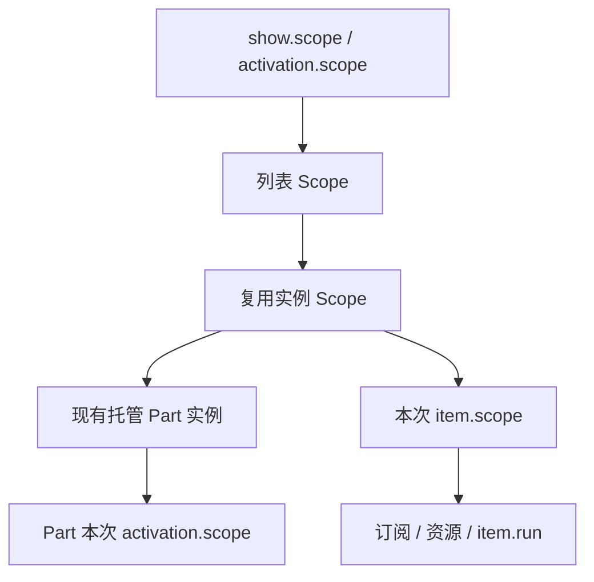

# 固定尺寸虚拟列表

`VirtualList` 位于 `assets/framework/ui/components/virtual-list`，为 Cocos Creator 3.8.8 的 `ScrollView` 提供固定尺寸纵向列表和按行排列的固定列数网格。只创建窗口附近的条目；十万条数据不会创建十万个节点。业务 Part、模型和预制体放在业务模块，框架不依赖任何业务条目。

## 可运行示例

运行 `assets/game/boot/Bootstrap.scene`，进入 **UI 实验 → 虚拟列表**。

- 初始包含一万条数据，可拖动滚动、切换三列网格、动画定位第 5000 项。
- “刷新可见项”只更新窗口内的数据；“清空 / 恢复”验证回收与重新填充。
- “广播更新”由每次条目绑定独立订阅；条目滚出或页面关闭时立即退订。
- 每条记录模拟一次可取消的异步详情加载。快速滚动后，旧详情不会写进新条目。
- 页脚显示当前窗口、实例数与待处理操作数；返回后再进入会创建新的列表会话。

源码：[VirtualListLabPage.ts](../assets/game/modules/showcase/code/ui/VirtualListLabPage.ts)、[VirtualListItemPart.ts](../assets/game/modules/showcase/code/components/VirtualListItemPart.ts)。两个预制体均在 `showcase/bundles/default/dynamic`，经 Cocos MCP 创建与写入，并调用现有工作台自动绑定流程。`generated/*Binding.ts` 不需要手改。

## 节点与布局所有权

```text
node_list                    ScrollView + VirtualList + UITransform
└─ View                      Mask + UITransform，可用 Widget 拉伸
   └─ Content                UITransform；初始为空
      └─ 运行时创建的业务 Part
```

`ScrollView.content` 指向 Content，Content 的直接父级是 View。列表挂载后接管 Content 的尺寸、左上锚点 `(0, 1)` 和条目位置，使用纵向滚动并禁用横向滚动。Content 和条目根节点不能有启用的 Layout / Widget；不要另外用动画驱动它们的位置。Content 使用单位缩放、不旋转。条目根节点必须有 UITransform 与指定的 GameComponent 派生类，尺寸由布局覆盖，锚点可以不同。业务动效建议放到根节点下的 Visual 子节点。

条目内部可以使用 Widget / Layout。列表改变根尺寸时会立即对齐启用的子 Widget，兼容 `ON_WINDOW_RESIZE`；没有尺寸变化时不会遍历子 Widget。文本换行、缩放策略、图标和按钮由业务 Part 设置。固定尺寸条目不应通过文本反向改变根高度。

挂载和 `setLayout` 时总列宽（含边距/间距）不得超过视口宽度。窗口尺寸变化会自动重新计算可见行、Content 高度和实例容量，不自动改变列数或条目宽度；缩窄后超宽内容由 Mask 裁切。需要响应式列数时，由页面根据新宽度调用 `setLayout`。先使 View 完成布局，再 mount；高度为 0 时暂不创建条目。

示例页面额外监听 View 的 `SIZE_CHANGED`，按新的宽度重新计算单列/三列条目宽度，再调用 setLayout；这项业务选择不会改变组件固定尺寸的约定。

## 接入现有 Part 与自动绑定

在工作台创建业务 Part，按 `lbl_title`、`spr_icon`、`btn_select` 等命名节点并更新绑定。业务类继承生成的 Binding，继续使用 `onInit` / `onActivate` / `onDeactivate`，不覆盖 Cocos 保留生命周期。

```ts
import {
    VirtualList,
    type VirtualListHandle,
    type VirtualListItemContext,
} from '../../../../../framework/ui/components/virtual-list';

interface Row { readonly id: number; readonly title: string }

// 放在页面 onShow 内；nodeList 是页面自动绑定的 node_list。
const list: VirtualListHandle<Row> = this.nodeList.getComponent(VirtualList)!.mount<Row, InventoryItemPart>({
    owner: show.scope,
    assets: show.assets,
    prefab: InventoryRes.prefab.prefabsInventoryItemPart,
    part: InventoryItemPart,
    layout: { itemWidth: 600, itemHeight: 88, spacingY: 8, overscanRows: 1 },
    render: (part, item) => part.render(item),
});
list.setItems(rows);
list.scrollToIndex(99, 'center', 0.25);

// InventoryItemPart extends InventoryItemPartBinding
render(item: VirtualListItemContext<Row>): void {
    this.lblTitle.string = item.data.title;
}
```

`assets` 使用当前业务上下文的 `ScopedAssets`，内部按每个复用实例创建子期限，用现有 `instantiate({ active: false })` / `activate` 接通宿主、自动绑定和 Part 生命周期。不要自行调用底层 `cc.instantiate` 或在框架目录存放业务预制体。

## 布局参数

所有距离均为 UI 坐标；索引从 0 开始。

| 字段                           | 默认 | 约束与行为                                |
| ------------------------------ | ---- | ----------------------------------------- |
| `itemWidth` / `itemHeight`     | 必填 | 有限正数，所有条目相同                    |
| `columns`                      | `1`  | 正整数；大于 1 为从左到右、从上到下的网格 |
| `spacingX` / `spacingY`        | `0`  | 有限非负数；最后一行后没有额外间距        |
| `paddingLeft/Right/Top/Bottom` | `0`  | 有限非负数；空数据仍保留边距              |
| `overscanRows`                 | `1`  | 非负整数；窗口上下各保留此数量的预备行    |

```ts
list.setLayout({
    itemWidth: 192,
    itemHeight: 120,
    columns: 3,
    spacingX: 12,
    spacingY: 10,
    paddingTop: 12,
    paddingBottom: 12,
    overscanRows: 1,
});
```

支持短内容、最后一行不满、空列表、视口调整和 ScrollView 回弹。回弹时用夹紧后的偏移计算窗口，保留原生弹性效果。Content 高度至少等于视口高度。

## 数据、局部刷新与定位

| API                                                              | 行为                                                                              |
| ---------------------------------------------------------------- | --------------------------------------------------------------------------------- |
| `setItems(items, resetScroll = false)`                           | 复制数组并替换数据；重新绑定当前窗口，默认保留像素偏移并夹紧范围；传 true 回顶部  |
| `updateItem(index, data)`                                        | 替换单个模型并刷新对应绑定，其余条目保持上下文                                    |
| `refresh(indices?)`                                              | 指定索引去重后刷新；省略则刷新窗口内全部；离屏条目进入时读取数据                  |
| `setLayout(layout)`                                              | 校验后更新固定布局；仍可见的条目只重新排布，数据未变化时不重绑                    |
| `scrollToIndex(index, alignment = 'start', durationSeconds = 0)` | 立即或动画滚动，单位秒；不返回动画完成屏障                                        |
| `whenIdle()`                                                     | 等待当下及其后续加载、渲染、回收；不等待滚动动画与仍在显示的 item.run             |
| `inspect()`                                                      | `count`、左闭右开 `range`、实例数 `slots`、操作数 `pending`、已分配索引 `indices` |
| `dispose()`                                                      | 立即取消并隐藏，返回完整清理 Promise；重复调用安全                                |

`start` 对齐顶部，`center` 居中，`end` 对齐底部，`nearest` 只在未完整可见时移动最短距离。目标条目比视口更高且已覆盖视口时，nearest 保持位置。所有定位均夹紧合法边界；空列表及越界索引会抛出 `VIRTUAL_LIST_INDEX`，调用前可检查 `list.count`。

```ts
list.updateItem(12, { id: 901, title: '新的标题' });
list.refresh([2, 5, 12]);
list.setItems(filteredRows, true);
if (list.count) list.scrollToIndex(list.count - 1, 'end');
await list.whenIdle();
```

数组被浅复制：修改原数组的结构不会改变列表；追加、删除、排序用 setItems，替换元素用 updateItem。对象本身不深复制，原地修改对象后须 refresh。列表按索引调度，不保留业务选中状态、不提供稳定 Key 差量更新；业务身份使用 `item.data.id`，不能把 `item.index` 当永久 ID。

## 每次复用的生命周期



一次实例可能绑定许多不同数据。滚出、局部刷新或替换数据时：

1. 同步取消旧 item.scope，使旧 commit 失效，解绑响应取消信号的订阅。
2. 同步禁止 Part 再激活并隐藏节点，调用现有失活流程。
3. 等待旧绑定任务、Part 激活任务及清理回调全部完成。
4. 为节点创建新 item.scope，渲染新数据，完成后激活 Part。

实例数量受视口容量约束，容量按 `ceil(视口高度 / 行步长) + 1 + 2 × 预备行数` 乘列数估算，并受数据总数限制。容量缩小时，超额实例会在旧工作退出后销毁。加载中快速滚动只保留最新窗口，不会积累滚动请求队列。旧任务迟迟不退出时可能暂时留空；框架不会无限创建补位节点，也不会强行终止任意 Promise。

Part 的 `onInit` 每个实例一次，`onActivate` / `onDeactivate` 随复用反复执行。与当前数据关联的订阅和异步操作放在 item.scope；Part 自身激活期逻辑可继续用 activation.scope。不要将条目数据资源放在页面或模块的长期 Scope 中。

```ts
render(item: VirtualListItemContext<Row>): void {
    // 每次必须完整重置，避免复用时残留旧颜色、按钮状态和图片。
    this.lblTitle.string = item.data.title;
    this.lblDetail.string = '加载中…';

    this.ctx.events.on(ItemChanged, (event, task) => {
        if (event.id === item.data.id) task.commit(() => this.lblDetail.string = event.text);
    }, item.scope);

    void item.run(async task => {
        const detail = await service.loadDetail(item.data.id, task.signal);
        task.commit(() => { this.lblDetail.string = detail.text; });
    }).catch(error => {
        if (!(error instanceof OperationCancelled)) reportError(error);
    });

    // 图片持有也跟随本次绑定，避免旧图在回收后继续占用资源。
    void item.run(() => this.ctx.assets.in(item.scope).setSprite(this.sprIcon, item.data.icon))
        .catch(error => { if (!(error instanceof OperationCancelled)) reportError(error); });
}
```

上述为模式片段，`ItemChanged`、`service`、带 icon 字段的 Row 由业务定义。始终捕获本次 item/task，在 await 后使用它的 commit；不要在 await 后读取已被下一次 render 覆盖的 `this.currentItem`。`commit` 仅接受同步回调。

节点事件使用取消信号即时解绑；仅 `scope.defer` 的回调需要等登记任务排空后才执行：

```ts
const onClick = () => item.commit(() => select(item.data.id));
this.btnSelect.node.on(Button.EventType.CLICK, onClick);
item.signal.onAbort(() => this.btnSelect.node.off(Button.EventType.CLICK, onClick));
```

列表禁用、节点销毁或父 Scope 结束都会取消会话。重新显示时重新 mount；同一组件必须等旧 handle.dispose 完成后才能再次 mount。不要在 render / item.run / Part 激活任务中 await 自己列表的 dispose，也不要从这些工作中等待依赖自身退出的 whenIdle，以免形成自等待。

## 错误与验证

布局、时长、索引错误使用 `VIRTUAL_LIST_LAYOUT`、`VIRTUAL_LIST_DURATION`、`VIRTUAL_LIST_INDEX` 等明确错误码；结构或布局冲突为 `VIRTUAL_LIST_SETUP`。加载/渲染失败由 onError 上报，失败项隐藏且不会每帧无限重试，调用 refresh 或让它重新进入窗口可重试。onError 是同步上报器，不应抛错。清理失败的节点会被销毁而不会返回可复用池；Part 的同步 `onDeactivate` 异常也适用。关闭期间发生的清理失败会在其余实例释放后，使 `dispose()` 或父级 `close()` 以 `SCOPE_CLEANUP_FAILED` 拒绝；正常刷新时已上报并处理完的失败不会影响以后正常关闭。

```powershell
npm run verify
npm run test:showcase
# Creator 中运行 Bootstrap 的浏览器预览后，填入当前 MCP 返回的本机预览端口：
node tests/integration/verify-virtual-list.mjs http://127.0.0.1:7456/
```

单元测试覆盖布局、边界、十万条数据、局部刷新、订阅解绑、任务与 Part 清理屏障、加载失败/迟到、关闭和视口变化。类型合同验证数据类型与借用 Lifetime。集成测试使用实际 Cocos 引擎、ScrollView、自动绑定 Part 和资源管理器，验证网格、动画定位、子 Widget 尺寸、快速跳转、清空、禁用、重新挂载及返回再进入；截图保存在 `temp/mcp-captures/virtual-list-*.png`。

当前范围为固定尺寸纵向滚动，不包含变高条目、横向虚拟化、无限循环、分页取数、多种条目预制体和拖拽排序。Web 预览验证不代表微信或原生真机性能验收。ScrollView 偏移和定位接口依据 [Cocos 3.8 官方 API](https://docs.cocos.com/creator/3.8/api/zh/class/ScrollView)。
